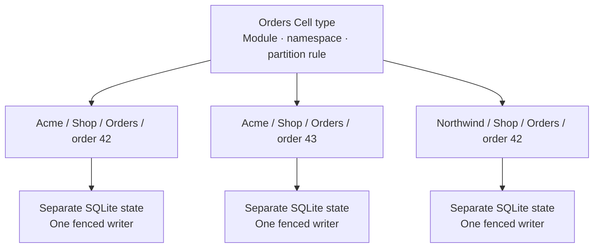
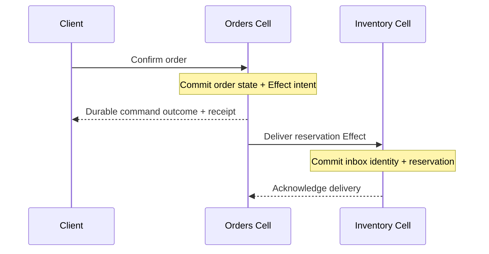

A **Cell** is an addressed, SQLite-backed state partition with one fenced writer. It is the unit in which a command changes data, records an outcome, and establishes a recoverable committed position. An application can have many Cells; each keeps its own state and request history.

Think of an order and its line items. If their totals must change atomically, put them in one Orders Cell. Another order can live in another Cell and run independently. The important question is which facts must agree after every command, rather than which tables happen to share a name.

## Explore a stable identity

Change the tenant or order below, then compare the two transaction boundaries. The displayed labels explain the model; real partition encodings follow the declared topology contract.

<CellModelLab />

A `CellTarget` combines tenant, application, namespace, and partition. Moving ownership between machines leaves that address intact. The owner is a routing and authority decision, not part of the Cell's logical identity. Tenant identity is an addressing input; your service must still authorize access before invoking the framework.

## Separate the definition from the instance

A **Cell type** declares a module, namespace, role, and partition rule. A module provides operations and schema behavior. A target selects a particular instance of that definition. Many targets can use the same type without sharing one database or one writer.

The module registry and topology are compiled into a descriptor. Typed handles bind operations to declared targets. A namespace or partition rule is therefore more than a convenient label: changing it can change persisted identity and routing. Review descriptor and schema compatibility before deploying such a change.

## Choose the smallest useful atomic boundary

A command runs against **one Cell**. Its domain changes and recorded request outcome commit together in one SQLite transaction. A larger business process can span Cells, but it needs a delivery protocol between those local transactions.

| Question                                | A useful boundary                              | Why                                                     |
| --------------------------------------- | ---------------------------------------------- | ------------------------------------------------------- |
| Must order totals and line items agree? | One order Cell                                 | One command can update both atomically                  |
| Are orders independently mutable?       | A Cell per order, when using entity partitions | Separate writer lanes avoid one shared order bottleneck |
| Are settings selected by a scope?       | A declared scoped partition                    | The same scope routes related operations together       |
| Must inventory and an order coordinate? | Separate Cells with an Effect                  | Each Cell owns its invariant; delivery connects them    |

Do not choose a Cell per row automatically. That can turn a simple invariant into a distributed process. Conversely, placing every tenant's state in one Cell creates one serialized writer lane for that entire partition. Start with the domain's consistency requirements, then consider state size, write contention, and independent recovery.

One fenced writer gives a Cell one ordered command lane and a clear publication authority. SQLite can commit related state and request evidence locally, while the fence prevents an obsolete owner from advancing authoritative state. The tradeoff is that one Cell's writes stay serialized; distribute independent Cells when the domain permits it rather than assuming more nodes split that lane.

## Understand the partition rule

Cellule supports declared fixed-shard and entity partition strategies. Fixed shards map scoped keys into a known number of partitions. Entity partitions use a canonical entity key to address an entity's Cell. The direct UUID strategy preserves its canonical UUID bytes in the partition encoding; it is a distinct declared strategy with its own descriptor representation.

| Strategy                      | Fits                                                      | Design consequence                                               |
| ----------------------------- | --------------------------------------------------------- | ---------------------------------------------------------------- |
| Fixed shards                  | Scoped metadata or work grouped into a declared shard set | Multiple keys can share one transaction and writer lane          |
| Entity partitions             | Independently addressed aggregates                        | Each entity can have a separate state and recovery boundary      |
| Direct UUID entity partitions | Canonical UUID entity identities                          | UUID encoding and validation become part of the routing contract |

These are declared choices, not a promise that changing shard count transparently redistributes existing state. Keep stable namespace, role, partition strategy, and operation identity in the compatibility review. See the [topology contract](/docs/crates/app/docs/topology) for exact validation and encodings.

## Cross a boundary deliberately

The first receipt proves the source command's committed position. It does not mean the inventory reservation has finished. If the product needs to show that distinction, record a pending reservation state and advance it when the destination result is handled. The [durable work concept](/docs/concepts/coordination) explains retries, deduplication, and external activities.

## Turn the model into an application

List the invariants a command must preserve. Group the required state into Cells, declare the modules and partition rules, and use typed handles to invoke them. Keep public HTTP, user authorization, provider credentials, and deployment decisions in the embedding service.

An order API can validate its caller, select an authorized tenant and order target, invoke the Orders module, and translate the recorded result into a response. Cellule supplies the ownership and durability machinery under that boundary. It does not infer your product's authorization policy from the target.

Continue with [framework layers](/docs/concepts/layers) to see where these responsibilities live. For a working implementation, follow the [quickstart](/docs/guides/quickstart) and [application authoring guide](/docs/crates/app).
