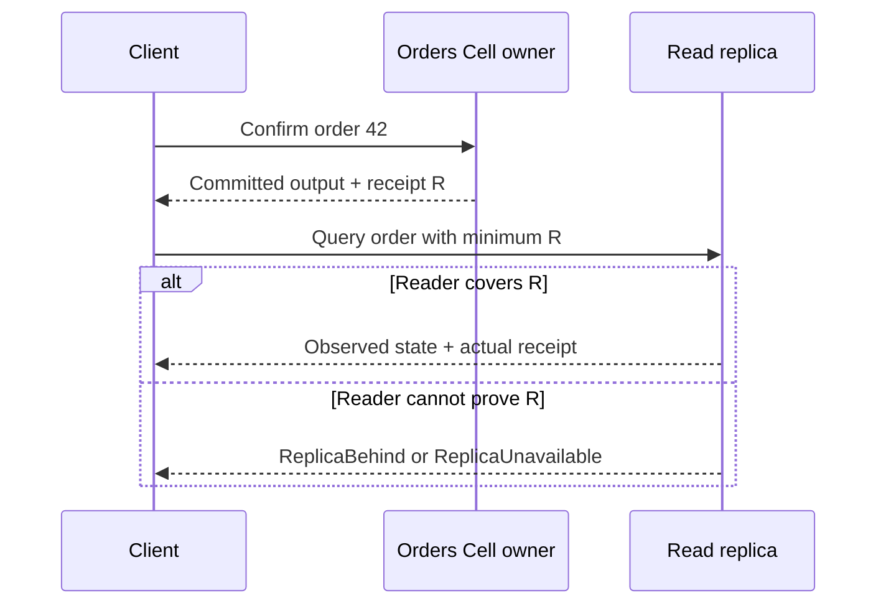
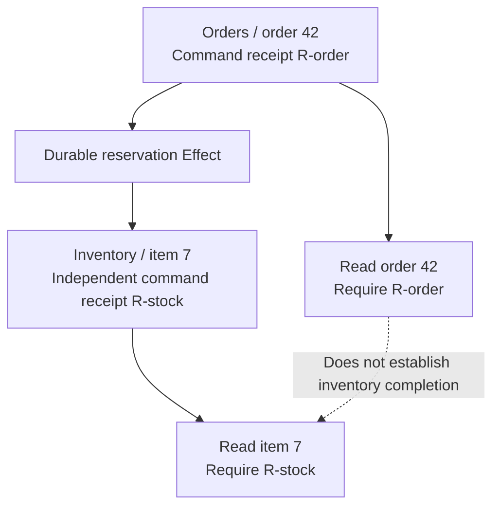

A **receipt** binds an observation to a committed position in a particular Cell. After confirming an order, a caller can require that receipt when reading the order back. The reader must cover the required position rather than return an older version that happens to be available.

Receipts include Cell identity, incarnation, and commit sequence. Sequence numbers below are illustrative positions within one incarnation. Try a lagging reader, a caught-up reader, and an unavailable reader; then switch the read policy or use a receipt from another Cell.

<ReadConsistencyLab />

## Read your command's result

Suppose a command confirms order 42 and returns receipt 42. A query that requires that receipt must observe a position covering that command. It may include later commits: a minimum receipt is a lower bound, not a request to reconstruct a historical snapshot exactly at that number.

The query result reports the actual observed receipt. Keep the minimum and observed positions conceptually separate: the caller specifies what must be covered, and the runtime reports what it actually read. Cell identity and incarnation matter as well as the sequence; comparing bare integers from unrelated Cells discards the contract.

## Choose a policy explicitly

Typed queries default to `ReadPolicy::CurrentOwner`. This follows the owner's ordered execution. Commands, mutation resolution, and lease validation remain owner-ordered operations. An explicitly selected `ReadPolicy::Replica` uses an admitted reader and must enforce any requested minimum.

| Policy                             | Useful when                                                    | Behavior to expect                                                                |
| ---------------------------------- | -------------------------------------------------------------- | --------------------------------------------------------------------------------- |
| Current owner                      | You need owner-ordered state observation                       | The query routes through the current owner                                        |
| Explicit replica with a minimum    | You want a replica that covers a known command                 | It returns an observed position covering the minimum or fails closed              |
| Explicit replica without a minimum | Your application permits that reader's admitted observed state | It still reports its actual position; absence of a minimum is a deliberate choice |

Installing and admitting read replicas is an integration responsibility. Selecting the replica policy does not create a replica. The [invocation guide](/docs/crates/app/docs/invocation) documents typed handles, replica errors, and the runtime and host facilities that support them.

## Treat lag as a visible outcome

A lagging replica cannot return stale state as though it met the requested receipt. An unavailable replica cannot silently turn an explicit replica query into an owner query. These failures tell the caller which requirement could not be fulfilled.

Your service can deliberately retry later, select an owner read, or report temporary unavailability according to its product policy. Choosing another policy should be visible in that service's logic. It should not erase the original error or reinterpret a missing reader as proof that the requested state does not exist.

For an order confirmation screen, an owner read may be appropriate after a replica reports lag. For background reporting, waiting for the replica may be preferable. The framework supplies the consistency boundary; your application decides the user experience and load tradeoff.

## Keep receipt scope within one Cell

The order receipt cannot act as a global checkpoint across order and inventory Cells. Each has an independent ledger and committed position. A source command may durably record an Effect before the destination applies it. If the UI needs to display “reservation complete,” model and observe that business state rather than infer it from the order's receipt.

Likewise, a group of individual reads does not automatically form one cross-Cell SQL snapshot. Put state that requires one atomic observation inside an appropriate Cell boundary, or define a product-level coordination and observation protocol for the wider process.

## Validate work leases at the owner

A replica observation does not authorize an external side effect. Queue claims and supervised work use leases and tokens whose current validity must be checked through the owner. A worker that once observed a claim might have lost it while another worker took over.

Keep the steps separate: obtain work under its claim contract, validate the exact lease or token as required, perform external work with a suitable idempotency strategy, then record or acknowledge the result. Ordinary replica reads cannot substitute for that owner-ordered validation.

This separation prevents a fast read path from becoming an accidental authority path. The [Queue guide](/docs/primitives/queue) and [Activities guide](/docs/primitives/activities) explain the work-specific protocols.

## Design an observation path

Start with the product question: “Has my command been observed?”, “Can this reader satisfy a minimum?”, or “Has the wider process completed?” These need different evidence. Keep command receipts, query observations, delivery outcomes, and external acknowledgements distinct in your service and UI.

Continue with [ownership and fencing](/docs/concepts/ownership) to understand why an owner can move without weakening these boundaries. For canonical receipt and consistency rules, read [runtime execution](/docs/crates/runtime/docs/runtime) and [typed invocation](/docs/crates/app/docs/invocation).
