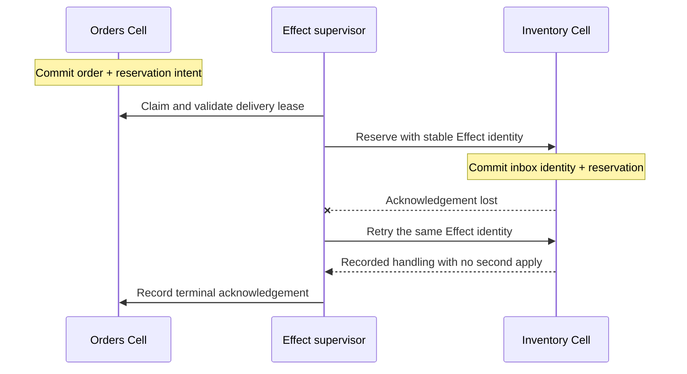
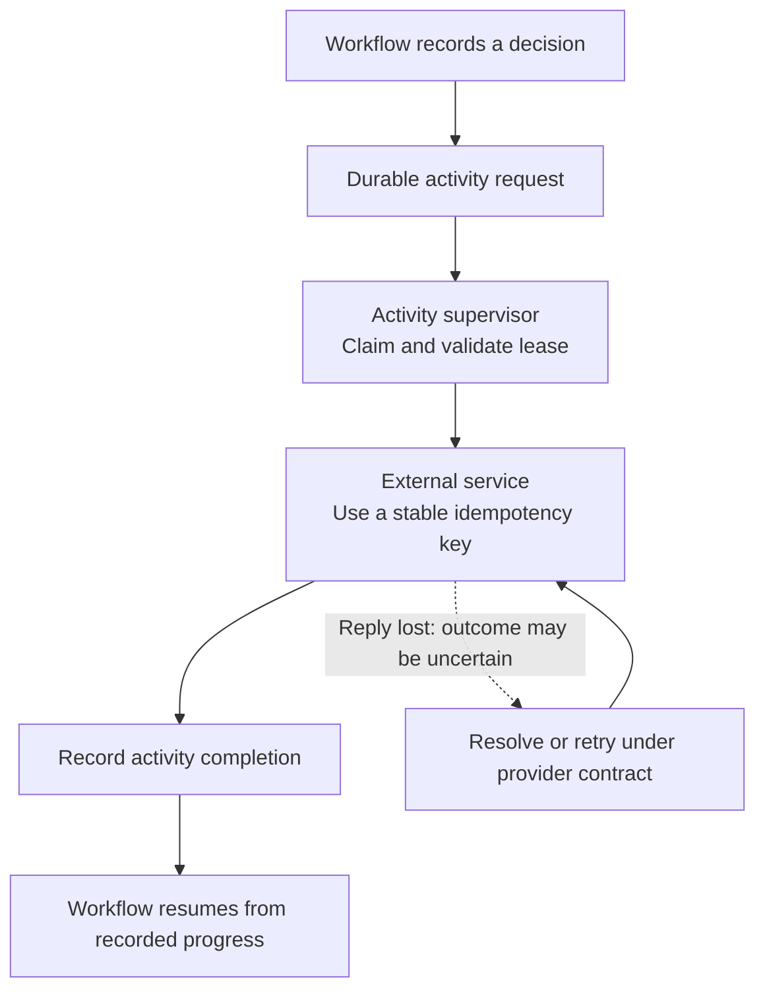

One Cell provides an atomic state boundary. A business process often crosses several of them and calls external services. Cellule records **durable intent and progress** so that work can be retried without pretending those operations share one SQL transaction.

Confirming an order and reserving inventory is a useful example. Step through the delivery below, then lose the destination acknowledgement. The retry uses the same Effect identity so the destination can recognize work it already applied.

<DeliveryLab />

## Connect local transactions with Effects

An Effect records a command intended for another Cell. The source commits its domain change and Effect intent together. An explicitly installed supervisor claims, validates, and delivers that intent. The destination records the Effect identity in its inbox together with the domain change.

Effect targets stay within the source tenant and application, and their namespace must be declared in the registry. This routing boundary does not replace the embedding service's authorization policy.

The destination inbox makes repeated delivery of the same Effect idempotent under its contract. It does not merge the source and destination into one transaction. Between the two commits, the order may be confirmed while its reservation is still pending. Model that intermediate business state and handle destination rejection or retry according to the domain.

See the [Effects guide](/docs/primitives/effects) for the runtime protocol and the distinction between recording intent and running delivery.

## Separate workflow decisions from external activities

A **Workflow** persists the decisions and progress of a longer process. An **Activity** performs external work under explicit supervision, with leases and recorded completions. The workflow can wait for an activity result and continue from durable state instead of depending on an in-memory call stack.

For onboarding, a workflow might record that a welcome notification is needed, schedule an activity, wait for its result, and then advance the user's onboarding state. The notification provider remains outside the Cell transaction.

Recording a completion cannot atomically commit a remote payment or email. If the provider accepted a call and its reply was lost, the activity can be retried. Use the provider's idempotency or status-resolution mechanism where available. A Cell inbox cannot deduplicate side effects inside a system that does not participate in that inbox transaction.

The [Workflow guide](/docs/primitives/workflow) explains durable decisions; the [Activities guide](/docs/primitives/activities) covers execution, supervision, and uncertainty.

## Choose the primitive that expresses the job

The eight primitives share the Cell's fenced writer, request ledger, publication gate, and recovery boundary. Their APIs differ because their jobs differ.

| Primitive  | Expresses                                         | Example                                            |
| ---------- | ------------------------------------------------- | -------------------------------------------------- |
| SQL        | Related relational state in one local transaction | Update an order and its line items                 |
| KV         | Scoped values with conditional checks and updates | Change settings only if the version matches        |
| Blob       | Staged content and published references           | Publish an attachment after its parts are recorded |
| Queue      | Independent work with claims and leases           | Dispatch email jobs to consumers                   |
| Cron       | Deduplicated recurring occurrences                | Record a reminder trigger on schedule              |
| Workflow   | Remembered process decisions and progress         | Advance onboarding after an activity result        |
| Activities | Supervised calls to external systems              | Invoke an idempotent notification handler          |
| Effects    | Durable commands between Cells                    | Request an inventory reservation                   |

Use a Queue when consumers can handle independent messages. Use a Workflow when the process must remember which step it is waiting for. Use an Effect to send a command to another Cell under the destination inbox contract. A single product flow can compose these primitives without making them interchangeable.

## Expect retries in work delivery

Queue delivery is at least once. A consumer must follow the claim-token and lease-validation contract before external work, then acknowledge the result. A previous claim does not stay valid forever; an owner-ordered check protects the current work authority.

Cron records bounded, deduplicated occurrences. Declaring a schedule does not start the application's scheduling maintenance automatically. Workflow activities and Effects likewise need their explicit supervisors and facilities. Install those workers deliberately, expose their progress, and let the serving lifecycle coordinate their drain.

Retries are part of these protocols, not an exceptional reason to drop work. Keep stable work identities and recorded outcomes, and preserve unresolved states when a transport failure does not prove whether the destination applied an operation. Read [Queue](/docs/primitives/queue) and [Cron](/docs/primitives/cron) for their distinct delivery contracts.

## Keep content publication and deletion safe

Blob content lives outside SQLite, while recorded metadata and references participate in the Cell's state. Staging bytes, publishing a Blob reference, and deleting unused parts are different boundaries. A finished upload is not automatically a safely published application reference.

Cleanup must account for references across Cells. A local scan that finds no references cannot prove that another Cell stopped using a part. Deletion requires the documented complete reference set, quiesced writes, and grace boundary. Follow the [Blob guide](/docs/primitives/blob) instead of inventing a local-only garbage collector.

## Model completion where users can observe it

A source command's receipt means its own outcome is committed. A delivery acknowledgement means the destination handling reached its protocol boundary. An activity completion records what the workflow can use next. These pieces of evidence answer different questions.

For an order screen, show “reservation pending” until your modeled process reaches its completion state. Preserve the original work identity across retries. Give operators access to durable progress and errors rather than treating a lost network reply as a new business operation.

Return to [Cells and boundaries](/docs/concepts/cells) when deciding where invariants belong, or follow the [primitive overview](/docs/primitives) and [quickstart](/docs/guides/quickstart) to build a runnable version of these ideas.
