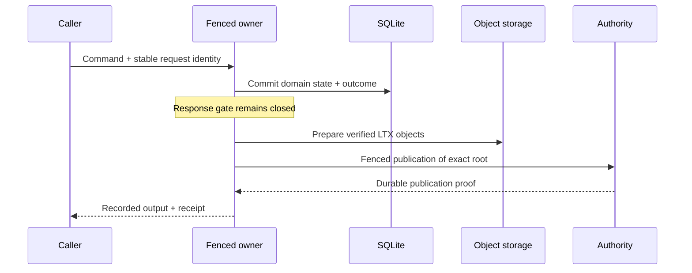
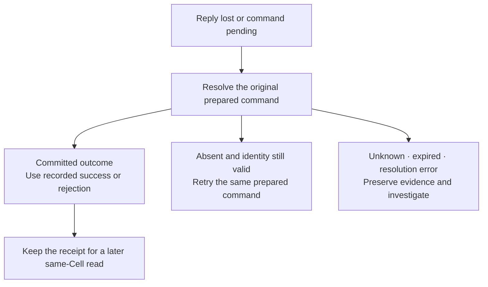

A successful command response carries more than the fact that its handler ran. Cellule releases its output and receipt after **durable publication or a recoverable follower-log proof**. This connects what a caller has been told to what a successor must be able to recover.

The command's domain changes and request outcome commit together in SQLite. That local transaction is essential, but a local commit alone does not open the response gate. Select either configured durability path and walk through the proof boundary.

<DurabilityExplorer />

## Separate a local commit from a durable reply

Consider confirming order 42. The handler updates the order and records its outcome in one transaction. LTX captures the committed boundary. On the object publication path, immutable objects are prepared and a fenced authority compare-and-swap pins the exact root. Only then can the publication proof release the response.

Uploading objects and making them authoritative are distinct operations. A previous owner might still be able to upload bytes; its obsolete fence must prevent it from publishing a new authoritative root. Storage listing order or object timestamps cannot replace that authority decision.

## Understand the alternative proof path

A configured follower-log path can establish recoverable follower proof before object publication completes. The response gate still requires proof; a network send or an unverified peer acknowledgement is insufficient. Later object publication and recovery must preserve the acknowledged prefix.

| Event                                    | What it establishes                                        | May it alone release a successful reply? |
| ---------------------------------------- | ---------------------------------------------------------- | ---------------------------------------- |
| Handler finishes                         | An execution result is available                           | No                                       |
| SQLite transaction commits               | State and outcome agree locally                            | No                                       |
| Objects upload                           | Recovery bytes have been prepared                          | No                                       |
| Fenced root publication succeeds         | The exact root is authoritative and durable                | Yes, under the publication contract      |
| Configured follower proof is established | The acknowledged position is recoverable through that path | Yes, under the follower contract         |

These are configured runtime protocols, not options a caller can improvise per request. The [follower durability contract](/docs/crates/runtime/docs/failover-and-followers) defines ensemble, acknowledgement, recovery, and fallback requirements. This walkthrough illustrates the boundaries; it does not claim any particular production latency or deployment qualification.

## Give one logical mutation one identity

A mutation identity includes a request ID and validity timestamps. Preserve the original identity and prepared command until its outcome is known. A fresh request ID describes a new logical mutation, even if the payload happens to be identical.

The ledger lets a same-identity retry find its recorded outcome. Reusing an identity with different command bytes conflicts with that identity's recorded digest. Expired identities have a separate validity boundary; they must not be treated as permission to execute the original operation again under a new ID.

This matters when an HTTP request times out. The service cannot infer that the mutation failed merely because it lost the response. The order might already be durably confirmed. Creating a new identity could execute another logical operation rather than resolve the first one.

## Resolve an uncertain outcome

| Resolution          | Caller action                                             | Why                                                       |
| ------------------- | --------------------------------------------------------- | --------------------------------------------------------- |
| Committed           | Use the recorded output or business rejection and receipt | The ledger settles the original command                   |
| Absent, still valid | Retry the same prepared command                           | Identity and payload still describe the original mutation |
| Unknown             | Preserve the pending identity and investigate             | Unknown is not proof that the handler never ran           |
| Expired             | Follow the documented expiry handling                     | The identity no longer supports an ordinary retry         |
| Resolution error    | Handle the error and retain evidence                      | A failed query does not settle the mutation               |

Retain the prepared command before execution when cancellation could otherwise discard it. The [typed API guide](/docs/guides/api#handle-an-uncertain-command) shows the concrete Rust handling pattern.

## Distinguish business rejection from transport uncertainty

A durably recorded business rejection is a settled outcome: the caller can use its recorded rejection and receipt. A pending mutation is uncertain and requires resolution. A published result whose decoding fails still carries publication evidence; preserve its receipt and source error while investigating the codec or schema issue.

Do not flatten these cases into a generic “try again” button. A product can safely explain a business rejection, show an unresolved command as pending, and offer status resolution without manufacturing another mutation identity.

## Use the receipt for the next observation

The receipt identifies a committed position in the addressed Cell. It can establish a minimum for a later read, but it does not prove that an emitted Effect or external activity has completed. Continue with [receipts and reads](/docs/concepts/consistency), then [durable work](/docs/concepts/coordination) for those wider processes.

For execution details, read [runtime commands and receipts](/docs/crates/runtime/docs/runtime) and the [primitive request ledger contract](/docs/crates/runtime/docs/primitives).
