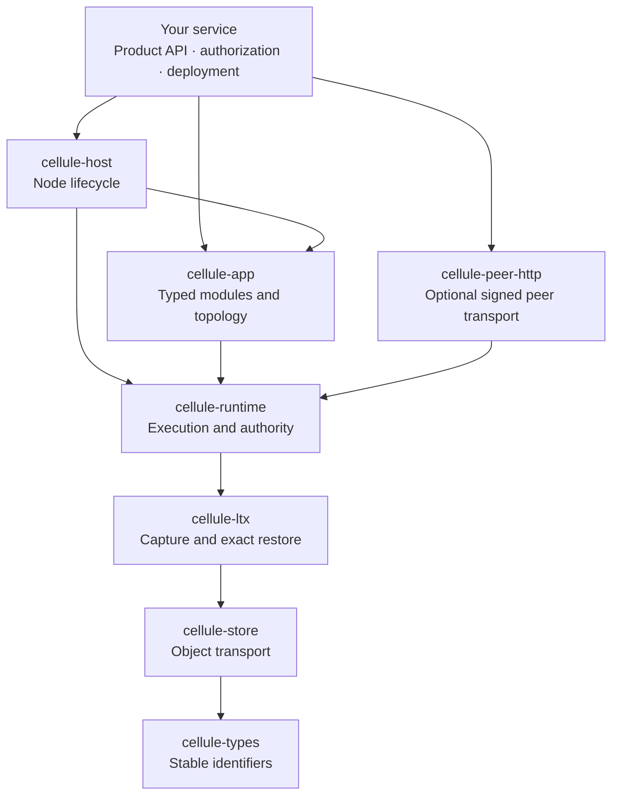
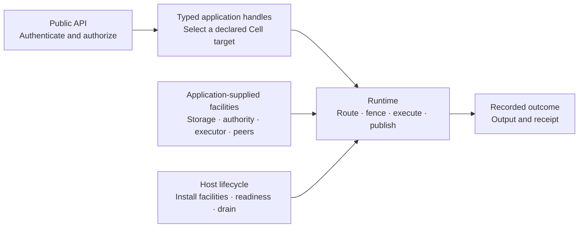

Cellule embeds inside a Rust application. Its layers separate application authoring, execution, verified storage, and provider transport. This makes the ownership and durability contracts visible without moving product policy into the framework.

There are six crates in the main dependency chain and an optional peer transport adapter. Select a layer to inspect its responsibility and open its reference guide.

<LayerExplorer />

## Follow the dependency direction

Higher layers use lower layers. The host also uses runtime directly. The optional peer HTTP adapter depends on runtime; it does not turn the framework into a public HTTP service.

The direction matters when adding a feature. Object transport should not need to know which tenant is allowed to call an operation. A recovery codec should not select the authoritative owner. Keeping those decisions above the byte transport makes the contracts easier to review and exercise independently.

## Find the owner of a responsibility

| Layer               | Owns                                                                               | The boundary to preserve                                 |
| ------------------- | ---------------------------------------------------------------------------------- | -------------------------------------------------------- |
| `cellule-types`     | Stable provider, bucket, and related identifiers                                   | Keep persisted encodings compatible                      |
| `cellule-store`     | Bounded object operations, conditional writes, retries, classified provider errors | Transport does not select the authoritative Cell root    |
| `cellule-ltx`       | WAL capture, immutable recovery objects, byte verification, exact reconstruction   | Verified bytes do not grant writer authority             |
| `cellule-runtime`   | Cell actors, owner fencing, request outcomes, receipts, primitives, publication    | Product ingress and authorization remain outside         |
| `cellule-app`       | Module registration, compiled topology, typed handles                              | Authoring does not provision a serving fleet             |
| `cellule-host`      | Node facilities, readiness, admission, and drain                                   | The embedding service supplies infrastructure and policy |
| `cellule-peer-http` | Signed, routed peer communication under runtime contracts                          | The application owns endpoints and authorization         |

For example, a failed object read should preserve its source error through transport and recovery. Converting it into “empty Cell” would erase the difference between absent state and unavailable required bytes. Similarly, a stale writer must be rejected by fencing even if its object uploads succeeded.

## Assemble a service around the framework

Your application declares domain modules and Cell topology through `cellule-app`. Typed clients select targets and invoke declared operations. A serving node uses `cellule-host` to install the runtime's facilities and coordinate lifecycle. Add the optional peer adapter when your integration uses that transport.

Provider credentials belong to the service's infrastructure setup. They should not leak into a module's domain API. The application also owns its async executor, public listeners, user and tenant policy, and deployment configuration. This lets the same module run in a local example and a serving integration without embedding those product decisions into its operation contract.

## Distinguish authoring from execution

A module describes what a domain operation does. Compiling a topology binds those modules to stable Cell declarations. A typed handle expresses how a caller invokes that declaration. Runtime execution then enforces the current owner's fence and records the outcome under the durability contract.

That separation is useful during change review. Adding a public route may change only the service. Changing a namespace or operation ID can change a persisted contract. Adding a new object provider concerns transport. Changing when a reply becomes observable concerns runtime publication and recovery. The correct layer follows the contract being changed, not the file that is easiest to edit.

The SQL example in the [quickstart](/docs/guides/quickstart) is a good first assembly: declare an application, issue a command, query at its receipt, check the result, and drain the runtime. It demonstrates the mechanics locally; a serving node must additionally establish its documented facilities and live node session.

## Make readiness and shutdown meaningful

A process being alive is not enough to accept serving traffic. Required facilities and session checks must be established before readiness. During shutdown, stop admitting new work, let accepted work finish, maintain the leases needed by that work, and release resources in the documented order.

The host supplies lifecycle coordination, but the service decides how to expose readiness and when its public listener accepts requests. Scheduled maintenance and supervisors must be explicitly installed where required; declaring a primitive does not start every background worker automatically. See [framework integration](/docs/guides/framework) and [host lifecycle](/docs/crates/host/docs/lifecycle).

## Review a change by its contract

Ask which persisted identity, execution rule, or lifecycle ordering the change touches. Read its producer and consumer together. Storage, authority, and application policy have different responsibilities even when all three participate in one request.

Continue with [durable commands](/docs/concepts/durability) to follow that request through the publication gate. The [architecture guide](/docs/guides/architecture) contains the canonical responsibility table and compatibility checklist.
