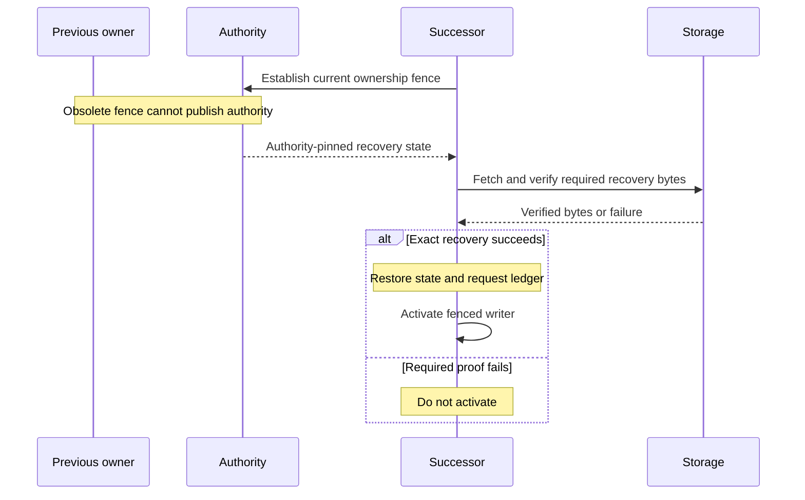
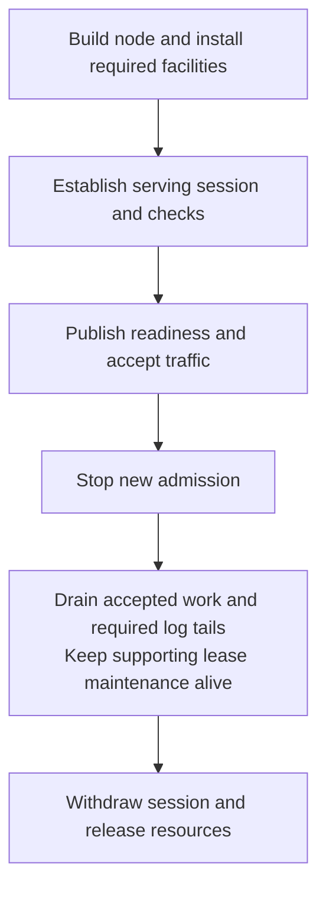

A Cell has **one fenced writer**. Its target stays stable while the node that owns it can change. Placement determines where work is routed; fencing determines which owner is allowed to make a mutation or publication authoritative.

Choose one node, split placement, or an owner handoff below. During handoff, notice the interval with no active writer: a successor must establish authority and verified state before serving the Cell.

<TopologyLab />

## Distinguish an address from an owner

An Orders target identifies tenant, application, namespace, and partition. It does not embed a machine address. The runtime's routing and authority mechanisms locate the current owner for that stable target.

This lets the application keep referring to order 42 while ownership moves from node A to node B. A copied database or reachable endpoint is not enough to become the writer. An owner needs the current authority fence, and its committed position must satisfy the framework's recovery and publication rules.

| Concept                          | Answers                             | Does not establish                        |
| -------------------------------- | ----------------------------------- | ----------------------------------------- |
| Cell target                      | Which state partition is addressed? | Who is currently authorized to write      |
| Placement                        | Where should this Cell be served?   | That an old owner can still publish       |
| Authority fence                  | Which ownership generation can act? | That recovery bytes are valid             |
| Verified root and recovery proof | Which state must be reconstructed?  | Product authorization for a user          |
| Node session                     | Which serving node session is live? | A shared transaction across all its Cells |

A node can own many Cells, and different Cells can be placed on different nodes. Each Cell retains its own writer and local transaction boundary.

## Fence the old writer before activating the next

The diagram shows the conceptual safety boundary rather than every handoff or crash-recovery message. A previous owner may still be running or have unfinished network operations. Its old fence must not grant it permission to advance the authoritative root after ownership changes.

The successor must restore the selected state and its request outcomes consistently. Activating against a plausible but unverified snapshot would break the relationship between earlier replies and recovered data. See [exact recovery](/docs/concepts/recovery) for the verification boundary.

## Separate a clean move from a crash

A graceful move can drain accepted work and prepare the next owner. A crash may require follower-log recovery, sealing and selecting the acknowledged prefix, and pinning recovery state before Cell restore. Those paths have different mechanics, but neither permits an acknowledged command to disappear from recovered state.

An object listing is discovery evidence, not authority to select a newer-looking root. A stale local cache can be helpful only under the verification contract. A warm follower is not automatically an admitted writer. The [failover and follower guide](/docs/crates/runtime/docs/failover-and-followers) describes the actual session, proof, and recovery protocol.

## Do not confuse a work lease with writer authority

Queue claims, activity execution, and Effect delivery use leases to control work attempts. A lease authorizes work under that primitive's contract; it does not make a worker the Cell's writer. Workers still invoke owner-ordered operations to validate tokens and record outcomes.

If a lease expires, another worker may retry the task. External side effects therefore need idempotency handling appropriate to the service being called. Writer fencing protects Cell state; it cannot roll back an email or payment request that an outside system already accepted.

## Admit traffic only when the node is ready

The host coordinates readiness and drain; the embedding application connects that state to its public traffic policy. Starting a process does not prove the node can safely serve. Similarly, stopping a listener is not the end of shutdown if accepted commands and publication work are still in flight.

During drain, preserve the supporting lease and maintenance work until accepted operations and required tails finish. Release SQLite handles, leases, slots, and tasks on all exit paths. Follow the [host lifecycle contract](/docs/crates/host/docs/lifecycle) for exact ordering and deadline semantics rather than assuming one timeout covers every phase.

## Apply the model to deployment decisions

Choose Cell boundaries before reasoning about node count: adding nodes does not split one Cell's writer lane. Place independent Cells across nodes, expose meaningful readiness, and distinguish graceful movement from failed-owner recovery in operational workflows.

Your service still owns provider credentials, endpoint authorization, orchestration, and deployment policy. Continue with [exact recovery](/docs/concepts/recovery), then use [framework integration](/docs/guides/framework) to assemble a serving node under these contracts.
