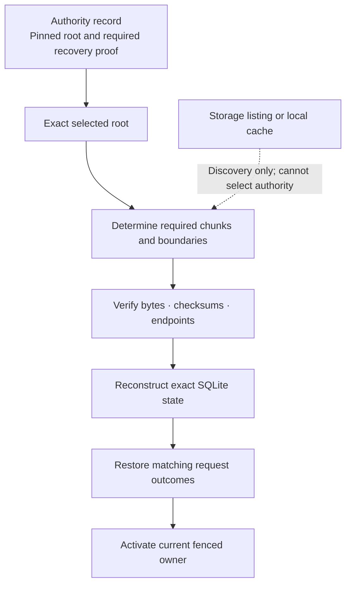
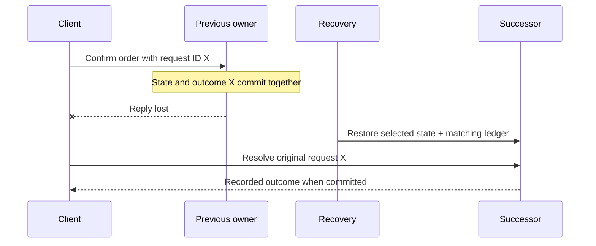

Recovery reconstructs the state the framework is obligated to preserve. It starts from **authority-selected recovery state**, verifies the exact required bytes, and restores SQLite together with its request ledger. Reconstruction is byte-identical or recovery fails.

An owner can move while Cell identity remains stable. Change the chunk condition below to see why a plausible reconstruction is insufficient: invalid bytes block activation rather than silently produce a different database.

<RecoveryExplorer />

## Start with authority, not discovery

The authoritative root is selected through the Cell's authority record and applicable recovery proof. Listing storage objects can discover files, but it cannot decide which candidate is the committed state. Newer-looking objects may be abandoned preparations or writes from a fenced previous owner.

Object availability and authority are separate concerns. Having all the bytes for an obsolete root does not make that root current. Having a current root descriptor does not make missing required bytes acceptable. Both the selected authority state and its required byte proof are necessary.

## Verify the reconstruction inputs

LTX captures committed WAL boundaries and represents recovery content as immutable objects. Recovery checks the required root, chunks, checksums, and transaction endpoints according to its format contract. The result must reconstruct the selected SQLite bytes exactly.

| Input or condition               | Required interpretation                                       |
| -------------------------------- | ------------------------------------------------------------- |
| Authority-pinned root            | Start from the selected committed state                       |
| Every required chunk             | Fetch and verify the bytes needed by that state               |
| Checksum and endpoint validation | Reject corruption or incompatible reconstruction boundaries   |
| Missing required object          | Fail recovery rather than fabricate absent pages              |
| Local database or cache          | Reuse only under the documented verification rules            |
| Extra objects in a listing       | Do not promote them into an alternative authoritative history |

The word **required** matters. Recovery can use the documented sparse and snapshot strategies; it need not fetch every historical object ever written. It must verify every byte source that the selected reconstruction requires. Optimization can change how verified inputs are obtained, not what constitutes a valid recovered state.

Read [LTX recovery](/docs/crates/ltx/docs/recovery) for exact and sparse activation behavior, and [LTX safety](/docs/crates/ltx/docs/safety) for filesystem and ownership invariants.

## Preserve the ledger with the data

A successful command records its domain mutation and request outcome together. Restoring only the domain tables would lose the evidence needed to resolve an old request. Restoring only the ledger without matching domain state would claim an outcome whose data is missing.

Suppose order confirmation committed but the caller lost its reply. After recovery, resolving the original request should find its recorded result when that result belongs to the preserved committed prefix. The caller can then use the original outcome instead of submitting a new logical confirmation.

Recovery is therefore part of invocation semantics, not just an operations concern. The response gate and the restore protocol must agree about which acknowledged positions are recoverable. See [durable commands](/docs/concepts/durability) for the caller's uncertainty handling.

## Include follower acknowledgements in failed-owner recovery

When the configured follower-log path released a response before object publication, ordinary object state alone may not yet cover that acknowledged position. Failed-owner recovery must preserve the recoverable acknowledged prefix and establish the required recovery state before Cell activation.

Do not simplify this into “use the latest object snapshot.” The follower protocol covers sealing, recovery selection, manifests, and authority pinning. The [canonical follower guide](/docs/crates/runtime/docs/failover-and-followers) is the source for those details; the explorer above focuses on the final verification boundary common to a selected recovery state.

## Fail closed and preserve the cause

When required bytes are missing, corrupt, or incompatible, recovery must not activate a writer against invented state. Preserve the source failure so operators can distinguish unavailable transport from invalid bytes or a rejected authority transition.

A fallback is valid only if the documented recovery protocol proves it reconstructs the selected state. A partial listing, empty database, or plausible older snapshot is not a substitute. This may reduce availability during a failure, but it keeps the framework from converting a recoverable data problem into acknowledged data loss.

## Treat cleanup as part of recoverability

Recovery content cannot be deleted merely because the current process no longer uses it. Required roots, follower recovery data, and referenced Blob artifacts have their own retention and retirement rules. Blob part deletion requires a complete cross-Cell reference set, quiesced writes, and a grace boundary.

Continue with [durable work](/docs/concepts/coordination) for the reference and delivery boundaries. For lower-level recovery selection and storage contracts, read [runtime storage](/docs/crates/runtime/docs/storage) and [LTX recovery](/docs/crates/ltx/docs/recovery).
