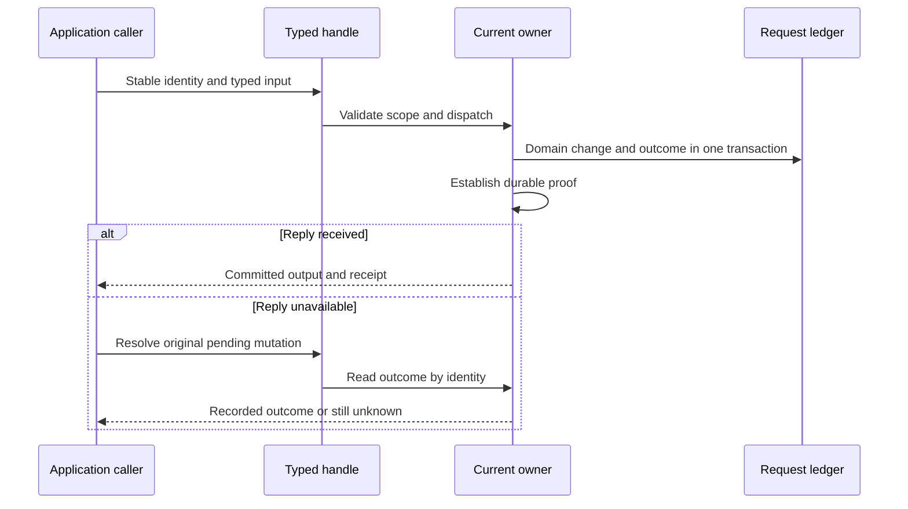

A typed command changes one addressed Cell. Its successful result contains the application output and a receipt for the committed position. The runtime stores the request outcome with the domain change and releases the response only after it has recoverable durability proof.

The caller must preserve the identity of the operation across uncertainty. A new request ID represents a new operation; it is not a substitute for resolving a timed-out call.

## Keep the identity with the attempt

`MutationIdentity` includes a request ID, issue time, and expiry. The runtime also binds the operation digest and expected identity. Reusing the same request identity and digest returns the recorded outcome. Reusing it with changed input is rejected.



`ApplicationHandle::command` performs a typed invocation after checking application scope. `prepare_command` provides a prepared mutation whose evidence can be retained across cancellation. `resolve` checks the original pending target and asks the current owner for its outcome. Keep that original evidence available to your request lifecycle.

## Handle the outcome you actually know

| Outcome | What the caller knows | Appropriate next step |
| --- | --- | --- |
| Committed success | Output has a durable receipt | Return it and preserve the receipt for reads |
| Committed rejection | Domain rejection is a recorded outcome | Explain the rejection without inventing a second attempt |
| Definitely not started | No accepted execution for this refusal | Correct the cause and retry within the allowed identity/deadline rules |
| Pending or unknown | The operation may have committed | Resolve the original mutation |
| Still unresolved | Current evidence cannot establish the result | Keep the ambiguity visible and reconcile later |

A canceled HTTP wait does not roll back accepted SQLite work. A failure after local commit is not automatically a safe retry. Publication, capture, or fencing can leave the caller with an unknown outcome even when a domain handler ran.

## Keep handlers inside their capabilities

Native handlers execute under bounded transaction-scoped contexts. Put SQL changes and emitted Effect intentions there. External API calls belong in activities or service-owned work after a durable decision, with an idempotency key accepted by the external system.

For example, accepting an order and recording an intention to notify another Cell can happen atomically in the Orders Cell. The notification's destination commits separately. Claiming that both databases changed in one transaction would hide the delivery boundary.

<DurabilityExplorer />

Use the explorer to compare object publication with configured follower-log proof. In both cases, the proof must cover the specific command's cut before its result is released.

## Run a real command

```sh
cargo run -p cellule-app --example sql --locked
```

The [SQL example source](https://github.com/crabbuild/cellule/blob/main/crates/cellule-app/examples/sql.rs) includes the generated client and the command-to-query path. Continue with [reads and receipts](/docs/crates/app/reads), or inspect the complete [invocation contract](/docs/crates/app/docs/invocation) and [runtime execution ordering](/docs/crates/runtime/docs/runtime).
