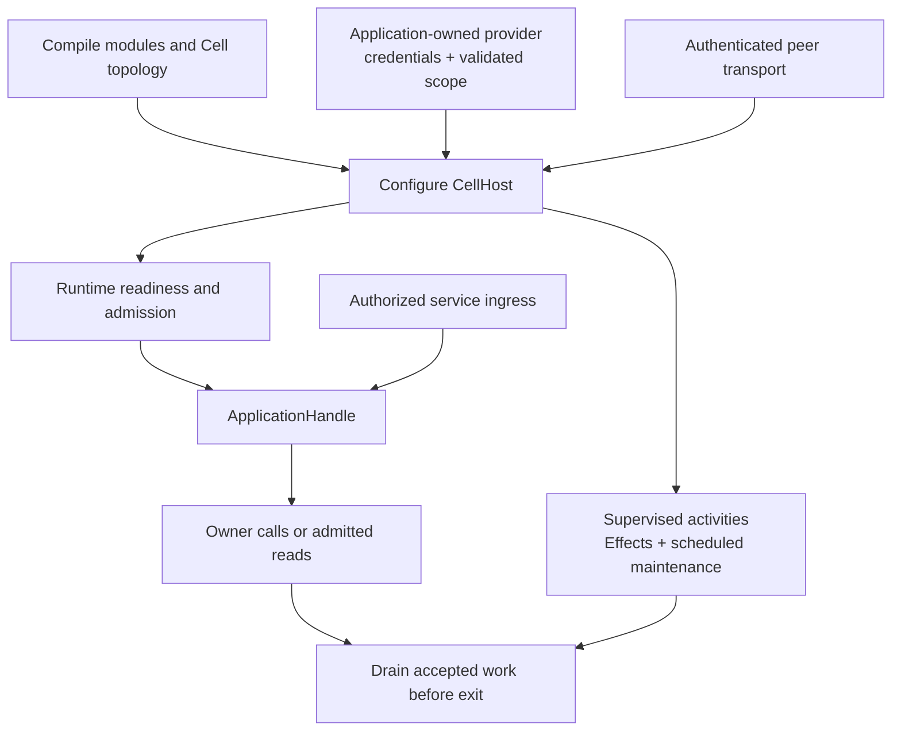

A complete service needs both a compiled application and a running node. `cellule-app` supplies the declaration and typed handles. `cellule-host` supplies lifecycle around the runtime. The embedding service provides storage credentials, authenticated ingress, peer endpoints, deployment, and product authorization.

Build that boundary explicitly: authenticate a product request, choose its tenant and application scope, then use the matching typed capability.

## Assemble the serving path



## Bring the node up in order

1. Compile the application and retain its descriptor and registry.
2. Construct a provider with the application's credentials and validated storage scope. Check required conditional-write and ranged-read capabilities.
3. Configure host resources, runtime identity, and the peer client and endpoints the deployment requires.
4. Start the node and advertise readiness only after the required serving path is ready.
5. Bind an `ApplicationHandle` to the matching client, tenant, application ID, and compiled application.
6. Supervise the activity, Effect, and scheduled-maintenance workers used by the application.

Local examples replace the provider and deployment wiring with fixtures. Their success demonstrates API and durability mechanics; it does not qualify a cloud environment.

## Give each worker a clear contract

| Work | Service responsibility |
| --- | --- |
| Activities | Run registered external handlers; make external side effects idempotent |
| Effects | Drive recorded cross-Cell intentions to the destination and reconcile retries |
| Queue consumers | Validate claims, perform idempotent work, then acknowledge |
| Cron and workflow maintenance | Supervise the scheduled ticks and durable transitions used by the module |
| Read replicas | Install admission, selection, and authenticated peer access before enabling the policy |

A durable record preserves a decision; a running worker makes progress on it. Restarting a process should resume from the ledger or primitive state, rather than inventing a new request identity for the same accepted work.

## Plan shutdown as part of startup

Stop admitting new product work, then drain accepted mutations and the background tasks participating in the node's lifecycle. Release ownership and withdraw the node session in the host's documented order. Await worker completion so SQLite handles, leases, admission slots, and tasks are released on both success and failure paths.

If a client disconnects during drain, its accepted mutation still needs durable completion or an explicit unknown outcome. The caller can resolve that identity later. A process exit is not evidence that an in-flight operation rolled back.

## Extend the runnable examples

```sh
cargo run -p cellule-app --example blob --locked
cargo run -p cellule-app --example workflow --locked
cargo run -p cellule-app --example schedules --locked
```

Use [the application example guide](/docs/crates/app/docs/examples) to select a complete source file. Blob demonstrates the body-publication boundary; workflow and schedules demonstrate durable progress and external work. Read [framework integration](/docs/guides/framework) and [host lifecycle](/docs/crates/host/docs/lifecycle) before replacing fixtures with a serving node.

For a contract change, update its descriptor, typed client, handlers, examples, and tests together. The [application reference](/docs/crates/app/docs) and [runtime qualification guide](/docs/crates/runtime/docs/delivery) separate local checks from provider and production evidence.
