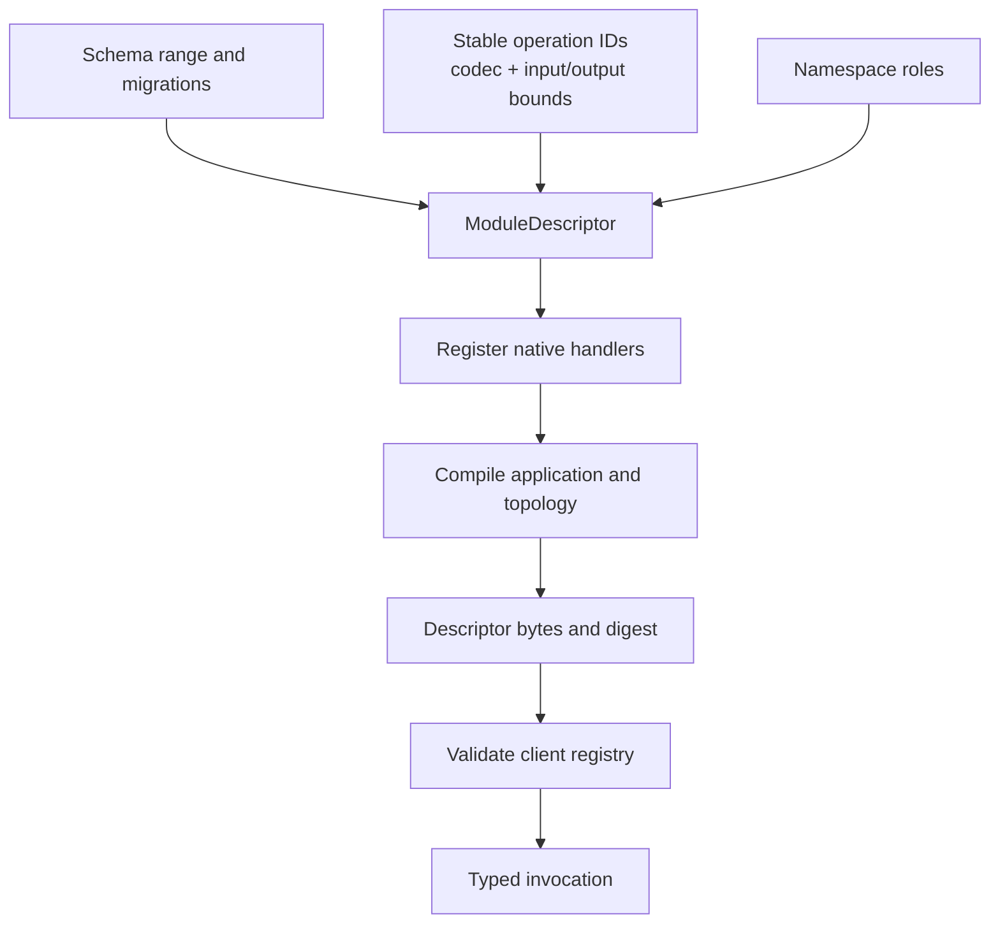

A module is a native Rust implementation of domain behavior. Its descriptor declares the operations and schema versions that the runtime is allowed to execute. `ApplicationBuilder` combines registered modules with Cell types into an immutable `CompiledApplication`.

The descriptor makes routing and compatibility explicit. The application that generates a client and the application running on a node must agree on the registry behind those operations.

## Declare behavior before dispatch

| Declaration | Why it matters |
| --- | --- |
| Module name and source digest | Identify the compiled behavior being served |
| Command and query IDs | Keep wire dispatch stable across compatible releases |
| Codec version and value limits | Bound decoding, inputs, and results |
| Schema range and migrations | State which persisted databases this code understands |
| Namespace and catalog role | Bind a capability to the intended class of Cell |
| Workflow and activity declarations | Register the durable work that the application can run |

For a Settings module, registering a KV capability includes the primitive operations it uses. For a custom SQL module, registration installs typed commands and queries. A generated method is only useful when the matching operation is present in the registry.

## Compile one artifact

Implement `CellApplication::register` to register modules and declare the Cell types. Compilation validates the registry and topology, rejects duplicate Cell type identities, and produces bounded deterministic descriptor bytes. The descriptor includes the registry digest and topology fields; its digest changes when those contract bytes change.

Use the same compiled application to configure the host and construct its `ApplicationHandle`. The handle checks the application author type and client registry before accepting invocations. This catches a mismatched client at the boundary, before it sends an operation under the wrong compiled contract.

## Treat changes as compatibility work

A display label and a stored namespace have different consequences. Changing a namespace, role, partition encoding, operation ID, or codec can change where state lives or how old bytes are interpreted. Review the descriptor producer, generated client, registry consumers, persisted state, and tests together.

| Change | Review before release |
| --- | --- |
| Add a command | Descriptor registration, codec fixtures, bounds, and handler behavior |
| Change a wire shape | New codec version and decoding compatibility |
| Add a schema version | Contiguous migration coverage and supported code/schema pairs |
| Change a Cell type | Namespace, role, partition scheme, and descriptor digest |
| Add an activity | Registration, external idempotency, and worker lifecycle |

A schema range is an accepted interval, not a promise that arbitrary historical code can execute every newer database. Deployment and migration must respect the runtime's registered compatibility rules.

## Study a complete module

The [basic example](https://github.com/crabbuild/cellule/blob/main/crates/cellule-app/examples/basic.rs) shows module descriptors, primitive registration, namespace declarations, and application compilation in one file. Follow its Settings and Jobs implementations rather than copying only the final builder call.

For custom operations, continue with [Native Rust authoring](/docs/crates/runtime/docs/rust-api). For the state addresses bound into the descriptor, read [Cell topology](/docs/crates/app/topology). Keep the [canonical descriptor contract](/docs/crates/app/docs/topology) open while changing a persisted declaration.
