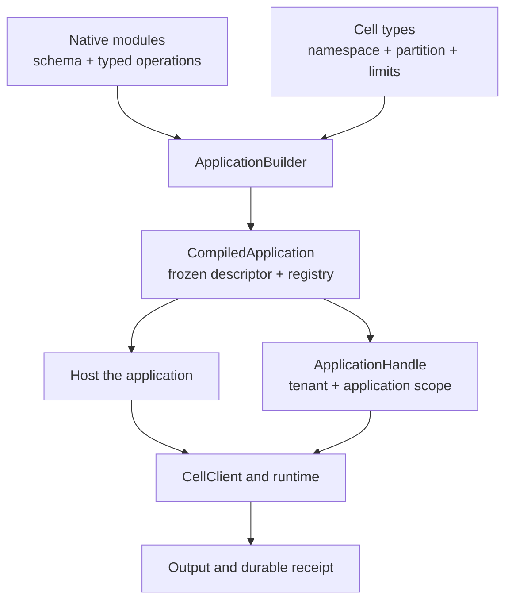

`cellule-app` turns a set of statically linked Rust modules into one compiled application. It binds those modules to stable namespaces, partition strategies, schema ranges, and resource limits. A typed application handle then exposes operations within a tenant and application scope.

Start here when you are building a domain such as orders, settings, or jobs. The runtime already provides the durability machinery; this layer describes which operations your application can perform and where their state belongs.

## Follow the application path



| Step | What you decide | Guide |
| --- | --- | --- |
| Define behavior | Modules, operation IDs, codecs, and migrations | [Modules and descriptors](/docs/crates/app/modules) |
| Define state boundaries | Namespaces, roles, and partition keys | [Cell topology](/docs/crates/app/topology) |
| Invoke a mutation | Stable request identity and outcome handling | [Commands and outcomes](/docs/crates/app/commands) |
| Read committed state | Owner policy or explicit replica minimum | [Reads and receipts](/docs/crates/app/reads) |
| Serve the application | Host wiring, workers, ingress, and drain | [Service integration](/docs/crates/app/integration) |

## Run before extending

```sh
cargo run -p cellule-app --example basic --locked
cargo run -p cellule-app --example sql --locked
```

The [basic example](https://github.com/crabbuild/cellule/blob/main/crates/cellule-app/examples/basic.rs) compiles Settings and Jobs Cell types, performs a KV write, reads at its receipt, and claims and acknowledges a Queue item. The [SQL example](https://github.com/crabbuild/cellule/blob/main/crates/cellule-app/examples/sql.rs) shows an entity-scoped Orders Cell and a typed query. Both use local fixtures, so you can study the API without credentials or an HTTP service.

Read these examples in three passes: first the module descriptor, then the application registration, then the invocation and shutdown. Preserve their explicit error handling when adapting them. Changing only a domain handler while overlooking its declared operation limits or schema range creates an incomplete application contract.

## Keep responsibilities clear

| Layer | Responsibility |
| --- | --- |
| Your application | Domain rules, module code, partition choices, authentication, credentials, and ingress |
| `cellule-app` | Compile and validate topology; bind typed capabilities to application scope |
| `cellule-runtime` | Route calls, fence ownership, record outcomes, establish durable proof, and recover |
| `cellule-host` | Node lifecycle, readiness, background workers, and orderly drain |

A compiled descriptor describes an application; it does not start a node. A handle uses an already configured client; it does not provision storage or authorize a product user. Authenticate the request before choosing its tenant scope.

## Design one complete operation

For an order update, put the order and its line items in one Cell if their totals must agree after every command. Return the committed receipt with the result. Use it as the minimum for a subsequent order query. Emit an Effect if another Cell must react; that destination commits independently.

This reading path moves from declaration to invocation to hosting. The [canonical application reference](/docs/crates/app/docs) remains the source for the crate's exact contracts and runnable example inventory.
