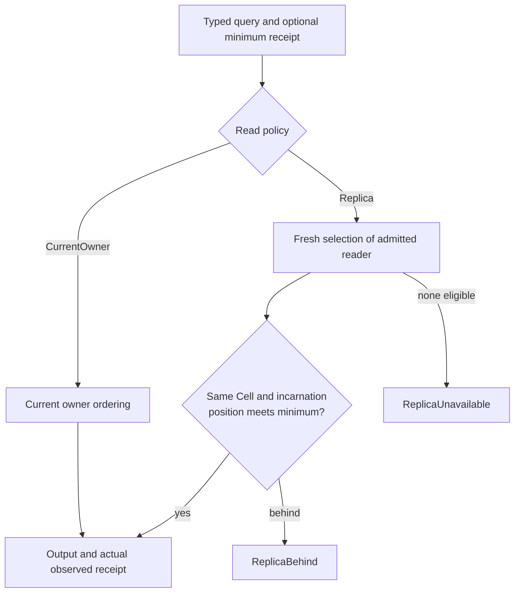

A receipt lets your application carry a committed position from a command into a later query. It belongs to one Cell and incarnation. It is a lower bound for that Cell's read, rather than a snapshot of the whole application.

For an order confirmation screen, pass the order command's receipt to the follow-up order query. That query must observe at least the committed position you just showed as successful.

## Choose the route explicitly

| Call | Routing behavior |
| --- | --- |
| Default typed query | `ReadPolicy::CurrentOwner`; follows owner order |
| Query under `ReadPolicy::Replica` | Uses an admitted replica and returns its actual observed receipt |
| Command | Current owner |
| Outcome resolution | Current owner |
| Stream or primitive lease validation | Remains owner-ordered |

`ApplicationHandle::with_read_policy` returns a handle with an explicit typed-query policy. It does not change command routing. Replica policy requires host-configured reader admission and an authenticated peer client. A handle alone cannot create a reader fleet.

## Try the consistency boundary

<ReadConsistencyLab />

Compare a lagging reader with one that has caught up, then select an unavailable reader or a receipt from another Cell. Choosing the owner is an explicit caller decision. The client does not silently convert a failed replica query into an owner query.

## Interpret the observed position

Suppose an Orders command returns sequence 12. A query requiring that receipt cannot accept sequence 11 for the same Cell incarnation. Sequence 13 can satisfy the lower bound, so a later committed change may also be visible. A receipt from Jobs cannot establish that Orders has caught up, even if its sequence number is larger.

When combining values from multiple Cells, maintain a receipt per Cell if your application requires those individual minimums. Those receipts do not establish a shared distributed transaction or a global ordering between independent Cells.

## Handle lag as part of the product flow

On `ReplicaBehind`, your application can show a pending state or explicitly issue an owner query according to its own policy. On `ReplicaUnavailable`, it can report that the selected read route is unavailable. Preserve the distinction for observability and avoid calling a stale result current merely because it arrived quickly.

Replica selection and query retries share the documented five-second deadline. Refreshing placement does not grant each attempt another full budget. Queries report the actual receipt they observed so the caller can continue carrying evidence instead of assuming every response reflects the latest write.

## Check the serving boundary

The host installs `ReplicaReadRouter` and the authenticated `ReplicaPeerClient` on the runtime client. Reader readiness must reflect the snapshot and its resource admission. Your service owns credentials, endpoint authorization, and how read outcomes map to its UI or public API.

Continue with [service integration](/docs/crates/app/integration). The [runtime replica guide](/docs/crates/runtime/reads) explains admission and selection; [typed invocations](/docs/crates/app/docs/invocation) defines the application-facing contract.
