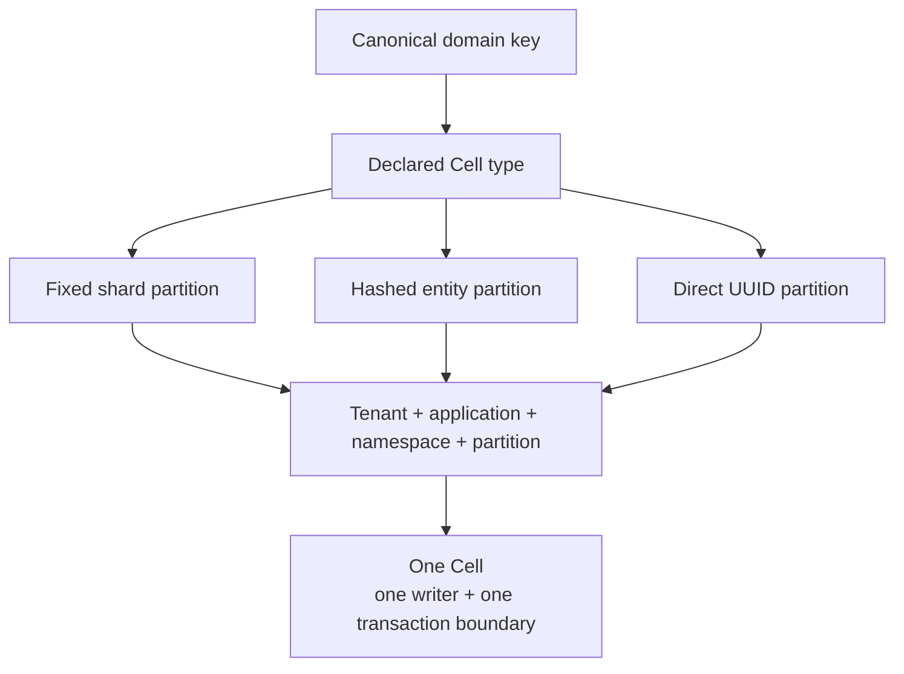

Topology answers where a command's state lives. A `CellType` names a module, namespace, catalog role, and partition strategy. A `CellTarget` supplies the tenant, application, namespace, and partition for one addressed Cell.

Start with the invariant: which records must change together? Orders and line items whose totals must agree belong in the same Cell. Independent orders can use separate partitions. Separate Cells can progress independently, but they do not share one SQLite transaction.

## Explore the boundary

<CellModelLab />

Changing the tenant or order selects another addressed Cell. Moving ownership between nodes preserves the target. The diagram is illustrative; actual partition bytes come from the declared strategy.

## Select a partition strategy

| Strategy | Declaration | Best fit | Persisted encoding |
| --- | --- | --- | --- |
| Fixed shards | `CellType::new` with a shard count | Namespace primitives and a bounded set of partitions | Partition version 1 |
| Hashed entity key | `with_entity_partitions` | A separate Cell for each canonical domain key | Version 2; 33-byte partition |
| Direct UUID | `CellType::entity_uuid` | SQL entities addressed by canonical UUID bytes | Version 3; 16-byte partition |

Entity strategies declare one shard. Direct UUID input must have a recognized version from 1 through 8 and RFC variant bits. The generated client routes those bytes unchanged. Hashed entity routing derives a partition from canonical key bytes. A `CellKey` implementation must return the same bounded bytes for the same logical key across compatible releases.



## Declare an Orders Cell

This small declaration uses the same API as the packaged application guide:

```rust
use cellule_app::CellType;
use cellule_runtime::{CatalogRole, NamespaceId};

fn orders_topology() -> cellule_runtime::Result<CellType> {
    CellType::new(
        "orders", "orders", NamespaceId::from_bytes([1; 16]),
        CatalogRole::Sql, 1,
    )?.with_entity_partitions()
}
```

The declaration describes routing. It does not create every possible entity Cell immediately or authorize an end user to access those entities.

## Match capabilities to the topology

KV, Blob, Queue, Cron, Workflow, and Activities namespace helpers derive fixed-shard targets internally and require fixed-shard declarations. Explicit SQL capabilities and Effect source capabilities accept an explicitly selected target, including an entity partition. The application handle validates tenant, application, namespace, module, role where applicable, and partition shape before invocation.

Do not route an entity namespace through a fixed-shard helper: it would select a different address. Treat switching partition schemes as a persisted identity change rather than an implementation optimization.

## Set limits beside the declaration

`with_schema_range` states which database schema versions this Cell type accepts. `with_limits` bounds database and capture sizes per Cell. Host and runtime admission still apply node-wide resource budgets. A small Cell ceiling does not bound HTTP request bodies, external work, or the entire node's storage footprint.

Continue with [commands and outcomes](/docs/crates/app/commands). See the [canonical topology reference](/docs/crates/app/docs/topology) for partition contracts and the [ownership chapter](/docs/concepts/ownership) for placement and handoff.
