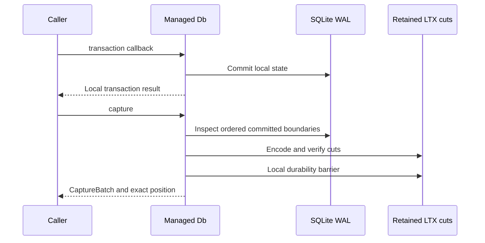

`Db` owns an exclusive SQLite writer and its capture session. Open it with a fresh metadata directory and keep external writers away from the managed database and retained LTX files. Capture depends on knowing which committed WAL boundaries belong to that session.

A transaction's local success and the framework's durable command response are different boundaries. Calling `Db::transaction` alone does not publish remote authority.

## Capture after local commit

| API | Use it for |
| --- | --- |
| `Db::open` | Claim a fresh managed session |
| `Db::transaction` | Commit one local transaction |
| `Db::transaction_with` | Preserve application rejection separately from commit/capture errors |
| `Db::capture` | Produce ordered cuts after the local barrier |
| `Db::capture_deferred` | Produce readable cuts with pending local durability |
| `Db::durability_barrier` | Flush pending cuts and their directory chain |
| `Db::checkpoint` | Capture the boundary before SQLite checkpoint |
| `Db::snapshot` | Build an independent full image |

## Preserve every committed boundary

LTX reconstruction starts with a full snapshot and follows an ordered contiguous chain. Capture cannot silently drop a committed transaction to meet a budget. If one delta exceeds `max_capture_bytes`, the implementation creates a full image bounded by `max_file_bytes`.

This changes representation, not the requirement to include committed state. If the state cannot fit the accepted limits, preserve the failure and let the owner fence or reconcile according to its phase. Increasing a limit blindly is not evidence that the lineage is complete.

## Use deferred durability deliberately

Deferred capture can make bytes readable before their local durability barrier has completed. A caller must cross the barrier or establish a published-root proof before acknowledging on that basis. Retain the exact batch and keep it under resource accounting until the appropriate proof exists.

The distributed runtime coordinates these cuts with object or follower proof. An application using the local LTX API must not borrow the runtime's guarantee without implementing that response boundary.

## Checkpoint through the managed owner

Checkpointing changes WAL retention. Use the managed checkpoint path so capture records the necessary boundary first. External checkpoint or write activity can invalidate the session's assumptions. Keep the writer, capture files, and their cleanup under one owner.

Closing a session also belongs in orderly error handling. Accepted or dispatched work must be awaited or reconciled; cancellation of a caller does not prove that a local transaction failed to commit.

## Study the complete sequence

Run the [local round-trip example](https://github.com/crabbuild/cellule/blob/main/crates/cellule-ltx/examples/local_roundtrip.rs) and compare its captured position with the restored result. Continue with [root publication](/docs/crates/ltx/publication) to see when those cuts become selected state. The [canonical capture contract](/docs/crates/ltx/docs/capture) and [LTX crate reference](/docs/crates/ltx) contain the API details and compiled local example.
