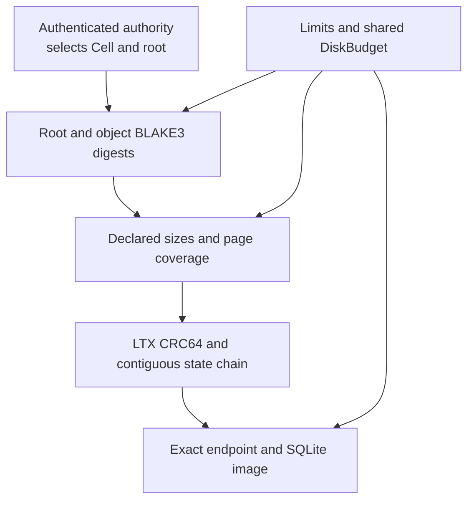

LTX safety combines format verification with resource limits and ownership discipline. Checksums detect invalid file structure and state chains. Digests bind immutable objects. The authenticated authority record selects the root that recovery is allowed to use.

These mechanisms answer different questions. Passing a checksum does not establish that a root was authorized for this Cell.

## Layer the evidence

| Check | Detects or constrains |
| --- | --- |
| Cell scope and authority selection | Foreign or unauthorized selected state |
| BLAKE3 object and root digests | Content substitution or corrupt immutable bytes |
| CRC64 and rolling database state | Invalid LTX structure or broken state chain |
| Ordered full snapshot plus deltas | Gaps and reordered reconstruction |
| Declared size and page coverage | Malformed, oversized, or incomplete data |
| Fresh destination | Accidental overwrite of existing state |

CRC64 is not an authenticator. Credentials and authority authentication remain the service's responsibility.

## Use the error class to choose the next action

`LtxError::classify()` exposes the caller-facing recovery strategy:

| Class | Caller response |
| --- | --- |
| `Retryable { after }` | Retry within the caller's budget and honor the suggested delay |
| `Capacity` | Reduce or release resources; the refused side effect did not proceed |
| `Permanent` | Change invalid input or selected state |
| `Ambiguous` | Reconcile before retrying |
| `Fenced` | Close the session and restore authoritative state |

Interpret this together with the enclosing runtime phase. A command that already committed can remain unknown even when a later operation reports capacity. Do not discard invocation evidence by flattening every nested error into a refusal.

## Bound the actual resource footprint

`Limits` bounds file, capture, and database size. `DiskBudget` and host admission account for local scratch, retained cuts, and remote I/O. Captured batches, reconstruction images, and compaction output need accounting for their full lifetimes, including error cleanup.

A database's occupied SQLite bytes do not include every WAL file, captured segment, cache, or scratch artifact. Size node resources from the complete path rather than treating one database ceiling as the entire disk budget.

## Preserve dispatched work through cancellation

The host owns scheduling and cancellation. Once work has been dispatched, the caller must await its completion or reconcile its result. Dropping a wait does not prove that writes were rolled back. Fenced capture state must not keep acknowledging unprovable cuts.

Keep the first failure available when cleanup also fails. Pruning, temporary-file removal, and handle closure belong to explicit ownership paths rather than detached best-effort tasks.

## Verify format changes with real consumers

External decoder vectors and fuzz entry points are available in [decoder vectors](/docs/crates/ltx/tests/vectors) and [fuzz targets](/docs/crates/ltx/fuzz). Review capture producers, restore consumers, immutable layout, and persisted IDs together before changing a format.

See [the safety reference](/docs/crates/ltx/docs/safety), [storage failure handling](/docs/crates/store/failures), and [runtime qualification](/docs/crates/runtime/docs/delivery) for checks at the appropriate level.
