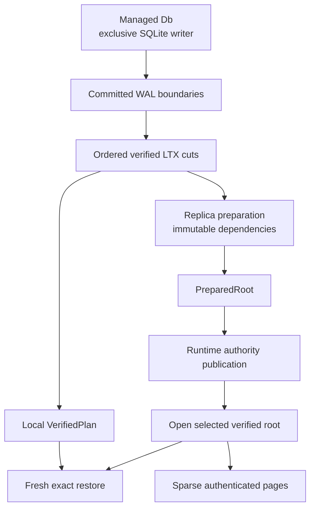

`cellule-ltx` owns managed SQLite WAL capture and exact LTX reconstruction. The optional `replica` feature adds immutable Cell roots, object transport, compaction, and authenticated paged reads. The runtime selects authority; LTX supplies the verified bytes that authority names.

Start with the local round trip to understand capture and restore before adding object publication or a distributed owner.

## Follow the bytes



| Guide | Learn the boundary |
| --- | --- |
| [Managed capture](/docs/crates/ltx/capture) | Local transaction, capture, deferred barrier, and checkpoint |
| [Root publication](/docs/crates/ltx/publication) | Immutable preparation, authority CAS, pruning, and compaction |
| [Recovery and hydration](/docs/crates/ltx/recovery) | Exact reconstruction, fresh destinations, and sparse activation |
| [Safety and limits](/docs/crates/ltx/limits) | Checksums, digests, admission, failure classes, and cancellation |

## Run the local round trip

```sh
cargo run -p cellule-ltx --example local_roundtrip --locked
```

The [complete runnable example](https://github.com/crabbuild/cellule/blob/main/crates/cellule-ltx/examples/local_roundtrip.rs) writes a managed database, captures its lineage, removes the source, restores a fresh database, and reads the result. It demonstrates that recovery depends on the captured proof rather than the original SQLite file.

## Distinguish the positions

A SQLite commit establishes local state. A capture describes committed cuts and their exact LTX position. A prepared root identifies immutable dependencies. Authority publication selects that root for the Cell. Only the owning runtime can apply the distributed response gate, including a configured follower-log proof.

These boundaries matter when something fails. Uploaded bytes may be unreachable after a failed CAS. A local commit may require reconciliation after capture failure. A verified root remains a reconstruction plan, not an owner lease.

## Keep the transport and authority separate

| Layer | Owns |
| --- | --- |
| `cellule-store` | Provider-neutral reads, writes, conditional operations, and transport errors |
| `cellule-ltx` | Capture session, file verification, immutable layout, and reconstruction |
| `cellule-runtime` | Owner fencing, authority selection, outcome ledger, and response release |
| Embedding service and host | Provider configuration, scheduling, credentials, and resource policy |

Do not infer the selected root from a bucket listing or choose a new writer because a file can be opened. Follow [runtime authority](/docs/crates/runtime/authority).

The [canonical LTX reference](/docs/crates/ltx/docs) defines the APIs; [source lineage and licenses](/docs/crates/ltx/upstream) records upstream provenance. External decoder vectors and fuzz harnesses stay available under Reference for contributors checking format compatibility.
