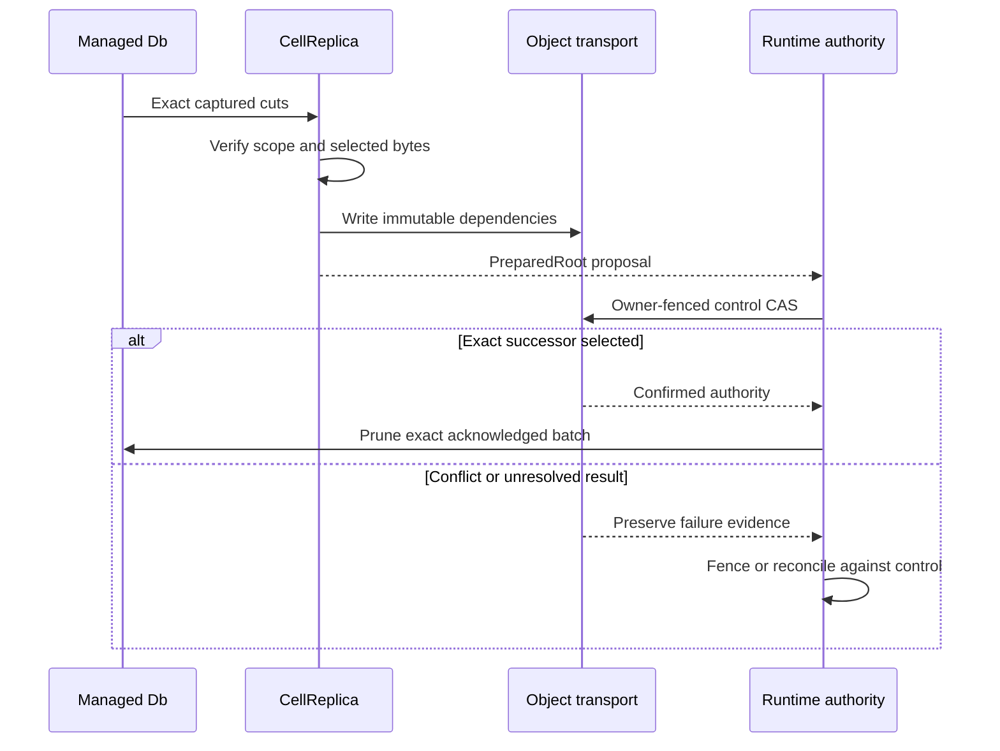

Root publication joins two separate responsibilities. `CellReplica` verifies and uploads immutable content. Runtime authority conditionally selects an exact root for the fenced owner. Preparing bytes does not grant a lease or make a state authoritative.

The boundary is visible when publication fails: uploaded objects can exist without any authority record selecting them.

## Prepare, select, then prune

| Operation | Responsibility |
| --- | --- |
| `CellReplica::prepare` | Verify cuts and write immutable root dependencies |
| `prepare_bundle` | Select this Cell's exact rows from a shared bundle |
| `prepare_compaction` | Rewrite representation while preserving logical state |
| Runtime CAS | Select owner and exact root under the authority contract |
| `Db::prune_captured` | Remove only the successfully published capture batch |

## Pin the proposal's bytes

Provider retries must operate on the selected capture bytes. Pinning and rechecking them prevents a local path replacement from changing an in-flight proposal. An immutable path collision is acceptable only when the already stored bytes are identical; different bytes indicate a failure.

Do not retry preparation by reading whatever now happens to exist at the same path. The original cut and proposed successor are the evidence to preserve.

## Handle an uncertain CAS

A failed conditional update does not acknowledge the prepared state. A lost response requires reconciliation: authority may already name the exact proposed successor. The runtime reads control and compares the proposal before adopting it or fencing. It does not execute the domain command again as a publication retry.

Unreachable prepared content can be collected later under the documented maintenance protocol. Never prune the only retained captured evidence simply because all uploads completed.

## Compact without changing the command history

Compaction rewrites a root's representation into a verified full snapshot while preserving its logical position and state. It must retain the request ledger, schema, sequence, and other runtime metadata. Authority still selects the successor; compaction does not invent a new application command.

`compact_exact` does not delete its inputs. Input retention and unreachable-object collection are separate lifecycle decisions. A background compactor needs the same resource and cancellation discipline as other dispatched work.

## Relate publication to command acknowledgement

The runtime can acknowledge through exact object publication or a configured recoverable follower-log proof. In the follower path, object publication may coalesce a bounded range of already proved commits. Each response still needs proof covering its own cut. An arbitrary upload is never that proof.

Continue with [recovery and hydration](/docs/crates/ltx/recovery). Compare [the canonical publication contract](/docs/crates/ltx/docs/publication), [runtime authority](/docs/crates/runtime/authority), and [storage operations](/docs/crates/store/operations) before changing a proposal, retry, or pruning path.
