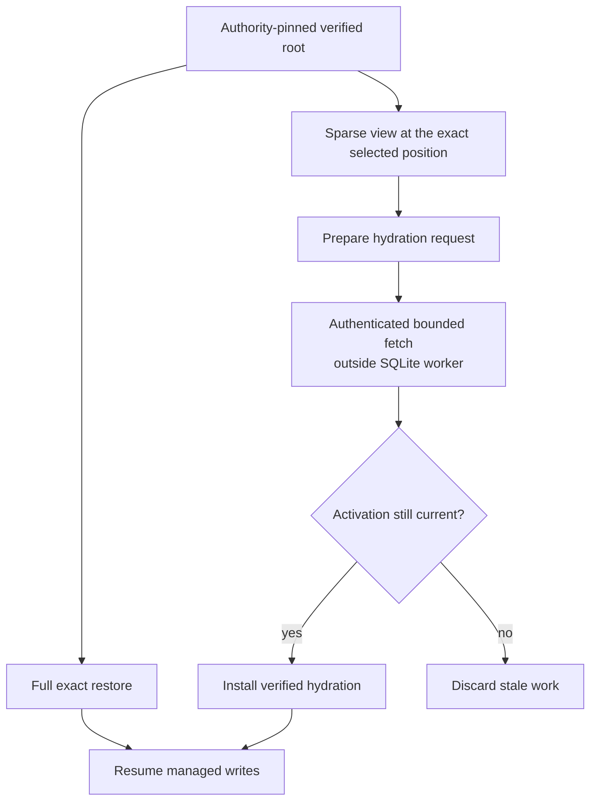

Recovery starts with a selected position, not a search for the newest object. Runtime authority supplies the root for a Cell. LTX verifies the root, ordered dependencies, checksums, page coverage, and endpoint before reconstructing the database.

The result must be byte-identical to the selected state or recovery fails. A plausible-looking database with missing chunks is not a successful restore.

## Inspect the recovery gate

<RecoveryExplorer />

Switch between verified and corrupt chunks. Activation stays blocked when required bytes cannot be verified. Successful recovery includes SQLite data and the request ledger, which lets the next owner resolve previously accepted operations.

## Select the reconstruction API

| API | Purpose |
| --- | --- |
| `VerifiedPlan::new` | Verify a complete snapshot-plus-delta chain and own the reconstructed image |
| `restore_exact` | Restore a requested endpoint into a fresh destination |
| `compact_exact` | Produce a verified full snapshot without deleting inputs |
| `CellReplica::open_root` | Verify Cell scope, root metadata, chain, and directory |
| `VerifiedRoot::restore` | Stream the selected root into a fresh destination |
| `VerifiedRoot::paged` | Serve authenticated page and page-run reads |
| `Db::resume` | Continue a verified lineage in a fresh session |
| `Db::open_resumed` | Continue a clean local image without an origin read |

Fresh destinations protect existing state. Do not restore over an unrelated database or use a partial reconstruction as a shortcut around the verification gate.

## Understand sparse activation

Sparse activation retains the exact selected position while fetching required pages on demand. `prepare_hydration`, authenticated fetch, and `install_hydration` separate network work from the SQLite worker. Installation checks that the activation is still current so late hydration cannot overwrite newer pages.

The optimization changes when bytes are materialized locally. It does not weaken Cell identity, root verification, or fencing.

## Recover outcomes as well as domain rows

Suppose an Orders command committed and its reply was lost. Restoring just the Orders table while dropping `sys_requests` would lose the evidence needed to deduplicate or resolve it. Exact state includes runtime metadata and the outcome ledger selected by the root.

For a follower-backed acknowledgement, takeover also consumes the sealed recovery evidence required by the runtime protocol. Opening an object root alone is not proof that every acknowledged follower cut is covered.

## Fail closed on missing evidence

A missing dependency, checksum mismatch, scope mismatch, or inconsistent endpoint stops recovery. Keep the original verification cause for diagnosis. A bucket listing cannot supply a substitute root, and a local cache cannot authorize serving.

Read [the canonical recovery contract](/docs/crates/ltx/docs/recovery), [runtime storage](/docs/crates/runtime/docs/storage), and [follower failover](/docs/crates/runtime/docs/failover-and-followers) for the exact reconstruction and activation protocol.
