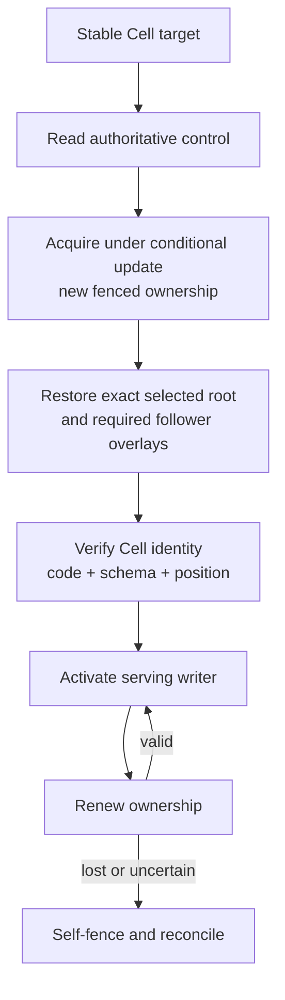
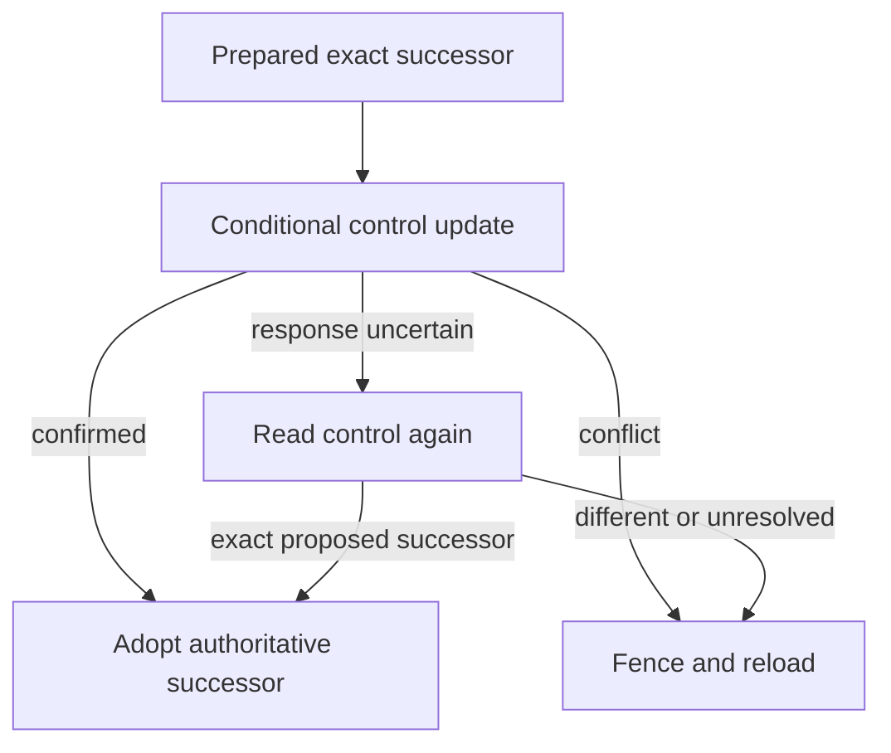

A Cell target stays stable while its owner can move. The authoritative control record selects the current owner, incarnation, epoch, serving state, and exact root. An owner may execute and publish only while its fencing conditions remain valid.

Placement decides where to try hosting a Cell. Authority decides whether that node is allowed to serve it. A placement hint or cached endpoint is not permission to write.

## Acquire, recover, then serve

Acquisition does not skip recovery. A successor must reconstruct the selected state, verify the database metadata, and consume any acknowledged follower evidence required by takeover before admitting commands.

## Understand what the control record selects

| Field family | Meaning |
| --- | --- |
| Cell and incarnation | Bind the record to the addressed state generation |
| Owner and epoch | Identify the permitted writer and fencing generation |
| Revision and state | Support conditional transitions through recovery, serving, idle, and tombstone states |
| Root and progress | Select the exact durable state boundary |
| Code and schema | Bind serving behavior to supported persisted state |
| Due summary | Preserve the durable scheduling boundary |

The object store provides conditional transport. The runtime interprets the authority transition. LTX prepares verified immutable bytes. These responsibilities stay separate even when the control record and immutable objects use the same provider.

## Reconcile ambiguous publication

A transport timeout after a conditional update is not proof that the update failed. Reconciliation compares the exact successor; it does not rerun the SQL handler to manufacture a new proposal. An uncertain write must remain uncertain until authoritative evidence resolves it.

## Reuse local state only with proof

A local continuity record can avoid unnecessary reconstruction when the documented checks match. It never grants ownership. The worker still verifies Cell identity, incarnation, code, schema, sequence, and SQLite position against authority. A stale or foreign image is discarded rather than served.

A bucket listing also cannot choose a recovery root. The newest-looking object may be unreferenced preparation from a failed publication. Follow the root selected by control and verify every required dependency.

## Handle ownership loss visibly

Self-fencing stops new work under the lost ownership and quarantines unproved local state. Accepted operations still require a durable result or explicit unknown outcome. Lease renewal preserves the root, code, schema, and due summary while updating liveness fields; it is not a new state publication.

Continue with [node lifecycle](/docs/crates/runtime/lifecycle) for readiness and drain. The exact contracts are in [Authority, storage, and recovery](/docs/crates/runtime/docs/storage), [Execution and receipts](/docs/crates/runtime/docs/runtime), and [Follower durability and warm failover](/docs/crates/runtime/docs/failover-and-followers).
