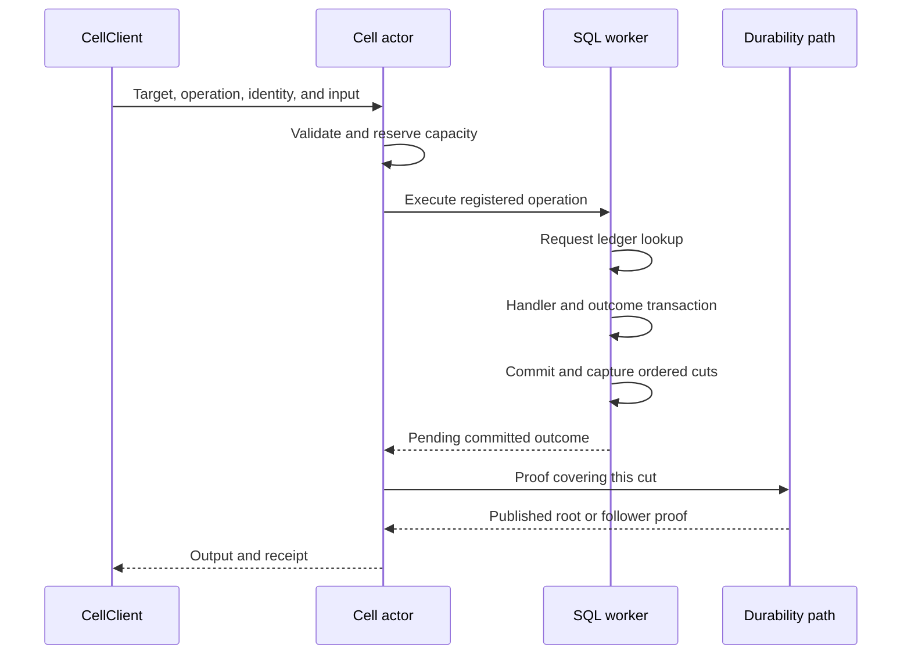

One Cell actor owns the command state machine. A stable SQL worker owns that Cell's managed SQLite connection. The actor coordinates admission and the response gate; the worker executes the registered handler under a bounded transaction boundary.

This separation allows the runtime to account for queued work, retain ownership of dispatched work after caller cancellation, and fence a worker whose local state can no longer be proved.

## Trace the ordered phases

| Boundary | Required evidence |
| --- | --- |
| Before dispatch | Valid target, operation, owner epoch, deadline, and resources |
| Before handler execution | Request ID and digest do not already identify a conflicting or recorded outcome |
| At local commit | Domain changes and encoded request outcome commit together |
| At capture | Every committed WAL boundary is represented in the lineage |
| At response release | Publication or recoverable follower proof covers the command's cut |

The ledger is what makes outcome resolution useful. A retry with the same identity and digest can return the saved result without rerunning the handler. Changed input under that identity is rejected.

## Bound execution and waiting separately

A dispatched worker job keeps its slot and reservation until execution finishes, including when the caller is canceled. A waiting job does not take another worker's execution slot. The Cell mailbox, SQL pool, encoded input, maximum output, disk use, and pending publication all have separate bounds.

A client configured for admission backpressure may wait for known capacity to become available. Its clones share finite call and input-byte budgets. Known capacity refusals can be retried within the configured wait policy; fencing and ambiguous outcomes remain visible. Waiting does not erase command expiry or give accepted work a rollback guarantee.

## Distinguish refusal from uncertainty

| Failure point | Meaning |
| --- | --- |
| Validation or admission refusal before dispatch | Execution has not started |
| Capture failure after SQLite commit | Local state is fenced; outcome needs resolution |
| Another authority CAS wins | Reload authority; tentative local state cannot keep serving |
| Timeout after SQL starts | Interrupt and await worker exit; outcome can be unknown |
| Reply lost after durable completion | Resolve the stable identity to recover the recorded result |

Do not map every capacity-related error to “not started.” Capacity can fail during publication after the handler committed. Preserve the enclosing invocation outcome and its source error.

## Keep the handler deterministic within its context

`CommandContext` supplies the verified target, sequence, sampled logical time, bounded SQL, and Effect emission. The handler does not manually commit, select the authoritative root, or call an arbitrary external service. `QueryContext` provides read-only access and does not create LTX or publish control changes.

For an Orders command, update rows and record an Effect intention within the one Cell transaction. Use an activity or an idempotent destination for later external work. Review [durable work](/docs/crates/runtime/work) for that boundary.

See [Execution and receipts](/docs/crates/runtime/docs/runtime) for full phase ordering, deadline handling, and panic recovery. Run the [application SQL example](https://github.com/crabbuild/cellule/blob/main/crates/cellule-app/examples/sql.rs) to observe the resulting command and query behavior.
