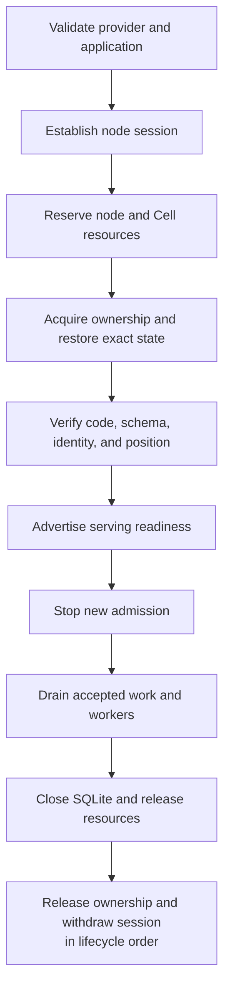

A node is ready when its required serving path is ready, not merely when its process has started. Cell activation must satisfy identity, ownership, recovery, code/schema compatibility, and resource admission before it can serve requests.

`cellule-host` supervises lifecycle around `cellule-runtime`. The service provides the deployment and provider environment in which those checks run.

## Follow activation through drain

The exact shutdown ordering includes the authority and worker steps in the host contract. Treat the diagram as a reading map; use the [host lifecycle reference](/docs/crates/host/docs/lifecycle) when implementing the transitions.

## Account for each resource owner

| Resource | Lifetime to preserve |
| --- | --- |
| SQL worker and connection | Remain owned until dispatched execution exits and the handle closes |
| Mutation admission | Covers the accepted attempt, including after caller cancellation |
| LTX scratch and retained cuts | Remain charged until verified publication or safe cleanup |
| Reader snapshot | Holds admitted memory, disk, and descriptors until replacement or removal |
| Activity or Effect task | Holds its task and lease through completion or documented reconciliation |
| Owner lease and node session | Follow the host's fencing and drain ordering |

Per-Cell limits from the compiled application and node-wide memory, disk, and execution limits cooperate. Neither replaces the other's accounting. Ingress body size and caller-owned input also require service-level bounds.

## Handle pressure without inventing rollback

Before execution, capacity can be refused or the configured client can wait within a bounded admission policy. After execution starts, the runtime must complete, fence, or return an unknown outcome according to its protocol. Pressure during publication cannot be downgraded to a harmless pre-dispatch refusal.

Shed new work using readiness and admission. Preserve accepted operations, source errors, and outcome evidence. A timeout budget bounds caller waiting; it does not allow abandoning a SQLite callback that still owns resources.

## Drain on every exit path

Stop admitting new work, supervise accepted operations to their durable result or explicit ambiguity, and await worker termination. Release leases, slots, tasks, SQLite handles, and scratch reservations even when a step fails. A cleanup failure should preserve the original cause rather than replacing it with a generic shutdown error.

Owner loss may require fencing instead of ordinary drain. Recovery must then choose authority-selected state and any required follower overlay. The next owner cannot assume that process termination canceled previously accepted mutations.

## Validate at the correct level

Local unit and integration checks establish local contracts. Provider probes establish required storage capabilities. Fault and process profiles require their documented isolated environment; production qualification needs matching raw evidence. Keep those profiles intact when investigating a failure.

The [qualification guide](/docs/crates/runtime/docs/delivery) distinguishes these levels. Continue with [framework integration](/docs/guides/framework), [host lifecycle](/docs/crates/host/docs/lifecycle), and [execution ordering](/docs/crates/runtime/docs/runtime) for exact readiness, admission, and drain behavior.
