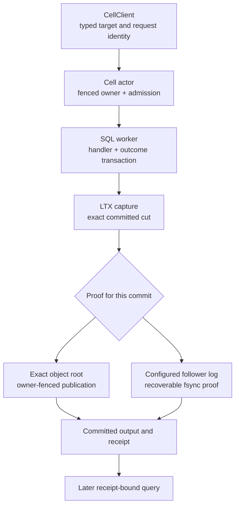

`cellule-runtime` coordinates addressed Cells. It validates targets, admits calls, serializes each Cell's commands through its owner, runs bounded native handlers, and records recoverable outcomes. It connects SQLite execution to LTX capture, publication, follower durability, and exact recovery.

Use this section to understand the serving protocol or extend framework behavior. Application authors usually start with [cellule-app](/docs/crates/app/overview); host integrators also need [host lifecycle](/docs/crates/host/docs/lifecycle).

## Follow a command through the runtime

Every successful command needs proof for its own committed position. A local database commit, an object upload, or a live owner alone is insufficient. With configured follower durability, later SQL work can run ahead of object publication within the runtime's pending-publication bounds.

## Read the guides in protocol order

| Topic | Main question | Guide |
| --- | --- | --- |
| Execution | What happens after a command is admitted? | [Command execution](/docs/crates/runtime/execution) |
| Authority | Which owner and root may a node serve? | [Authority and fencing](/docs/crates/runtime/authority) |
| Reads | Which snapshot can satisfy a receipt? | [Read replicas](/docs/crates/runtime/reads) |
| Work | How do decisions progress across retries? | [Durable work](/docs/crates/runtime/work) |
| Lifecycle | How do activation, resource limits, and drain fit together? | [Node lifecycle](/docs/crates/runtime/lifecycle) |

## Recognize the three kinds of state

| State | Purpose | Recovery significance |
| --- | --- | --- |
| Authoritative control record | Selects owner, epoch, state, and exact root | Determines which state may be restored and served |
| Immutable LTX objects | Store verified snapshots, deltas, and root dependencies | Reconstruct the selected bytes |
| Local SQLite and caches | Execute and read the current working state | Must be verified against authority or the documented continuity proof |

A recoverable follower log adds durable evidence for acknowledged cuts that may not yet be covered by object publication. Takeover must seal and consume that evidence before serving. Treating a cached database or a bucket listing as authority would bypass this protocol.

## Keep policy at the embedding boundary

The runtime owns coordination and durable ordering. The service owns authentication, public endpoints, cloud credentials, and product routing policy. Native command contexts expose bounded SQL and deterministic metadata rather than arbitrary storage or network capabilities.

The optional `cellule-peer-http` adapter implements runtime transport contracts. The application still installs and authorizes its HTTP endpoints. The [layer explorer](/docs/concepts/layers) shows this dependency boundary.

## Use the reference for implementation changes

The [reference index](/docs/crates/runtime/docs) links execution, storage, primitives, failover, Rust authoring, deployment, and qualification. Persisted SQL and peer-message contracts live beside those guides; use them when changing producers and consumers. The [coordination model](/docs/crates/runtime/model) explains the pure kernel and replayable decisions. These learning pages explain the protocol without replacing its exact contract files.
