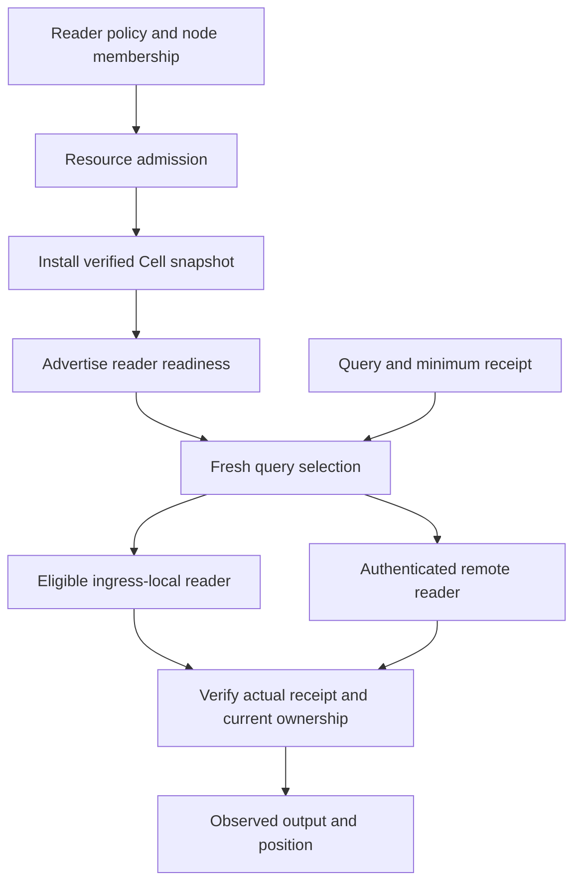

A read replica serves an admitted snapshot of one Cell. It must prove the actual Cell, incarnation, and committed position of its response. Its eligibility depends on fresh policy and membership, resource admission, and the serving protocol's ownership checks.

Use replicas for explicit query routing. Mutations and outcome resolution continue to use the current owner.

## Separate installation from selection

An installed snapshot is not automatically selected for every query. Fresh policy and membership must choose its node session. An eligible ingress-local snapshot can avoid a peer hop while preserving the same result checks. A remote attempt uses the authenticated peer client installed by the host.

## Apply minimum receipts precisely

| Check | Why it matters |
| --- | --- |
| Same Cell | Sequence numbers from unrelated partitions cannot be compared as one history |
| Same incarnation | A prior state generation is not evidence for the current generation |
| Position at least the minimum | Read-your-write requirements cannot accept a lagging snapshot |
| Actual observed receipt returned | The caller can carry concrete evidence into later operations |

A sequence greater than the minimum is acceptable; the query may observe later commits. A receipt does not freeze an old snapshot or establish an atomic snapshot across several Cells.

<ReadConsistencyLab />

The lab demonstrates the receipt boundary, rather than emulating a deployed reader fleet. Try a lagging or unavailable reader and compare an explicitly chosen owner read.

## Preserve failures and one deadline

`ReplicaBehind` identifies an available snapshot that cannot satisfy the required position. `ReplicaUnavailable` identifies a route without an eligible reader. The client does not silently fall back to the owner. The application can choose a new owner query, but that policy change must be explicit.

Selection, refresh, and query attempts share the same five-second deadline. Retry accounting must keep the remaining budget rather than restarting it for each candidate. Preserve typed errors and their evidence so operators can distinguish stale placement, lag, capacity, and peer failures.

## Budget readers as serving resources

Reader installation and refresh consume memory, descriptors, disk, and transport capacity. Readiness should reflect admitted state, and replacement must release the prior resources. A desired reader count expresses policy; it is not a guarantee that every requested reader is presently eligible.

Under reader loss, new selection must use current membership. Warm reader state can help takeover only through the authority and recovery protocol. Having bytes nearby does not authorize a new writer.

The host wires `ReplicaReadRouter` and `ReplicaPeerClient` onto `CellClient`. The service owns peer authorization and public ingress. See [application read policy](/docs/crates/app/reads), the [failover reference](/docs/crates/runtime/docs/failover-and-followers), and [deployment contracts](/docs/crates/runtime/docs/deployment) for the complete installation and serving behavior.
