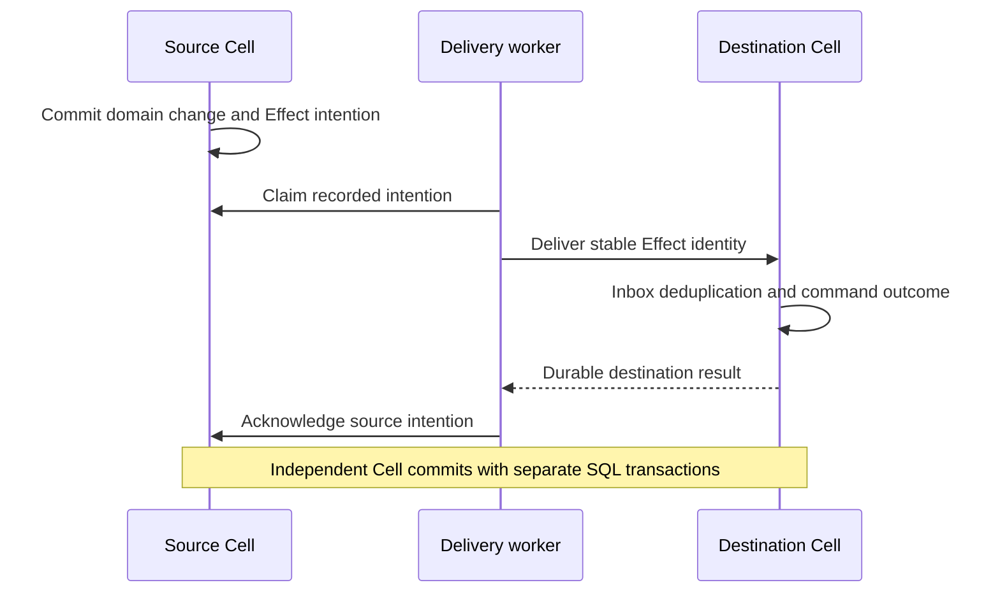

Durable work begins with a decision recorded in a Cell. A worker later drives that decision toward completion. Restart, retry, and lost acknowledgements are normal delivery cases; the persisted ledger or primitive state must tell the next worker what remains to do.

Choose the primitive by the work's shape. They share the Cell durability path, but their delivery and claim contracts differ.

## Choose the durable representation

| Need | Primitive | Important boundary |
| --- | --- | --- |
| Ask another Cell to apply a command | Effects | Source intention and destination inbox commit separately |
| Distribute independent jobs | Queue | Claims are leased; consumer work must tolerate redelivery |
| Generate recurring triggers | Cron | Record occurrences durably; wall-clock callbacks alone do not preserve them |
| Remember a multi-step process | Workflow | Persist decisions, waits, and progress |
| Call an external system | Activities | The external system needs its own idempotency contract |
| Publish content bodies | Blob | Recorded references and verified body availability govern visibility and deletion |

SQL and KV express durable application state. The work primitives connect transitions to future actions while retaining request-ledger and recovery semantics.

## Deliver an Effect across two transactions

If the destination commits and its acknowledgement is lost, delivery retries the same identity. The destination inbox identifies the already handled delivery. The source's completion must reflect durable destination evidence rather than an assumption based on a successful network send.

<DeliveryLab />

The lab follows a lost acknowledgement and deduplicated retry. It illustrates why destination idempotency matters even when the source intention is durable.

## Keep external effects outside the SQL callback

A transaction-scoped handler can emit an Effect intention or record workflow progress. It cannot make an external payment atomically with its SQLite transaction. A native activity runner performs the external call under the documented lease and outcome protocol.

Pass a stable external idempotency key when the external system supports it. After an uncertain external response, reconcile that key before starting a new external action. Cellule's request ledger cannot force an unrelated API to deduplicate a payment or email.

## Resume from recorded state

A Queue consumer validates its lease before work and acknowledges after the intended work is complete. A workflow resumes from remembered decisions rather than replaying arbitrary side effects. Cron and maintenance progress derive from durable state and the sampled logical time.

Timers wake the runtime; they are not the sole durable record of due work. Ownership changes must carry the due summary and recover the SQLite state before scheduling resumes.

## Retain Blob parts safely

Publishing a Blob body and its metadata crosses a visibility boundary. Deletion requires a complete cross-Cell reference set, quiesced writes, and a grace boundary. A locally empty reference table does not prove that another Cell has stopped referring to those parts.

Continue with the [primitive overview](/docs/primitives) and [durable work concepts](/docs/concepts/coordination). The [primitive contracts](/docs/crates/runtime/docs/primitives) define claim, retry, retention, and scheduling semantics; [Native Rust authoring](/docs/crates/runtime/docs/rust-api) covers registered activities and Effect emission.
