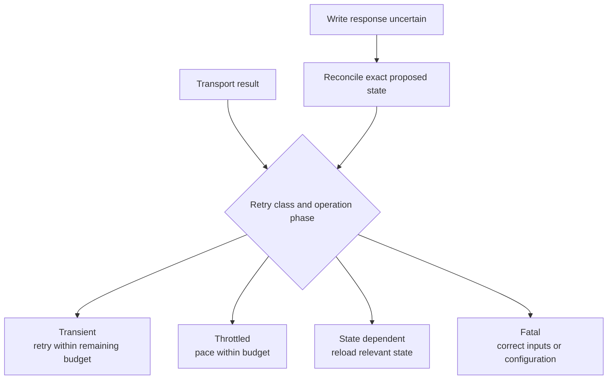

A storage error must retain enough information for its caller to decide what happens next. `StorageError` preserves its source where available, and `RetryClass` separates transient, throttled, state-dependent, and fatal failures.

The caller owns its deadline and the meaning of the attempted operation. A retry policy that is appropriate for a read may be unsafe for an uncertain authority write.

## Classify before retrying

| Situation | Preserve | Caller action |
| --- | --- | --- |
| Temporary read failure | Provider cause and remaining deadline | Retry within the read protocol's budget |
| Throttling | Provider indication and retry context | Pace attempts without restarting the deadline |
| Conditional conflict | Failed comparison and selected version | Reload state and evaluate the next legal transition |
| Invalid input or unsupported capability | Exact cause | Correct input/configuration before serving |
| Uncertain mutation response | Proposed bytes and identity | Reconcile before another mutation |
| Multipart failure | Original error and upload context | Attempt cleanup without masking the cause |

## Keep ambiguity at the correct layer

A provider timeout can occur after a write was accepted. The store preserves the result; it does not know whether the written bytes constitute the runtime's exact proposed successor. Authority reconciliation belongs to runtime code that can compare that state.

Similarly, an immutable upload can be retried by comparing exact bytes, while a domain command cannot be rerun merely because its publication transport failed. Carry the enclosing invocation evidence through the transport error.

## Hold admission for the actual work

Reserve read capacity before backend access. Account for request and byte use while the attempt is in progress. Release reservations on completion and cancellation, with ownership that matches the dispatched work's lifecycle.

Cancellation of a caller's wait is not evidence that provider side effects were undone. Multipart cleanup, temporary bytes, and outstanding attempts still need a clear owner. When cleanup fails too, keep the original error available.

## Observe without changing semantics

Optional observation counts requests and bytes so operators can understand transport demand. Counts do not authorize publication or change retry safety. Keep attempted request measurements distinct from durable command outcomes.

For example, one acknowledged command can require several object operations or a retry; one failed conditional proposal can upload immutable dependencies without producing a successful command response. A request count is therefore not a committed-command count.

## Verify changes at the right boundary

Transport tests should exercise bounded responses, exact immutable collisions, conditional conflicts, admission release, and source-error preservation. Provider tests require their configured environment. Runtime tests establish which transport evidence releases a result; storage tests alone cannot prove the full response gate.

See [the transport reference](/docs/crates/store/docs/transport), [runtime authority](/docs/crates/runtime/authority), and [LTX safety](/docs/crates/ltx/limits). The [qualification guide](/docs/crates/runtime/docs/delivery) defines the evidence required beyond local correctness.
