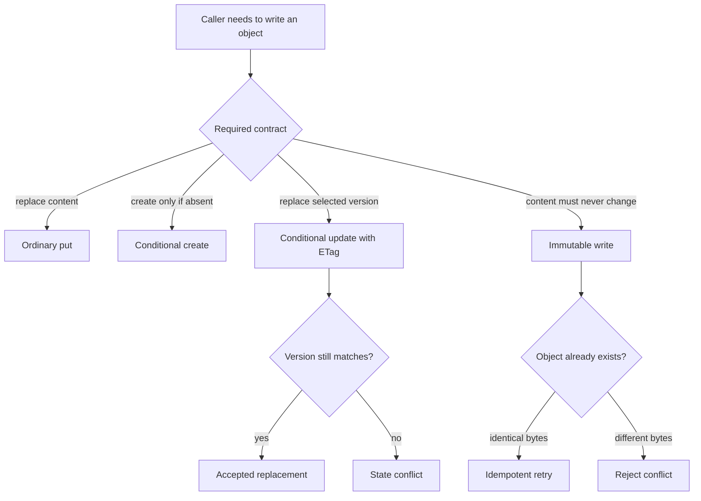

Choose a storage operation according to what the caller needs to prove. Ordinary object writes, conditional authority updates, and immutable content publication are different contracts even when they target the same provider.

`cellule-store` preserves those differences so higher layers can reason about retries and conflicts.

## Select the appropriate write

| Operation | Caller expectation |
| --- | --- |
| Bounded read | Validate size and framing before exposing bytes |
| Ranged read | Fetch the requested bounded range using the provider contract |
| Ordinary put | Store a body without claiming an authority transition |
| Conditional create | Preserve the provider's absent-object condition |
| Conditional update | Preserve the selected ETag/version condition |
| Immutable write | Existing identical bytes are safe to reuse; different bytes fail |
| Multipart | Account for the upload lifecycle and attempt cleanup on failure |

## Treat ETags as conditional evidence

`get_with_etag` returns bytes with the provider's conditional token. A higher layer can use the token when proposing an update to that specific version. If another writer wins first, the conflict must reach the caller.

A transport retry cannot convert an unsuccessful comparison into success. Runtime authority needs to reread and evaluate the actual control state. A lost response after a write also needs reconciliation because the provider may already have accepted the proposal.

## Publish immutable content idempotently

LTX prepares content whose object identity and bytes are fixed. Retrying an immutable write at an existing path is safe only when the stored bytes are identical to the pinned proposal. A different body is a conflict, even if its size matches.

For example, a root dependency uploaded before a process failure can be reused during retry when verification confirms the exact bytes. It becomes selected state only when the owning runtime publishes the corresponding root through authority.

## Bound reads before returning data

Check response framing, declared size, and the accepted read limit before exposing bytes to the caller. Provider errors remain transport errors with their source where available. Successful transport does not establish an LTX checksum chain; the consuming layer still verifies the object and root.

Reserve read admission before backend work. The reservation must remain owned while the read is in progress and be released on completion or cancellation according to the operation lifecycle.

## Keep multipart state explicit

Multipart work may leave provider-side upload state when an attempt fails. Cleanup is attempted, while the original error remains available. Caller-owned journals and resume decisions belong to the caller's protocol; a generic retry loop cannot infer that all partial work has vanished.

Continue with [failures and resources](/docs/crates/store/failures). See [the transport contract](/docs/crates/store/docs/transport), [Store source](https://github.com/crabbuild/cellule/blob/main/crates/cellule-store/src/store.rs), and [LTX publication](/docs/crates/ltx/publication) when changing write semantics.
