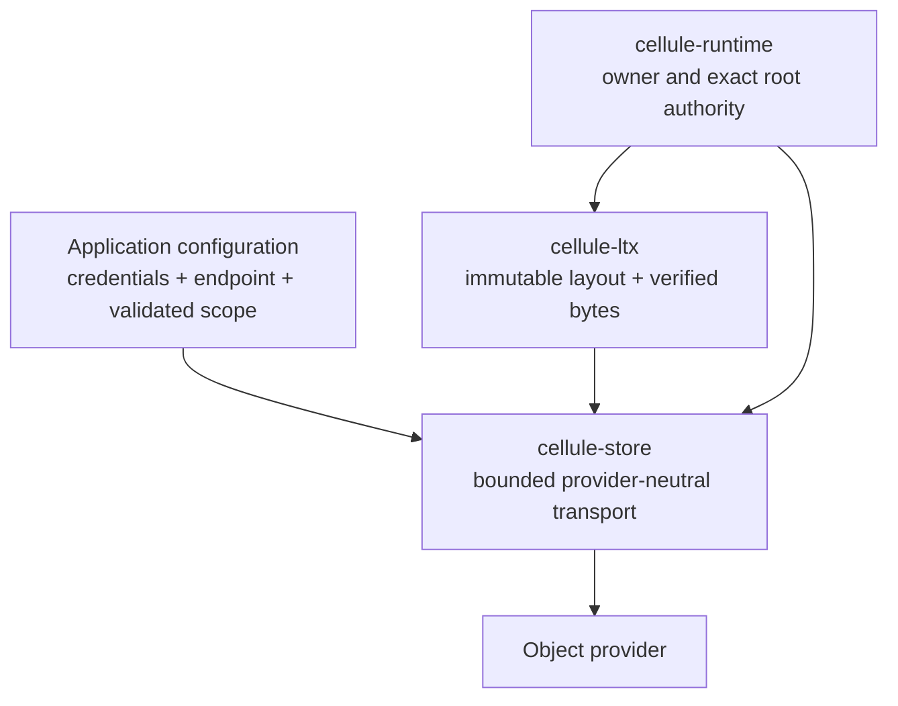

`cellule-store` wraps object transport with bounded reads, immutable and conditional writes, error classification, multipart cleanup, and optional observation. It uses `object_store` backends while preserving the provider's conditional-write semantics.

Use it when constructing the storage path under LTX or implementing a provider integration. Application handlers usually interact with typed Cell capabilities rather than a raw store.

## Locate the boundary



| Guide | What you will learn |
| --- | --- |
| [Object operations](/docs/crates/store/operations) | Choose ordinary, conditional, immutable, and bounded operations |
| [Provider integration](/docs/crates/store/providers) | Validate scope and capabilities before serving |
| [Failures and resources](/docs/crates/store/failures) | Classify errors, preserve ambiguity, release admission, and observe work |

The provider may store both mutable control records and immutable LTX objects. The store transports those requests; the runtime decides which transition is authoritative, and LTX decides what bytes and layout constitute a verified root.

## Start with an in-memory backend

The canonical transport guide includes this small local example:

```rust
use std::sync::Arc;
use bytes::Bytes;
use cellule_store::Store;
use object_store::{memory::InMemory, path::Path};

async fn example() -> Result<(), cellule_store::StorageError> {
    let store = Store::new(Arc::new(InMemory::new()));
    let key = Path::from("cells/example/object");
    store.put(&key, Bytes::from_static(b"state")).await?;
    let (body, _etag) = store.get_with_etag(&key).await?;
    assert_eq!(&body[..], b"state");
    Ok(())
}
```

This demonstrates transport and error propagation. It does not select a Cell owner, publish an authority record, or establish a distributed command receipt. In-memory backends are useful fixtures; real provider qualification needs its own documented environment.

## Assign the decisions to their owners

| Decision | Owner |
| --- | --- |
| Physical provider identity | Shared `cellule-types` identities |
| Credentials and endpoint authorization | Embedding application |
| Request bounds and transport result | `cellule-store` |
| Immutable root structure and verification | `cellule-ltx` |
| Fenced owner, root selection, response gate | `cellule-runtime` |
| Startup probe handling and readiness | Application and host integration |

A failed CAS is a state conflict, not a successful retry. An uploaded object is content, not an owner lease. Preserve these distinctions when adapting a new provider.

Continue with [object operations](/docs/crates/store/operations). The [canonical storage reference](/docs/crates/store/docs) and [transport contract](/docs/crates/store/docs/transport) define the exact surface.
