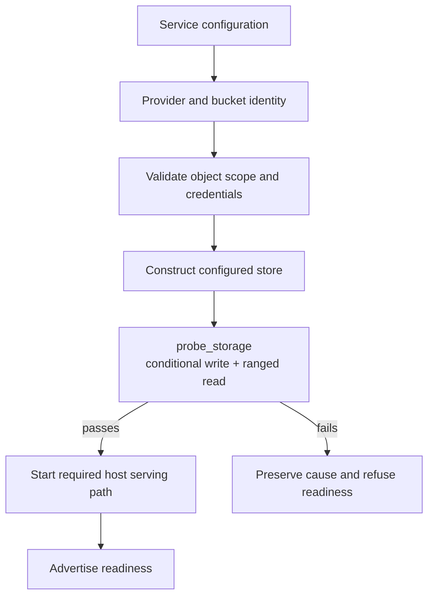

The embedding service chooses the physical provider, endpoint, credentials, and authorized object scope. `cellule-store` offers provider-neutral transport and an optional explicit provider builder. The framework does not infer product authorization from a bucket name or prefix.

A provider that supports basic object reads may still lack the conditional-write or ranged-read semantics required to serve Cells safely.

## Validate before advertising readiness

| Integration step | Owner and evidence |
| --- | --- |
| Choose provider | Service selects S3-compatible, GCS, Azure, or explicitly local storage |
| Normalize physical identity | `cellule-types` identifies provider, host, and container |
| Validate scope | Service checks permitted prefixes and their source |
| Construct transport | Existing backend or opted-in `build_explicit_store` |
| Probe capabilities | `probe_storage` checks required conditional and range behavior |
| Handle failure | Host integration refuses serving readiness and retains the cause |

## Keep identity separate from credentials

A `BucketIdentity` allows equivalent physical bucket descriptions to share an identity. It contains no secret and is not a credential validation result. `StorageScope` describes prefix views, while application authorization decides who may use them.

Normalize the identity at its designated boundary and preserve object-key semantics. Lowercasing a host or container for identity equality does not imply that arbitrary object keys may be lowercased.

## Probe the contract the runtime needs

Conditional operations underpin owner and root transitions. Ranged reads underpin bounded access to stored content. Run the capability probe against the configured provider before exposing serving readiness, and handle an unsupported or failed result explicitly.

A passing probe checks capabilities, rather than establishing all production fault behavior. Provider qualification still needs the documented workload, failure environment, and raw evidence. Local fixtures do not replace that evidence.

## Use local storage deliberately

In-memory or local providers are useful for examples and isolated tests. `StorageProviderKind::parse_cloud_alias` deliberately does not return Local for `local` or `file`. Select local storage explicitly in application configuration.

This makes a missing or misspelled cloud provider visible instead of silently redirecting a service to a test backend. Preserve that configuration boundary when extending accepted aliases.

## Wire the next layer

Pass the configured transport into the LTX and runtime setup appropriate to the host. LTX supplies immutable layout and verified root handling; runtime authority supplies root selection and fencing. Keep credentials at the service boundary rather than exposing them to native command contexts.

Read [framework integration](/docs/guides/framework), [storage identities](/docs/crates/types/identity), and the [canonical provider guide](/docs/crates/store/docs/providers) for the complete setup path. The [host lifecycle](/docs/crates/host/docs/lifecycle) explains how readiness and drain surround it.
