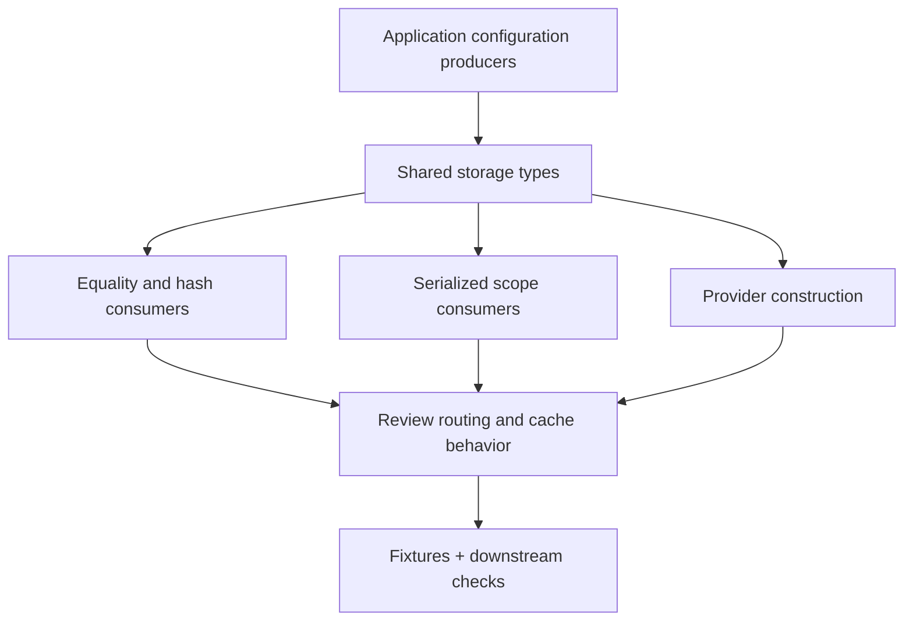

Small shared types can have large compatibility effects. Changing normalization can change cache keys. Changing an alias can change which provider a configuration selects. Changing serialized scope fields can break a strict decoder.

Review the producer and consumer paths before changing a shared identity, even when the Rust edit is only a few lines.

## Identify the contract surface



| Surface | Current contract | Change risk |
| --- | --- | --- |
| Provider enum | Distinct physical families; snake_case Serde names | Reinterpreting persisted or exchanged provider values |
| Cloud alias parser | Trimmed ASCII-insensitive known aliases; explicit Local | Unexpected backend selection |
| Bucket constructor | ASCII lowercase and trailing-slash removal | Merged or split cache identities |
| Bucket equality and hashing | Provider, host, and container participate | Cross-provider collisions or stale routing assumptions |
| Local sentinel | Local with empty host and container | Misidentifying local fixtures or unset configuration |
| Storage scope | Named string fields, schema, strict unknown-field rejection | Producer/decoder incompatibility |

`BucketIdentity` currently derives equality and hashing, while `StorageScope` and the provider enum carry Serde contracts. Do not assume every identity has the same wire representation or automatically add one to make an integration convenient.

## Work through a normalization change

Suppose a new constructor rule strips another character from host names. Check whether two previously different destinations now become equal and whether any producer still emits the old form. Review caches, provider setup, application validation, and persisted configuration together.

Similarly, allowing `local` through the cloud alias parser would change a deliberate configuration boundary. It could make an invalid cloud setting choose a local backend. Preserve explicit local selection unless the complete application contract intentionally changes.

## Check strict scope decoders

`StorageScope` rejects unknown fields. If a producer sends a new field, older consumers can reject the entire value. Review the issuing service, serialization fixtures, JSON schema, and consuming validation before shipping a field change.

A scope hash is application-issued data. Changing its derivation in a service may require coordinated downstream updates even when this crate's struct stays unchanged.

## Validate value behavior and integration

Keep focused fixtures for accepted aliases, rejected aliases, normalization, provider distinctions, the local sentinel, and serialized scope acceptance. Use the existing tests as the contract baseline rather than rewriting expectations to make a new implementation pass.

```sh
cargo test -p cellule-types --locked
```

Then check affected store and application consumers at the level appropriate to the change. Identity tests do not establish provider conditional-write behavior, root verification, or ownership fencing.

See [the implementation and tests](https://github.com/crabbuild/cellule/blob/main/crates/cellule-types/src/storage.rs), [canonical identity contracts](/docs/crates/types/docs/identity), and [provider integration](/docs/crates/store/providers). For the broader dependency boundary, review [framework layers](/docs/concepts/layers).
