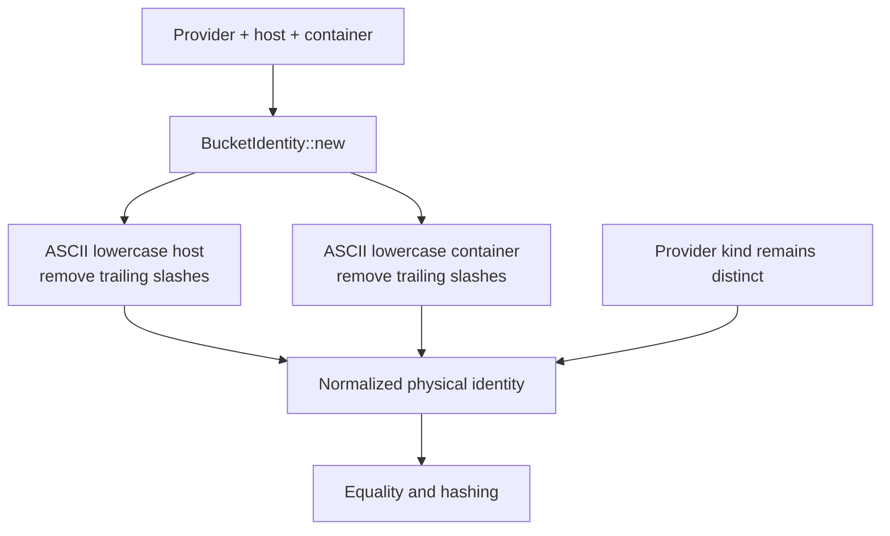

A storage identity answers whether two configurations refer to the same physical destination. `BucketIdentity` combines a `StorageProviderKind`, host, and container. Its constructor normalizes the host and container so equivalent spellings compare equally.

This equality is useful for storage routing and caches. It does not identify a tenant's Cell or select its authoritative root.

## Parse the provider deliberately

| Kind | Physical family | Accepted cloud aliases |
| --- | --- | --- |
| `S3` | AWS S3 or compatible endpoint | `aws`, `s3` |
| `Gcs` | Google Cloud Storage | `gcp`, `gcs`, `gs`, `google` |
| `Azure` | Azure Blob Storage | `azure`, `az`, `abs` |
| `Local` | Explicit filesystem or in-memory storage | None from `parse_cloud_alias` |

`parse_cloud_alias` trims surrounding whitespace and matches ASCII case-insensitively. Unknown aliases return `None`. `local` and `file` also return `None`; applications must explicitly opt into local storage.

## Normalize only the declared identity fields



The constructor removes trailing slashes and lowercases ASCII in the two string fields. It does not perform arbitrary URL parsing or validate credentials. Do not extend that normalization to object keys, which have their own provider and layout semantics.

```rust
use cellule_types::storage::{BucketIdentity, StorageProviderKind};

let a = BucketIdentity::new(StorageProviderKind::S3, "Bucket/", "Objects/");
let b = BucketIdentity::new(StorageProviderKind::S3, "bucket", "objects");
assert_eq!(a, b);
assert_ne!(a, BucketIdentity::local_unset());
```

The same host/container under GCS or Azure remains a different identity from S3. Scheme aliases can describe the same physical family; the family itself is part of equality.

## Understand the local sentinel

`BucketIdentity::local_unset()` returns Local with empty host and container. It represents local, in-memory, or otherwise unset storage identity. It is not a unique identity for every possible local directory, and it does not make an unspecified production provider valid.

If an application needs to distinguish concrete local stores, it must apply its own validated configuration policy rather than treating the shared empty sentinel as a path registry.

## Keep construction consistent

The fields are public. Constructor normalization is a construction contract, not an automatic transformation on every later field assignment. Build identities through the designated constructor and avoid modifying them in ways that break cache equality assumptions.

Before changing normalization, review all producers and cache/routing consumers. A change that merges previously distinct values can be as consequential as one that splits an existing identity. Continue with [compatibility](/docs/crates/types/compatibility), and consult [the canonical identity contract](/docs/crates/types/docs/identity) and [its tests](https://github.com/crabbuild/cellule/blob/main/crates/cellule-types/src/storage.rs).
