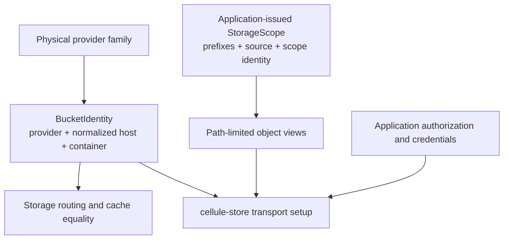

`cellule-types` defines dependency-light storage identities shared across framework boundaries. Its public storage vocabulary consists of `StorageProviderKind`, `BucketIdentity`, and `StorageScope`.

This crate is intentionally small. Cell targets, request IDs, receipts, and owner epochs are runtime identities; they are not all collected into this storage-identity crate. Knowing that distinction helps you find the right contract without treating every framework ID as interchangeable.

## Follow the shared vocabulary



| Type | Describes | Does not establish |
| --- | --- | --- |
| `StorageProviderKind` | Physical provider family | Credentials or endpoint reachability |
| `BucketIdentity` | Equality of physical storage destinations | A Cell address, root, or lease |
| `StorageScope` | Prefix-view data issued by an application | Product authorization or writer ownership |

## Read the identity path

Start with [Provider and bucket identity](/docs/crates/types/identity) to understand aliases and normalization. Continue with [Storage scope](/docs/crates/types/scope) for prefix boundaries, then [Compatibility](/docs/crates/types/compatibility) before changing equality or serialized fields.

The public implementation is in [storage.rs](https://github.com/crabbuild/cellule/blob/main/crates/cellule-types/src/storage.rs). Its small size makes it practical to read the constructors and tests together. The [canonical identity reference](/docs/crates/types/docs/identity) records the same contract for downstream consumers.

## Use identities at the boundary

When configuring a store, derive the physical destination consistently and validate the application's scope. Equivalent host/container spellings should not accidentally produce separate cache identities. Conversely, identical strings under different provider families must remain different destinations.

Do not include credentials in an identity or use identity equality as permission to serve a tenant. Credentials and authorization belong to the embedding service, while transport is handled by [cellule-store](/docs/crates/store/overview).

## Verify the contract locally

```sh
cargo test -p cellule-types --locked
```

The tests cover constructor normalization, distinct providers, the explicit local sentinel, and accepted cloud aliases. Local success checks these value contracts; it does not establish that a provider supports the runtime's conditional or ranged-read requirements. Those are checked at [provider integration](/docs/crates/store/providers).
