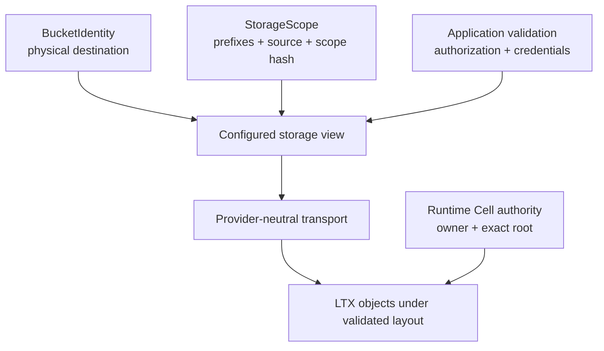

`StorageScope` carries the data used to describe a path-limited storage view. It contains repository and global prefixes, a source repository, and a scope identity. The embedding application validates those values and the credentials before constructing a store.

A scope describes where a view is intended to operate. It is not, by itself, an authorization check or an owner lease.

## Locate each kind of scope

| Field | Contract vocabulary |
| --- | --- |
| `repo_prefix` | Repository-scoped object prefix |
| `global_prefix` | Global object prefix for the view |
| `source_repo` | Source repository identity carried with the scope |
| `scope_hash` | Scope identity carried by the application |

The type stores these strings. It does not derive the hash, canonicalize every prefix, verify the source repository, or grant access to a tenant. Those checks belong to the service that issues and consumes the scope.

## Keep four identities distinct

A bucket identity names the physical destination. A storage scope describes a view within it. A Cell target addresses durable application state. A control record selects the writer and root for that Cell.

Two Cells can share a bucket without sharing an owner or SQL transaction. Two views can share a physical destination while exposing different prefixes. A valid storage scope does not establish that a caller is allowed to mutate every Cell whose objects are visible through it.

## Validate before transport setup

Check the source of the scope, permitted prefixes, and credentials before constructing the configured store. Validate product authorization before binding a typed application handle to a tenant. The runtime's application scope checks then enforce the declared target boundary; they complement the service's authorization policy.

Do not let an unvalidated scope turn an object prefix into a substitute for user authorization. Keep the policy at the embedding boundary so provider-neutral transport remains reusable.

## Preserve serialization behavior

`StorageScope` derives Serde serialization and deserialization and rejects unknown fields. It also exposes a JSON schema. Field names and acceptance behavior therefore matter to the applications that issue, persist, or consume it.

Adding a field is not automatically harmless for an older strict decoder. Review both sides of any serialized contract change and the application-owned validation logic. Continue with [compatibility](/docs/crates/types/compatibility) before changing the struct.

For the next integration step, read [provider setup](/docs/crates/store/providers). The [canonical identity reference](/docs/crates/types/docs/identity) and [implementation](https://github.com/crabbuild/cellule/blob/main/crates/cellule-types/src/storage.rs) define the current storage vocabulary.
