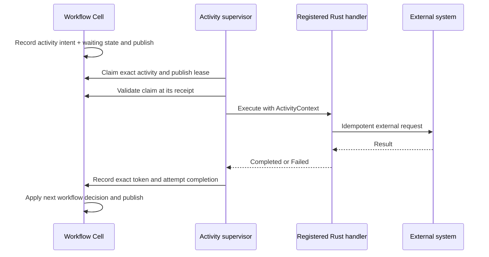
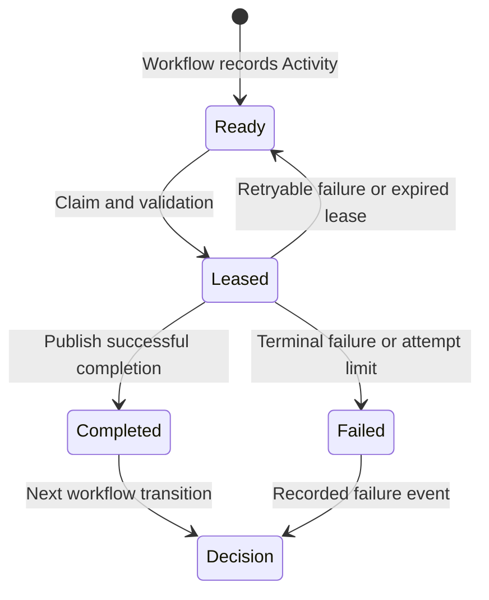

Activities perform external or expensive work requested by a workflow: call a service, generate an artifact, or run a native computation. The Workflow Cell records intent first. A supervisor claims and validates that intent, executes the registered handler outside the SQLite transaction, and records completion through the workflow's durable command path.

<PrimitiveDiagram id="activities" />

## Understand the three boundaries



The first boundary makes intent durable. The second permits one current attempt to start. The third records its outcome. No SQLite transaction stays open across the handler's asynchronous work.

Activities are tied to workflow runs and their pinned definitions. For independent jobs handled by general consumers, consider [Queue](/docs/primitives/queue). For commands between Cells, use [Effects](/docs/primitives/effects).

## Implement a native handler

This runnable-example-style Echo handler returns its input. It is useful for learning the lifecycle without external credentials. Production handlers follow the same trait but supply real service clients and product policy.

```rust
use cellule_runtime::primitives::workflow::{ActivityContext, ActivityExecution, ActivityHandler};
use std::{future::Future, pin::Pin};

struct Echo;

impl ActivityHandler for Echo {
    const TYPE: &'static str = "echo";

    fn execute(
        context: ActivityContext,
        input: Vec<u8>,
    ) -> Pin<Box<dyn Future<Output = ActivityExecution> + Send + 'static>> {
        Box::pin(async move {
            if context.cancellation().is_cancelled() {
                return ActivityExecution::Failed {
                    details: b"activity cancelled before work".to_vec(),
                    retryable: true,
                };
            }
            ActivityExecution::Completed(input)
        })
    }
}
```

Register the handler with `register_activity::<M, Echo>` and declare its type in the module descriptor. The definition's Activity action must request the same compiled type. Registration is release-scoped; an unregistered string is not a dynamic plugin or a remote procedure name.

### Carry external idempotency through retries

`ActivityContext::idempotency_key()` returns a stable 32-byte key derived from the run and activity identities. It is shared across retry attempts. Format it for a provider that expects a string:

```rust
use cellule_runtime::primitives::workflow::ActivityContext;
use std::fmt::Write;

fn external_idempotency_key(context: &ActivityContext) -> Result<String, std::fmt::Error> {
    let mut encoded = String::with_capacity(64);
    for byte in context.idempotency_key() {
        write!(&mut encoded, "{byte:02x}")?;
    }
    Ok(encoded)
}
```

Pass that key to the external service's idempotency mechanism and keep the same business input across retries. The attempt counter or lease token is unsuitable as the external idempotency key because it changes on a new attempt. Provider retention and ambiguous-result reconciliation are application concerns.

| Context field | What it tells the handler |
| --- | --- |
| `run_id()` | Workflow execution that owns this work |
| `activity_id()` | Stable activity within that run |
| `attempt()` | Which delivery attempt is executing |
| `lease_token()` | Current completion/extension authority |
| `lease_until_ms()` | Current logical lease expiry |
| `cancellation()` | Cooperative cancellation observation |
| `idempotency_key()` | Stable key for repeated external calls |

## Run one supervisor cycle

Obtain `application.activities::<M>()`. The application must have registered workflow activities and their handlers, started a run that records ready work, and chosen the explicit shard to visit.

```rust
use cellule_runtime::primitives::workflow::{
    ActivityRunOutcome, ActivitySupervisor, ActivitySupervisorError, WorkflowActivities,
    WorkflowActivityModule,
};

async fn run_one<M: WorkflowActivityModule>(
    activities: WorkflowActivities<M>,
    shard: u32,
) -> Result<ActivityRunOutcome, ActivitySupervisorError> {
    let supervisor =
        ActivitySupervisor::new(activities, 30_000).map_err(ActivitySupervisorError::Runtime)?;
    supervisor.run_once(shard, None).await
}
```

The supervisor claims at most one activity, validates its published claim, executes it, heartbeats its lease, and publishes completion or retry. `None` is appropriate here for the async Echo handler; blocking handlers use a dedicated worker reservation. A serving application should retain supervisors and bound concurrency rather than treating this one-cycle function as a full scheduler.

## Preserve outcome and error evidence

| Outcome | How to interpret it |
| --- | --- |
| Idle | No claimable activity in this shard on this cycle |
| Completed | Completion advanced the workflow; use its receipt for a read |
| Duplicate | The same completion token was already applied |
| Retrying | Failed attempt is recorded with a next due time |
| LeaseLost | This attempt no longer has authority to complete |
| IdentityConflict | Completion does not match the claimed activity identity |

`ActivitySupervisorError::Pending` contains unresolved mutation evidence. Preserve and resolve it before another cycle. `InvalidPublishedResult` preserves the receipt and decoding source error. Do not collapse these cases into “run the external call again.”



## Handle cancellation and the external crash window

If the lease is lost, the supervisor cancels the context. Handlers should cooperate, bound their I/O, and stop initiating further work. Cancellation does not prove an already submitted remote request was rolled back.

A crash after a payment provider accepted a charge but before activity completion can cause a new attempt. A stable provider idempotency key can resolve that ambiguity; otherwise the product needs reconciliation before another charge. Cellule's durable completion protects the workflow record, not an arbitrary external system's execution count.

The native failure event is input to the workflow definition. Decode success and failure before deciding whether the product process completes, compensates, or remains waiting. The small Echo tutorial does not model a real payment failure policy.

## Design for bounded execution

| Boundary | Current contract |
| --- | --- |
| Handler input/result budget | Activity payload bound of 256 KiB |
| Lease | 5–300 seconds, with supervised heartbeat extension |
| Attempts | At most 20 |
| Lifetime | At most 7 days |
| Completion identity | Exact run, activity, token, and attempt |
| Execution placement | Outside SQLite; async or dedicated blocking work |

Applications own external clients, credentials, timeouts, worker admission, supervisor startup, and shutdown. Drain accepted work and release reservations when stopping. Keep large bodies in Blob and pass a reference when a payload would exceed the activity budget.

## Run the complete program

```sh
cargo run -p cellule-app --example workflow --locked
```

The [workflow source](https://github.com/crabbuild/cellule/blob/main/crates/cellule-app/examples/workflow.rs) registers Echo, records it from Welcome, supervises one attempt, and verifies the final workflow state at its completion receipt. Expected output is `workflow welcome/42: completed`.

Continue with [Workflow](/docs/primitives/workflow), the [runtime workflow/activity contract](/docs/crates/runtime/docs/primitives#workflow), and [invocation resolution](/docs/crates/app/docs/invocation).
