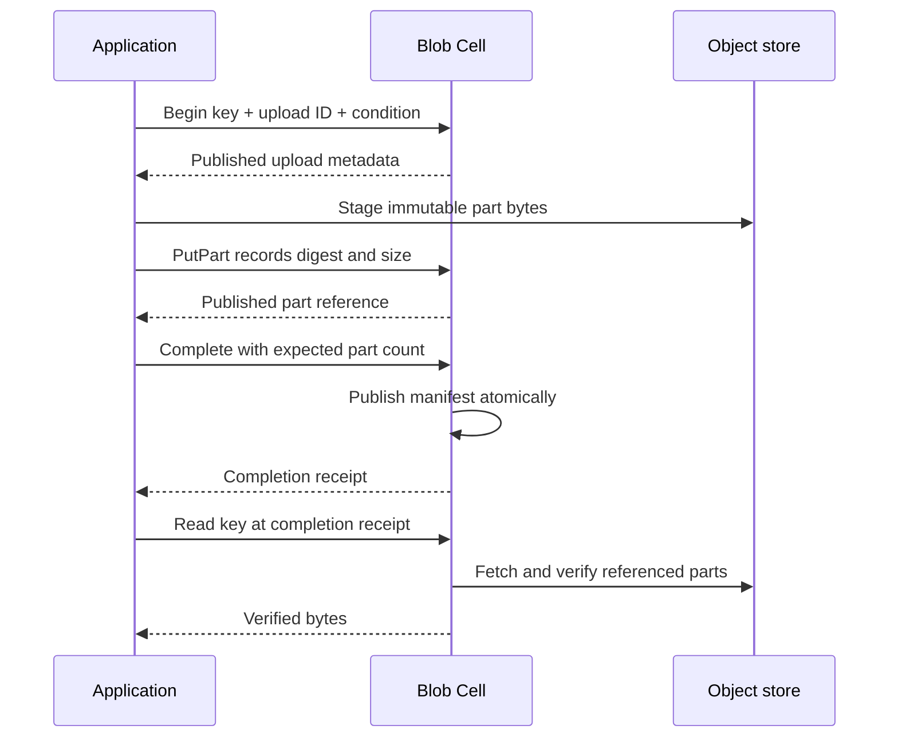
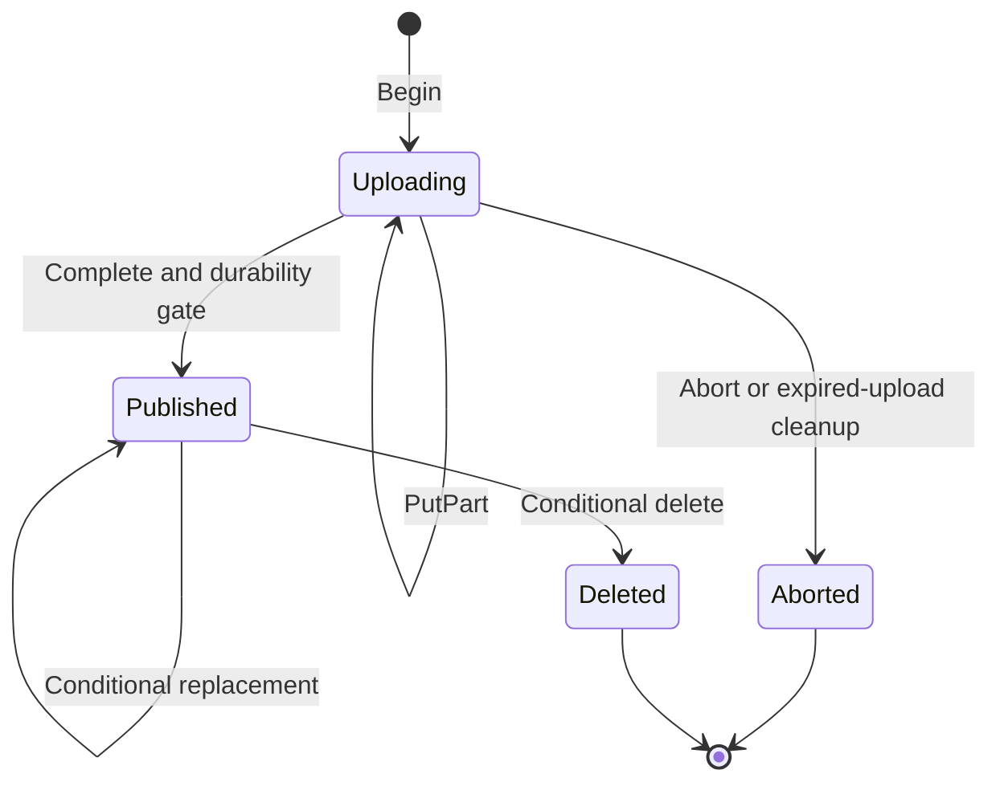

Blob stores attachments, exports, and other bodies outside the Cell database while keeping their publication metadata durable. `BlobNamespace<M>` maps an object key to a shard. Its SQLite transaction records upload metadata, part digests, the published manifest, and request outcomes. Immutable part bytes live in the configured object store.

<PrimitiveDiagram id="blob" />

## Separate staging from visibility

Uploading bytes is not the same as publishing an object. `Begin` creates an upload, `PutPart` stages a bounded part and records its reference, and `Complete` publishes the manifest. Readers address the published object key rather than an incomplete upload.



The typed capability handles staging to the object store during `PutPart`; the application does not need to invent a second upload protocol. The diagram separates those operations to show their ordering.

| Identity | Purpose |
| --- | --- |
| Object key | Stable name used by readers and shard routing |
| Upload ID | Groups the parts of one candidate object |
| Part number | Position in that upload; numbering starts at 1 |
| Request identity | Deduplicates one Begin, PutPart, Complete, or other mutation |
| Published ETag | Supports conditional replacement or deletion |

## Upload and read one attachment

Obtain `application.blob::<M>()` after registering a Blob module and configuring the handle with `with_blob_artifact_store`. The full example includes that wiring. This function expects a configured capability and three distinct mutation identities. Preserve each identity and its input when retrying that particular stage.

```rust
use cellule_runtime::primitives::blob::{
    BlobCondition, BlobModule, BlobMutation, BlobMutationOutcome, BlobNamespace, BlobQuery,
    BlobQueryResult,
};
use cellule_runtime::{Error, MutationIdentity};

async fn publish_attachment<M: BlobModule>(
    blob: &BlobNamespace<M>,
    identities: [MutationIdentity; 3],
    upload_id: [u8; 16],
    upload_expires_at_ms: i64,
) -> Result<Vec<u8>, Box<dyn std::error::Error>> {
    let [begin_id, part_id, complete_id] = identities;
    let key = b"orders/42/receipt.txt".to_vec();
    let payload = b"receipt for order 42".to_vec();
    let begun = blob
        .mutate(
            begin_id,
            BlobMutation::Begin {
                key: key.clone(),
                upload_id,
                condition: BlobCondition::Missing,
                content_type: Some("text/plain".into()),
                metadata: Vec::new(),
                expires_at_ms: upload_expires_at_ms,
            },
        )
        .await?;
    if begun.output != BlobMutationOutcome::Begun {
        return Err(Error::Control("upload did not begin").into());
    }

    let part = blob
        .mutate(
            part_id,
            BlobMutation::PutPart {
                key: key.clone(),
                upload_id,
                part_number: 1,
                payload: payload.clone(),
            },
        )
        .await?;
    if !matches!(part.output, BlobMutationOutcome::PartStored { .. }) {
        return Err(Error::Control("part was not recorded").into());
    }

    let completed = blob
        .mutate(
            complete_id,
            BlobMutation::Complete {
                key: key.clone(),
                upload_id,
                part_count: 1,
            },
        )
        .await?;
    if !matches!(completed.output, BlobMutationOutcome::Committed { .. }) {
        return Err(Error::Control("manifest was not published").into());
    }
    let observed = blob
        .query(
            BlobQuery::Read {
                key,
                offset: 0,
                limit: 128,
            },
            Some(completed.receipt),
        )
        .await?;
    let BlobQueryResult::Read(Some(read)) = observed.output else {
        return Err(Error::Control("published attachment is missing").into());
    };
    if read.bytes != payload {
        return Err(Error::Control("attachment bytes differ").into());
    }
    Ok(read.bytes)
}
```

Choose upload expiry within the documented lifetime relative to the Begin command's issued timestamp. Upload expiry is separate from the shorter request-acceptance expiry. The runtime rejects an upload already expired when accepted.

## Read a bounded range

Large objects require several reads. The runtime verifies the referenced part bytes before returning a range, including after recovery. The range limit is a byte budget, not a request to stream the whole object.

```rust
use cellule_runtime::primitives::blob::{BlobModule, BlobNamespace, BlobQuery, BlobQueryResult};

async fn read_range<M: BlobModule>(
    blob: &BlobNamespace<M>,
    key: Vec<u8>,
    offset: u64,
) -> Result<BlobQueryResult, Box<dyn std::error::Error>> {
    let observed = blob
        .query(
            BlobQuery::Read {
                key,
                offset,
                limit: 64 * 1024,
            },
            None,
        )
        .await?;
    Ok(observed.output)
}
```

For concurrent replacements, use metadata and conditional operations to coordinate which published object your product intends to serve. A minimum receipt constrains the Cell position; it does not select an immutable historical version by itself.

## Plan for interruption and replacement



| Situation | Application action |
| --- | --- |
| Reply to PutPart is lost | Resolve or retry the same request and part bytes |
| Client disconnects before Complete | Resume the known upload or abort it; no complete manifest has been published |
| Another writer publishes the key first | Handle the conditional publication conflict |
| Range verification fails | Preserve the integrity error; do not return unchecked bytes |
| A published object is deleted | Coordinate metadata cleanup and eventual part reclamation separately |

`BlobCondition::Missing` gives create-only publication. ETag conditions support compare-and-swap replacement and deletion. Use these product concurrency rules instead of assuming a preliminary read reserves the key.

## Operate within the bounds

| Boundary | Current contract |
| --- | --- |
| Key | 1–1,024 bytes |
| Part | At most 256 KiB |
| Parts per object | At most 4,096 |
| Object | At most 1 GiB |
| Range read | At most 512 KiB |
| User metadata | At most 8 KiB |
| Upload lifetime | 1 minute to 7 days from mutation issuance |
| List | At most 128 objects from one explicit shard |

Use Blob rather than a large KV value when repeatedly replacing a body would rewrite it through SQLite and LTX. Listing is per shard; an application-wide inventory must deliberately visit the configured shards.

### Reclaim parts with complete evidence

Expired upload metadata cleanup does not establish that an object-store part is globally unreferenced. A collector needs the complete reference set from every Cell sharing the scope, quiesced writes, and a grace cutoff. The `BlobArtifactStore::sweep_unreferenced` helper limits deletions per pass, but it is not an automatic product collector. The embedding application supplies lifecycle policy and coordinates safe reclamation.

## Run the complete program

```sh
cargo run -p cellule-app --example blob --locked
```

The [Blob source](https://github.com/crabbuild/cellule/blob/main/crates/cellule-app/examples/blob.rs) registers the module, configures the artifact store, uploads one text part, publishes it, verifies the bytes at the completion receipt, and drains the runtime. Expected output includes `attachment stored: receipt for order 42`.

Continue with the [Blob contract](/docs/crates/runtime/docs/primitives#blob), [storage guide](/docs/crates/runtime/docs/storage), and [topology guide](/docs/crates/app/docs/topology).
