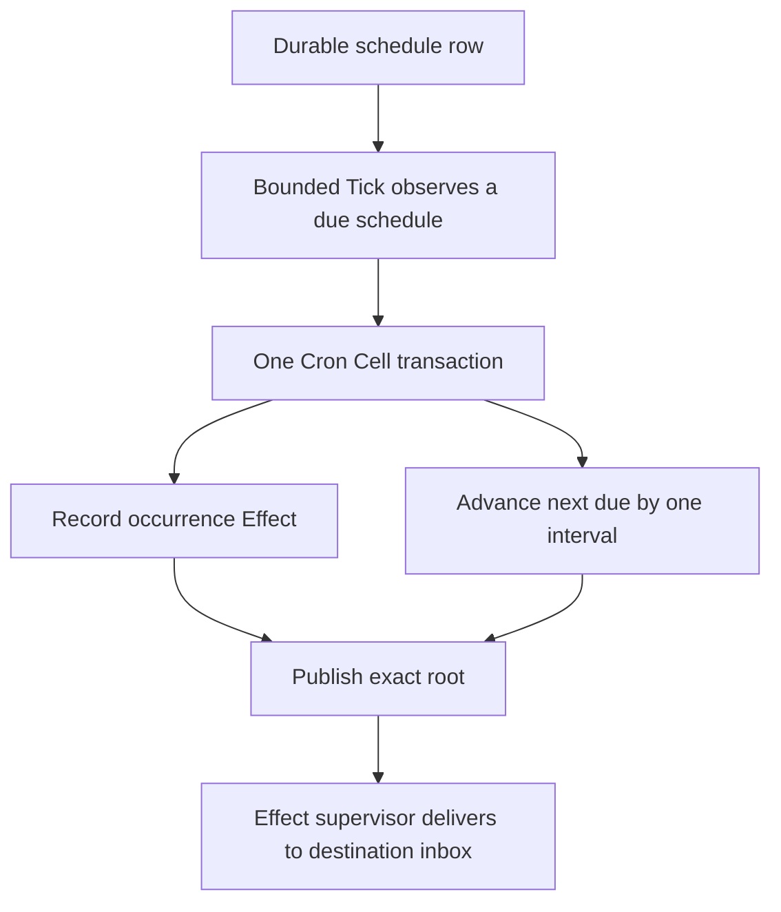
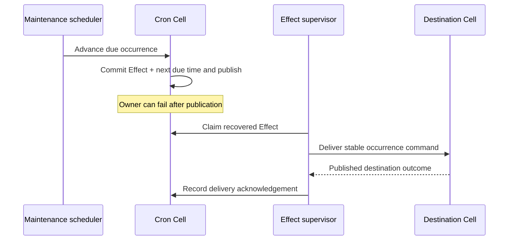

Cron records a recurring trigger as durable state. A serialized maintenance Tick advances a due schedule and emits a typed Effect in the same transaction. If the owner changes, the next owner recovers both the schedule and the pending delivery.

<PrimitiveDiagram id="cron" />

## Think in intervals and occurrences

A schedule is a fixed interval plus an explicit first due timestamp. It is not a cron-expression parser. Calendar rules, time zones, holiday policies, and the decision to skip or catch up belong to the embedding application.

| Field | Role |
| --- | --- |
| Schedule ID | Stable schedule identity and shard input |
| Target index | Selects a target declared by the compiled module |
| Target partition | Selects the destination Cell within that target namespace |
| Payload | Product input delivered inside `CronInvocation` |
| Interval | Fixed milliseconds between scheduled occurrences |
| Next due time | Absolute timestamp for the next occurrence |
| Generation and occurrence | Identify the schedule version and its progress |



The due time is not an execution deadline or a guarantee of delivery at that instant. Tick scheduling, capacity, owner recovery, and destination availability can delay execution while the occurrence remains durable.

## Register and observe a reminder

Obtain `application.cron::<M>()`. The compiled Cron module must declare the destination command and its namespace in its targets. `target_index: 0` below means the **first compiled target**, not an arbitrary network address. The destination partition must match that target's topology.

```rust
use cellule_runtime::primitives::cron::{
    CronModule, CronMutation, CronNamespace, CronQueryResult, CronSchedule,
};
use cellule_runtime::{Error, MutationIdentity};

async fn register_reminder<M: CronModule>(
    cron: &CronNamespace<M>,
    identity: MutationIdentity,
    schedule_id: [u8; 16],
    destination_partition: Vec<u8>,
    first_due_ms: i64,
) -> Result<CronSchedule, Box<dyn std::error::Error>> {
    let committed = cron
        .mutate(
            identity,
            CronMutation::Upsert {
                schedule_id,
                target_index: 0,
                target_partition: destination_partition,
                payload: b"send-reminder".to_vec(),
                interval_ms: 60_000,
                next_due_ms: first_due_ms,
            },
        )
        .await?;
    let observed = cron.get(schedule_id, Some(committed.receipt)).await?;
    match observed.output {
        CronQueryResult::Get(Some(schedule)) => Ok(schedule),
        _ => Err(Error::Control("schedule is missing").into()),
    }
}
```

This confirms the schedule exists at the mutation receipt. It does not fire the schedule. Compiling or registering Cron does not start an independent timer; a serving application needs maintenance scheduling and Effect delivery.

## Drive one bounded Tick explicitly

The runnable tutorial submits a Tick directly to make the boundary visible. In a serving system, the scheduler selects the current Cell position and retries stale observations according to its documented contract.

```rust
use cellule_app::{ApplicationHandle, CellApplication};
use cellule_runtime::primitives::maintenance::{
    MaintenanceModule, MaintenanceTickCommand, MaintenanceTickOutcome, MaintenanceTickRequest,
};
use cellule_runtime::{CellTarget, MutationIdentity, Receipt};

async fn tick_at<A, M>(
    app: &ApplicationHandle<A>,
    target: &CellTarget,
    identity: MutationIdentity,
    observed: Receipt,
) -> Result<MaintenanceTickOutcome, Box<dyn std::error::Error>>
where
    A: CellApplication,
    M: MaintenanceModule,
{
    let committed = app
        .command::<MaintenanceTickCommand<M>>(
            target,
            identity,
            MaintenanceTickRequest {
                expected_commit_sequence: observed.commit_sequence,
            },
        )
        .await?;
    Ok(committed.output)
}
```

The expected sequence prevents acting on an obsolete scheduling observation. Tick advances a bounded amount of work; one successful Tick is not a claim that every overdue item across the application has been processed. Use the [scheduler contract](/docs/crates/runtime/docs/primitives#scheduler) for serving behavior.

## Follow an occurrence across a crash



The destination receives a `CronInvocation` with schedule ID, generation, occurrence, scheduled timestamp, and payload. Inbox deduplication handles repeated delivery of the same Effect. If the target then calls an external service, that service call still needs product idempotency.

## Change a schedule deliberately

| Mutation | What the product decides |
| --- | --- |
| Upsert | Interval, first due time, destination, and payload for the schedule |
| Pause | Whether new occurrences should stop advancing |
| Resume | Explicit next due timestamp |
| Delete | Whether the schedule should be removed |

These are durable commands with their own identities. A new Upsert does not erase already emitted Effects. For receiver-level deduplication across schedule changes, account for the generation as well as the occurrence. The tutorial's reminder table is intentionally a small, single-generation example.

For “every day at 09:00 in the user's time zone,” compute the desired absolute time in application code and use explicit controls. Do not silently treat 24 hours as calendar semantics across daylight-saving changes.

## Keep timing within the contract

| Boundary | Current contract |
| --- | --- |
| Interval | 1 second to 1 year |
| First due time | Up to 5 years ahead |
| Payload | At most 256 KiB |
| Catch-up | One occurrence at a time, bounded by Tick budget |
| Delivery | Durable Effect with destination inbox deduplication |

The first-due window is evaluated from mutation issuance. If a valid due timestamp passes while the request waits for admission, the schedule can be accepted and becomes eligible on the next Tick. This keeps request latency from changing the caller's requested time.

## Run the complete program

```sh
cargo run -p cellule-app --example schedules --locked
```

The [schedules source](https://github.com/crabbuild/cellule/blob/main/crates/cellule-app/examples/schedules.rs) registers one reminder, explicitly drives one due Tick, delivers its Effect over a signed in-process peer loopback, and verifies one destination row. Expected output is `schedule reminder: one occurrence delivered`.

Continue with [Effects](/docs/primitives/effects), the [Cron contract](/docs/crates/runtime/docs/primitives#cron), and [host responsibilities](/docs/crates/host).
