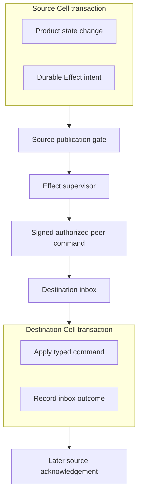
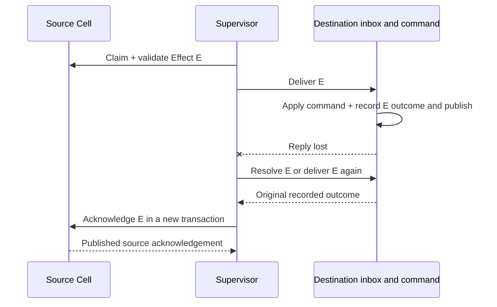

Effects connect two Cell transaction domains. A source command records an intent alongside its own state change. A supervisor later delivers the typed command to the destination's inbox. That inbox records the destination mutation and its outcome together so repeated delivery of the same Effect does not execute it again within the contract's retention window.

<PrimitiveDiagram id="effects" />

## Start with the source decision

If an order is accepted and another Cell must record a reminder, the source decision and delivery intent must commit together. A plain network call after the source command leaves a crash window where the order is durable but the notification has not been recorded.



This is durable at-least-once delivery with idempotent destination execution. It is not an atomic transaction spanning both Cells. The destination can be committed while the source still records pending delivery; a later retry or resolution reconciles those positions.

| Choose Effects when | Use another primitive when |
| --- | --- |
| A command must eventually reach another Cell | The invariant must be atomic: keep its rows in one Cell |
| A source change must not lose delivery intent | An arbitrary external API must be called: use Activities or Queue |
| Retries should use a destination inbox | A process needs remembered decisions and timers: use Workflow |

## Emit intent inside a command

`CommandContext::emit_effect` uses the command-owned identity allocator. The helper below runs **inside an already registered source command**, not from an `ApplicationHandle` after that command has returned.

The caller supplies a registered destination target, command ID, supported codec version, and correctly encoded command input. Registry validation and declared effect targets still apply; this helper is not a bypass around typed command contracts.

```rust
use cellule_runtime::CellTarget;
use cellule_runtime::primitives::effects::EffectCommandIntent;
use cellule_runtime::registry::CommandContext;

fn emit_destination_command(
    context: &mut CommandContext<'_, '_>,
    destination: CellTarget,
    command_id: u32,
    codec_version: u32,
    encoded_input: Vec<u8>,
    expires_at_ms: i64,
) -> cellule_runtime::Result<[u8; 32]> {
    context.emit_effect(&EffectCommandIntent {
        target: destination,
        command_id,
        codec_version,
        input: encoded_input,
        expires_at_ms,
    })
}
```

A source handler can update its application rows through the bounded command context, then emit this intent in the same transaction. A source rejection rolls back the application changes and new intent while recording the rejected outcome as documented. Do not construct Effect IDs manually; the allocator supplies a stable identity tied to the source command's ordered emissions.

The target must be in the same tenant and application, and its namespace must be declared by the module. The destination incarnation is resolved at delivery time, so an owner change does not require changing the logical target.

## Deliver one published Effect

Obtain `application.effects::<M>(source_target)`. The `source_target` is the Cell whose ledger you are draining, not the destination. Configure an `EffectPeerClient` with the service-owned signer, principal, and transport. The destination verifies signatures and authorizes the requested action.

```rust
use cellule_runtime::peer::EffectPeerClient;
use cellule_runtime::primitives::effects::{
    EffectModule, EffectRunOutcome, EffectSource, EffectSupervisor, EffectSupervisorError,
};

async fn deliver_one<M: EffectModule>(
    source: EffectSource<M>,
    peer: EffectPeerClient,
) -> Result<EffectRunOutcome, EffectSupervisorError> {
    let supervisor =
        EffectSupervisor::new(source, peer, 30_000).map_err(EffectSupervisorError::Runtime)?;
    supervisor.run_once().await
}
```

The supervisor claims at most one Effect, validates the source lease at its receipt, sends the signed command, resolves an ambiguous destination result when possible, then records source acknowledgement or retry. A serving application owns the loop and must cover its source Cells.

## Follow duplicate delivery



The destination inbox is the deduplication boundary. A remote service called directly by the destination command would be outside this transaction; command handlers cannot perform network I/O. Record an Activity or another appropriate durable intent for that subsequent work.

## Observe the source ledger

Keep the emitted 32-byte Effect ID if the product needs to inspect delivery state. The query below reads a current status from the source capability. `None` can mean no retained record; it is not proof that a destination action never occurred.

```rust
use cellule_runtime::primitives::effects::{EffectModule, EffectSource, EffectStatus};

async fn inspect_effect<M: EffectModule>(
    source: &EffectSource<M>,
    effect_id: [u8; 32],
) -> Result<Option<EffectStatus>, Box<dyn std::error::Error>> {
    let observed = source.status(effect_id, None).await?;
    Ok(observed.output)
}
```

| Supervisor outcome | Application interpretation |
| --- | --- |
| Idle | This source has no claimable Effect on this cycle |
| Delivered | Destination outcome is recorded and source acknowledgement is published |
| Retrying | A later attempt has a durable due time |
| Failed | Delivery reached a terminal failure; inspect and remediate |
| LeaseLost | This sender no longer holds the source claim |

Preserve `EffectSupervisorError::Pending` and resolve the source mutation before another cycle. Preserve the receipt and cause for `InvalidPublishedResult`. A transport timeout alone is not proof that destination execution did not happen.

## Respect delivery and retention bounds

| Boundary | Current contract |
| --- | --- |
| Encoded input | At most 1 MiB, with fixed claim/ack overhead reserved inside their budgets |
| Claim batch | 1–32 Effects; the supervisor cycle claims one |
| Lease | 5–300 seconds |
| Attempts | At most 20 |
| Effect lifetime | At most 7 days from emission |
| Inbox retention | 7 days beyond the Effect's own expiry |
| Target scope | Same tenant and application |

Stable Effect bytes and operation digests survive retries. Deduplication depends on retained inbox evidence; an application must not turn an expired Effect into a new logical command merely to force another delivery. Decide deliberately whether a terminal failure needs a new business action or reconciliation.

## Use product identity alongside transport identity

The schedules tutorial's destination command inserts a reminder using `INSERT OR IGNORE`. Its primary key is `(schedule, occurrence)` because the example only exercises one schedule generation. A production receiver spanning schedule changes should also account for generation and the product's intended semantics.

Inbox identity prevents repeated execution of the same Effect. A product key can additionally prevent several distinct Effects from creating the same business record. Choose both based on the business contract; they solve different duplication cases.

## Run the complete program

```sh
cargo run -p cellule-app --example schedules --locked
```

The [schedules source](https://github.com/crabbuild/cellule/blob/main/crates/cellule-app/examples/schedules.rs) contains the source and receiver descriptors, a signed loopback transport, verification and authorization, supervisor execution, destination SQL, and orderly shutdown. It verifies exactly one reminder row after one due occurrence.

Continue with [Cron](/docs/primitives/cron), the [Effects contract](/docs/crates/runtime/docs/primitives#effects), [invocation resolution](/docs/crates/app/docs/invocation), and the [peer adapter guide](/docs/crates/peer-http).
