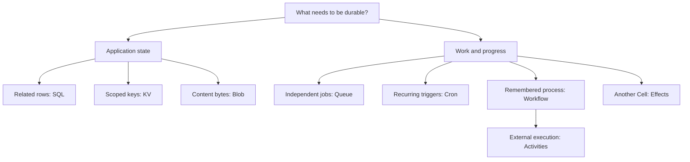
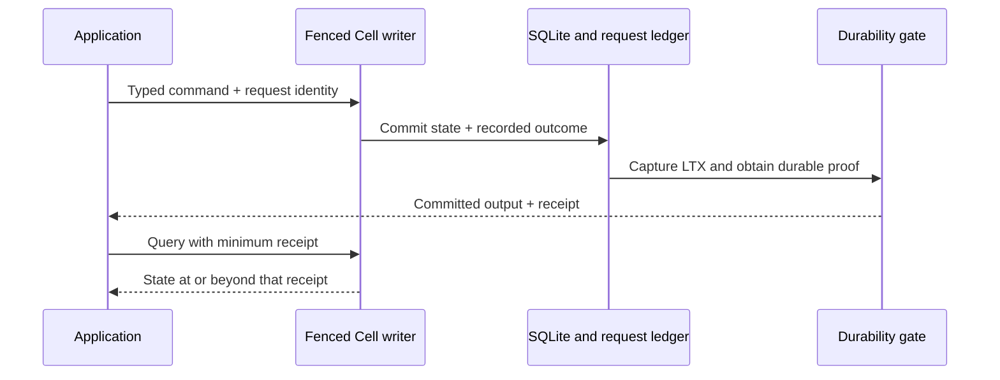
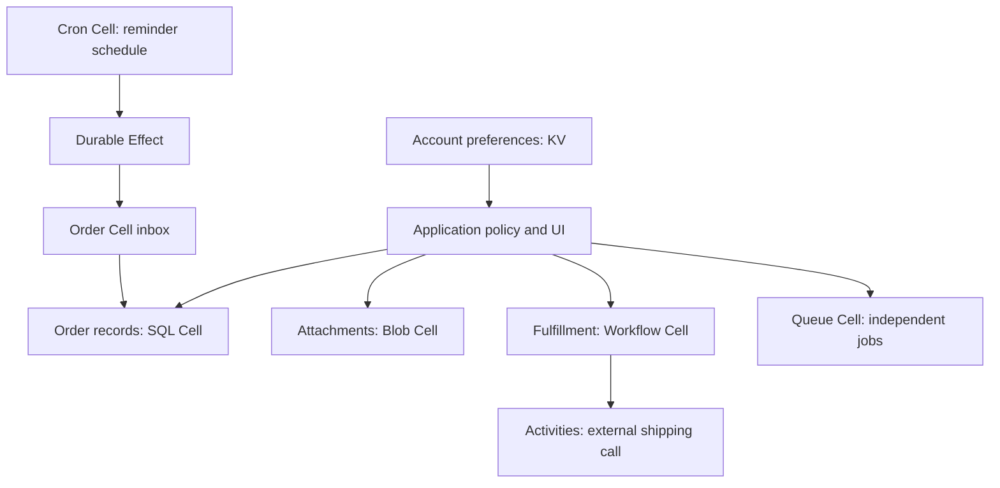

Cellule gives a Rust application eight ways to express durable state and work. SQL records relationships. KV updates scoped metadata. Blob publishes content. Queue distributes work. Cron records recurring triggers. Workflow remembers decisions. Activities perform external work. Effects deliver commands between Cells.

The APIs differ because the jobs differ. They share a Cell's fenced writer, SQLite transaction, request ledger, LTX capture, publication gate, and recovery. Learn that foundation once, then choose the primitive that matches your problem.

## Start with the job you need to do

| Your application needs to… | Start with | Example |
| --- | --- | --- |
| Update related rows together | [SQL](/docs/primitives/sql) | Save an order and its line items in one Cell |
| Change keys conditionally | [KV](/docs/primitives/kv) | Update account settings only if their version still matches |
| Store a body outside SQLite | [Blob](/docs/primitives/blob) | Publish an attachment after every part is recorded |
| Hand work to an available consumer | [Queue](/docs/primitives/queue) | Claim and acknowledge an email job |
| Generate a recurring trigger | [Cron](/docs/primitives/cron) | Record one reminder occurrence every minute |
| Remember a multi-step process | [Workflow](/docs/primitives/workflow) | Wait for an activity result before completing onboarding |
| Call an external service from a workflow | [Activities](/docs/primitives/activities) | Run an idempotent notification handler under a lease |
| Ask another Cell to apply a command | [Effects](/docs/primitives/effects) | Deliver a reminder to a destination inbox |

### Follow a decision



This is a starting point, not an exclusive choice. A product can use several primitives. First decide which state must commit together, then decide how work will cross that boundary.

## Understand the shared durability path

A mutation has two identities worth keeping separate: the **Cell target** says where it runs, and the **request identity** says which logical operation it represents. The module descriptor supplies operation IDs, codecs, limits, role, and partition rules.



Success follows durable publication or a recoverable follower-log proof. A local SQLite commit alone does not open the response gate. On an owner change, recovery restores the authority-pinned state and recorded outcomes together.

### Explore the response gate

Advance the steps below, then switch between object publication and follower proof. The response gate opens only after the selected path has durable evidence. This conceptual explorer illustrates the contract; it does not execute a runtime.

<DurabilityExplorer />

| Term | What it means for your code |
| --- | --- |
| Cell | One transaction and fenced-writer domain with a stable address |
| Mutation identity | Request ID, issued timestamp, and expiry for one logical command |
| Recorded outcome | Successful or rejected business result stored with the command |
| Receipt | Evidence of a committed position; a minimum for a read in that same Cell |
| Pending mutation | An unresolved result; preserve the evidence and resolve it before deciding what happened |
| Lease | Temporary permission to act on a claimed job, activity, or effect |

## Retry one operation with one identity

Keep the request ID **and command bytes** stable when retrying a logical mutation. Reusing an ID with different bytes is a conflict. Generating a new ID after a lost reply describes a new command and can repeat the business action.

This helper constructs the actual runtime type. The caller supplies a unique request ID and a trusted timestamp, then persists these values with the operation so a retry can reuse them. Checked arithmetic prevents expiry overflow.

```rust
use cellule_runtime::identity::RequestId;
use cellule_runtime::{Error, MutationIdentity};

fn mutation_identity(
    request_id: [u8; 16],
    issued_at_ms: i64,
) -> cellule_runtime::Result<MutationIdentity> {
    let expires_at_ms = issued_at_ms
        .checked_add(60_000)
        .ok_or(Error::Command("request expiry overflow"))?;
    Ok(MutationIdentity {
        request_id: RequestId::from_bytes(request_id),
        issued_at_ms,
        expires_at_ms,
    })
}
```

Separate mutations need separate identities: beginning an upload, storing a part, and completing an upload are three commands. Fixed IDs in the runnable programs are tutorial fixtures; production callers need an allocation policy.

See the [invocation guide](/docs/crates/app/docs/invocation) for `NotStarted`, `Rejected`, `Pending`, and resolution. A timeout is not sufficient evidence that nothing committed.

## Compose a product around explicit boundaries

Consider an order application. Its order rows belong in an SQL Cell. Attachments live in Blob Cells. A workflow remembers fulfillment progress. Activities call shipping services. Queue handles independent follow-up work. Cron emits recurring reminders. Effects carry commands between these Cells; KV stores account preferences.



The arrows describe application relationships. They do not imply one shared transaction. If an invariant requires two row updates to succeed together, place them in the same Cell and update them in one command. Calling two handle methods from one Rust function still produces two commands.

For cross-Cell processes, record the source decision and its Effect intent together, then let the destination inbox apply the command idempotently. For external systems, use a stable idempotency key and reconcile ambiguous outcomes. A Cell receipt does not prove that a remote payment or email happened exactly once.

## Know what the application supplies

| Framework responsibility | Embedding application responsibility |
| --- | --- |
| Typed command and query execution | Public HTTP endpoints and product authorization |
| Fencing, request outcomes, publication, and exact recovery | Object-store construction, credentials, and deployment |
| Bounded maintenance operations | Scheduling and supervising serving work |
| Queue, Activity, and Effect lease validation | External idempotency, deadlines, cancellation, and reconciliation |
| Primitive schemas and descriptor validation | Product schemas, stable namespace IDs, and partition choices |

`ApplicationHandle` binds tenant and application and checks the compiled primitive role. The embedding application still authorizes the user and selects the tenant. Reserved `sys_`, `kv_`, `blob_`, `queue_`, `cron_`, and `workflow_` tables are runtime implementation details.

## Work through the examples

Each child guide includes complete Rust functions with imports and explicit parameters. They expect an already registered, provisioned capability. Linked runnable programs include registration, local provisioning, storage setup, and shutdown.

| Run from the repository root | What to observe |
| --- | --- |
| `cargo run -p cellule-app --example sql --locked` | An order read at its committed receipt |
| `cargo run -p cellule-app --example basic --locked` | A KV value and a claimed, validated, acknowledged Queue job |
| `cargo run -p cellule-app --example blob --locked` | A completed attachment and verified content bytes |
| `cargo run -p cellule-app --example workflow --locked` | A workflow advanced by a supervised activity |
| `cargo run -p cellule-app --example schedules --locked` | A due Cron occurrence delivered through an Effect |

The examples use temporary SQLite files and in-memory object storage. They demonstrate contracts, not deployment capacity. For measured operating evidence, follow the [verification guide](/docs/guides/verification).

Start with [SQL](/docs/primitives/sql) or [KV](/docs/primitives/kv) for the command/receipt pattern, then [Queue](/docs/primitives/queue) for leases. Read [Workflow](/docs/primitives/workflow) with [Activities](/docs/primitives/activities), and [Cron](/docs/primitives/cron) with [Effects](/docs/primitives/effects). The [runtime primitive reference](/docs/crates/runtime/docs/primitives) remains the detailed contract source.
