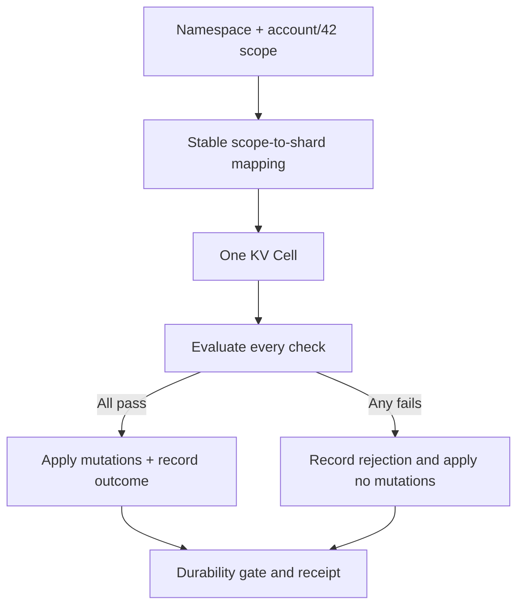
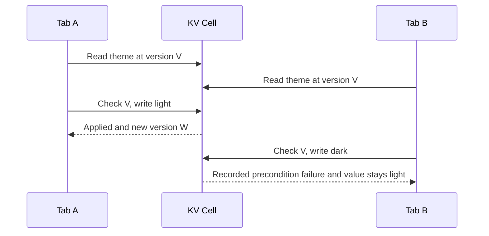

KV stores metadata without requiring an application table for every field. A scope groups keys into one atomic domain. The namespace and scope determine the shard; checks and mutations in one `KvAtomicRequest` run together in that shard's Cell transaction.

<PrimitiveDiagram id="kv" />

## Model a scope around an invariant

For account settings, use scope `account/42` with keys such as `theme` and `default_project`. Choose a scope containing the keys you need to update together, and keep its bytes stable across deployments.



Two scopes can happen to share a shard, but the `atomic` API still describes one scope. Do not design cross-scope invariants around an accidental hash collision. Shard count is part of the persisted topology contract.

| Choose KV for | Choose another primitive for |
| --- | --- |
| Settings, metadata, small lookup values | Relationships and joins: SQL |
| Create-if-absent and compare-and-swap | Large, frequently replaced bodies: Blob |
| A bounded group of scoped key changes | Durable external jobs: Queue or Activities |

## Write and read at a receipt

Obtain `application.kv::<M>(namespace)`. The registered module supplies operation IDs and codec limits; the namespace must have the KV role. The caller supplies the identity so a retry can reuse it.

```rust
use cellule_runtime::primitives::kv::{
    KvAtomicRequest, KvEntry, KvModule, KvMutation, KvNamespace,
};
use cellule_runtime::{Error, MutationIdentity};

async fn set_theme<M: KvModule>(
    kv: &KvNamespace<M>,
    identity: MutationIdentity,
) -> Result<KvEntry, Box<dyn std::error::Error>> {
    let scope = b"account/42".to_vec();
    let key = b"theme".to_vec();
    let committed = kv
        .atomic(
            identity,
            KvAtomicRequest {
                scope: scope.clone(),
                checks: Vec::new(),
                mutations: vec![KvMutation::Put {
                    key: key.clone(),
                    value: b"dark".to_vec(),
                    expires_at_ms: None,
                }],
            },
        )
        .await?;
    let observed = kv.get(scope, key, Some(committed.receipt)).await?;
    observed
        .output
        .ok_or_else(|| Error::Control("theme is missing at the committed receipt").into())
}
```

The entry contains value bytes, a version, and optional expiry. An unconditional put replaces the value. To prevent overwriting another user's change, add a version check.

## Replace only the version you read

Suppose two tabs read the same theme. Tab A saves first. Tab B must not silently overwrite A with a stale form. Pass the version that B read into the atomic request:

```rust
use cellule_runtime::primitives::kv::{
    KvAtomicOutcome, KvAtomicRequest, KvCheck, KvCondition, KvModule, KvMutation, KvNamespace,
};
use cellule_runtime::{Committed, InvocationError, MutationIdentity};

async fn replace_theme<M: KvModule>(
    kv: &KvNamespace<M>,
    identity: MutationIdentity,
    expected_version: [u8; 28],
    value: Vec<u8>,
) -> Result<Committed<KvAtomicOutcome>, InvocationError<KvAtomicOutcome>> {
    kv.atomic(
        identity,
        KvAtomicRequest {
            scope: b"account/42".to_vec(),
            checks: vec![KvCheck {
                key: b"theme".to_vec(),
                condition: KvCondition::Version(expected_version),
            }],
            mutations: vec![KvMutation::Put {
                key: b"theme".to_vec(),
                value,
                expires_at_ms: None,
            }],
        },
    )
    .await
}
```

This function preserves the typed invocation error. A failed condition is a durable `InvocationError::Rejected` containing `KvAtomicOutcome::PreconditionFailed`. Show a conflict or read the current value, then decide whether to issue a **new** logical command with a new identity.

Use `KvCondition::Absent` for create-if-missing. All checks run before any mutation, so one failed check prevents the entire mutation list from taking effect.



## Treat versions and expiry as runtime data

A version is a 28-byte incarnation-and-sequence value. Keep the bytes intact. Deleting and recreating a key produces a new version, so an old version cannot accidentally match the replacement.

Expiry is a logical timestamp evaluated inside the Cell. Reads exclude expired values; bounded maintenance cleans their rows later. A key's expiry and the mutation identity's expiry describe different things: one controls data visibility, the other controls command acceptance.

## List within one scope

`list(KvListRequest, minimum_receipt)` selects a scope, binary key prefix, optional `after_key`, and item limit. Results use binary key order. Carry the returned `next_after` into the next request. Each page is a current read; concurrent mutations can change later pages.

| Boundary | Current contract |
| --- | --- |
| Checks plus mutations | At most 128 combined |
| Value | At most 4 MiB |
| Atomic encoded budget | 4 MiB plus 64 KiB for keys and framing |
| List page | Ordinarily 1 MiB; one larger value occupies its own page |
| Value storage | SQLite and LTX history |
| Expired-row cleanup | Bounded maintenance Tick |

Register input and output limits large enough for your values. A primitive maximum does not override a tighter descriptor limit. Keeping metadata small makes bounded reads and recovery easier to operate.

## Run and extend the example

```sh
cargo run -p cellule-app --example basic --locked
```

The [basic source](https://github.com/crabbuild/cellule/blob/main/crates/cellule-app/examples/basic.rs) registers Settings and Jobs, writes `theme = dark` in `account/42`, reads at the receipt, then demonstrates a Queue lease. It includes local owner setup and shutdown.

To practice concurrency, replace the unconditional put with `Absent`, then issue a second command with a new identity. Observe rejection without a partial write. Next, capture the entry version and try the version-checked function above.

Continue with the [KV contract](/docs/crates/runtime/docs/primitives#kv), [invocation outcomes](/docs/crates/app/docs/invocation), and [Cell partitioning](/docs/crates/app/docs/topology).
