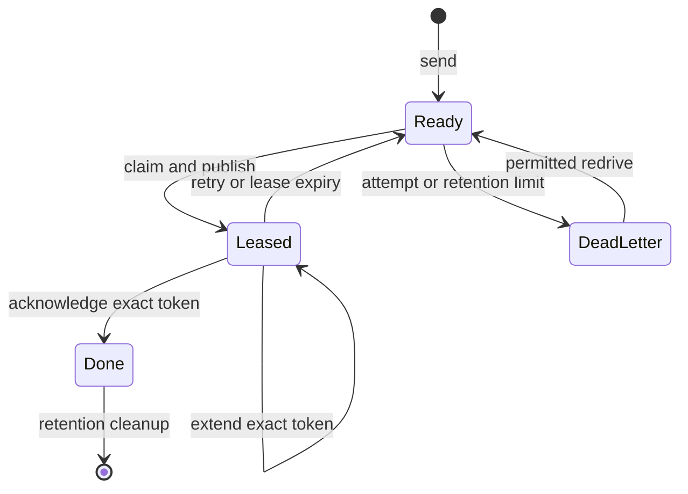
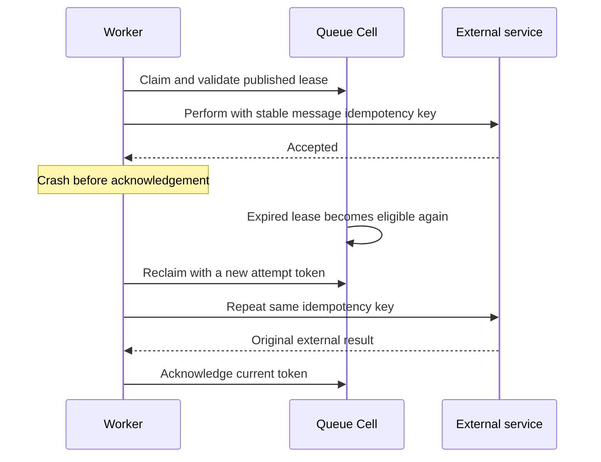

Queue separates producing work from performing it. A producer stores a payload; a consumer claims it under a lease, validates the claim, performs the work, and acknowledges it. Delivery is **at least once**. If a consumer disappears, another attempt can claim the job later.

<PrimitiveDiagram id="queue" />

## Choose Queue for independent jobs

Use Queue when a job can be handled by an available worker: sending email, generating a report, or rebuilding an index. Use [Workflow](/docs/primitives/workflow) when you need a remembered sequence of decisions, and [Activities](/docs/primitives/activities) for external work tied to that workflow.

Queue sends hash the producer ID to a shard. Consumers claim one explicit shard at a time, so serving workers need a deliberate policy for covering every configured shard. Queue does not promise FIFO ordering.



## Send a job with stable producer identity

Obtain `application.queue::<M>()` after registering the Queue module and namespace. This function preserves the typed result so callers can inspect both invocation errors and producer conflicts.

```rust
use cellule_runtime::primitives::queue::{
    QueueModule, QueueNamespace, QueueSendOutcome, QueueSendRequest,
};
use cellule_runtime::{Committed, InvocationError, MutationIdentity};

async fn send_email<M: QueueModule>(
    queue: &QueueNamespace<M>,
    identity: MutationIdentity,
    producer_id: [u8; 16],
    available_at_ms: i64,
) -> Result<Committed<QueueSendOutcome>, InvocationError<QueueSendOutcome>> {
    queue
        .send(
            identity,
            QueueSendRequest {
                producer_id,
                payload: b"send-email:order/42".to_vec(),
                available_at_ms,
            },
        )
        .await
}
```

There are two deduplication layers. The mutation identity resolves one send command. The producer ID identifies the produced message; repeating it with the same content returns its stable message identity, while conflicting content is rejected. The worker's lease token identifies one delivery attempt and changes when the job is reclaimed.

| Identifier | Keep stable across |
| --- | --- |
| Request ID | Retry or resolution of one send, claim, or acknowledgement command |
| Producer ID | Repeated submission of one produced message |
| Message ID | Delivery attempts of that stored job; useful for external idempotency |
| Lease token | Only the current claim; use the returned token for ack/retry/extend |

## Claim, validate, perform, acknowledge

This worker claims at most one message. Its `perform` callback receives the stable message ID and payload; the application must use that ID to make the external operation safe to repeat. Claim and acknowledgement are separate commands with separate identities.

```rust
use cellule_runtime::primitives::queue::{
    QueueClaimRequest, QueueLeaseOutcome, QueueModule, QueueNamespace,
};
use cellule_runtime::{Error, MutationIdentity};
use std::future::Future;

async fn process_one<M, F, Fut>(
    queue: &QueueNamespace<M>,
    shard: u32,
    claim_identity: MutationIdentity,
    ack_identity: MutationIdentity,
    perform: F,
) -> Result<bool, Box<dyn std::error::Error>>
where
    M: QueueModule,
    F: FnOnce([u8; 16], Vec<u8>) -> Fut,
    Fut: Future<Output = Result<(), Box<dyn std::error::Error>>>,
{
    let claimed = queue
        .claim(
            claim_identity,
            shard,
            QueueClaimRequest {
                limit: 1,
                lease_ms: 30_000,
            },
        )
        .await?;
    let Some(message) = claimed.output.first() else {
        return Ok(false);
    };
    let valid = queue
        .validate_claim(shard, claimed.output.clone(), Some(claimed.receipt))
        .await?;
    if !valid.output {
        return Err(Error::Control("queue lease is no longer valid").into());
    }
    perform(message.message_id, message.payload.clone()).await?;
    let acknowledged = queue
        .ack(ack_identity, shard, message.message_id, message.token)
        .await?;
    if !matches!(acknowledged.output, QueueLeaseOutcome::Applied { .. }) {
        return Err(Error::Control("queue acknowledgement did not apply").into());
    }
    Ok(true)
}
```

This is a small worker cycle, not a serving loop. The caller supplies a still-valid acknowledgement identity and keeps the work inside its lease budget. Longer work needs token-bound extension and cancellation/deadline handling. If the external call fails, this function returns without acknowledging; the application can explicitly retry or let bounded maintenance recover the expired lease.

## Understand the crash window



Lease validation protects admission to the work, but it cannot atomically include an external service call. A crash after the service accepts the call can repeat that call. Use provider idempotency or a product reconciliation protocol. If the work is entirely inside another Cell, [Effects](/docs/primitives/effects) provide destination inbox deduplication.

## Handle controls and terminal work

| Control or outcome | Meaning |
| --- | --- |
| Pause | Stops claims and invalidates claim revalidation; live leases can still ack, retry, or extend |
| Resume | Reopens claims and advances control generation |
| Purge | Deletes only non-leased messages, at most 128 per batch |
| Redrive | Returns dead messages to ready after any dead-letter effect is terminal |
| Info | Bounded aggregate counts for the shard |
| LeaseLost | The token is no longer current; do not force an acknowledgement |

A configured dead-letter target receives a typed durable Effect. The source retains the payload until that Effect reaches a terminal state. Inspect and remediate failed jobs instead of treating a retry-limit transition as successful work.

## Respect the current bounds

| Boundary | Current contract |
| --- | --- |
| Payload | At most 256 KiB |
| Lease | 5–300 seconds |
| Attempts | At most 20 |
| Retention | 30 days from enqueue |
| Claim batch | Bounded by item and registered output limits |
| Ordering | No FIFO guarantee |
| Delivery | At least once |

Choose a lease based on the work's actual duration, monitor attempts and dead-letter counts, and bound worker concurrency. Compiling a Queue module does not start consumers. The application owns worker startup, shard coverage, external credentials, and shutdown.

## Run the complete program

```sh
cargo run -p cellule-app --example basic --locked
```

The [basic source](https://github.com/crabbuild/cellule/blob/main/crates/cellule-app/examples/basic.rs) sends `send-email`, claims one message, validates it at its receipt, and acknowledges it. It demonstrates the lease path without actually calling an email provider. Expected output includes `queue job: send-email`.

Continue with the [Queue contract](/docs/crates/runtime/docs/primitives#queue), [invocation guide](/docs/crates/app/docs/invocation), and [Activities](/docs/primitives/activities) for supervised workflow work.
