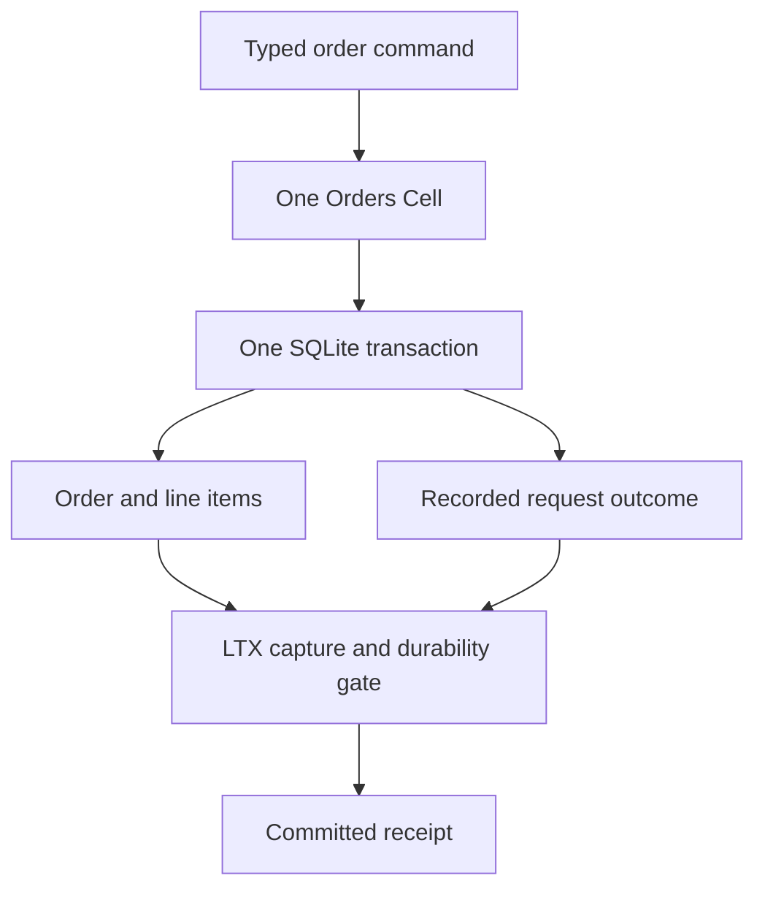
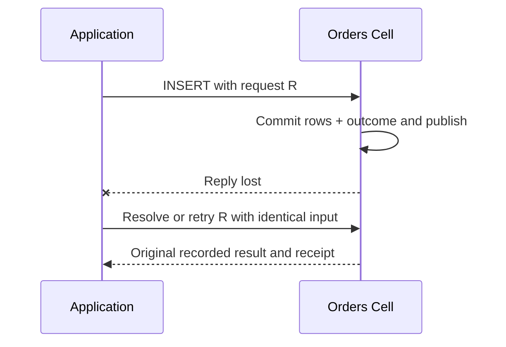

SQL is for application state with relationships: orders and line items, issues and labels, or a project and its permissions. A `SqlCell<M>` addresses one explicit SQL Cell. Its commands mutate rows, and its queries read them through the same typed runtime path.

<PrimitiveDiagram id="sql" />

## Choose the transaction boundary first

Put rows in the same Cell when an invariant needs them to commit together. An order total and its line items can share one command transaction. Independent orders can use different Cells when they do not need a shared invariant.

| Good fit | Consider another primitive when… |
| --- | --- |
| Related rows, indexes, and bounded relational queries | You only need scoped keys and version checks: use KV |
| Several row mutations that must succeed together | The body is large and frequently replaced: use Blob |
| Product-specific schemas and typed commands | The work belongs in another Cell: emit an Effect |

Calling two `batch` methods is two transactions. Neither a Rust function nor an HTTP request creates a transaction around multiple Cell calls.



## Commit an order and read its total

Obtain the capability with `application.sql::<M>(target)`. The application must register the module, declare the SQL role, migrate the schema, and provision the target. This function expects `orders(id INTEGER PRIMARY KEY, total_cents INTEGER NOT NULL)` to exist.

It accepts a registered `SqlModule` capability and one mutation identity. `SqlValue` binds values; the SQL string contains parameters rather than interpolated user input.

```rust
use cellule_runtime::primitives::sql::{SqlBatch, SqlCell, SqlModule, SqlStatement, SqlValue};
use cellule_runtime::{Error, MutationIdentity};

async fn save_order<M: SqlModule>(
    sql: &SqlCell<M>,
    identity: MutationIdentity,
    order_id: i64,
    total_cents: i64,
) -> Result<i64, Box<dyn std::error::Error>> {
    let committed = sql
        .batch(
            identity,
            SqlBatch {
                statements: vec![SqlStatement {
                    sql: "INSERT INTO orders (id, total_cents) VALUES (?1, ?2)".into(),
                    parameters: vec![SqlValue::Integer(order_id), SqlValue::Integer(total_cents)],
                }],
            },
        )
        .await?;

    let observed = sql
        .query(
            Some(committed.receipt),
            SqlBatch {
                statements: vec![SqlStatement {
                    sql: "SELECT total_cents FROM orders WHERE id = ?1".into(),
                    parameters: vec![SqlValue::Integer(order_id)],
                }],
            },
        )
        .await?;
    let [result] = observed.output.as_slice() else {
        return Err(Error::Control("expected one query result").into());
    };
    let [row] = result.rows.as_slice() else {
        return Err(Error::Control("expected one order row").into());
    };
    let [SqlValue::Integer(total)] = row.as_slice() else {
        return Err(Error::Control("expected an integer total").into());
    };
    Ok(*total)
}
```

The minimum receipt requires the query to observe this command's committed position in this Cell. It can observe a later position too; it is not a historical snapshot selector. An unrelated Cell cannot use this receipt as its consistency boundary.

### Read a bounded page

For a current read, pass `None`. Select a small page in key order instead of returning an entire table. The `after_id` value is an application cursor, not a promise that multiple pages share one snapshot.

```rust
use cellule_runtime::primitives::sql::{
    SqlBatch, SqlCell, SqlModule, SqlResultSet, SqlStatement, SqlValue,
};

async fn list_orders<M: SqlModule>(
    sql: &SqlCell<M>,
    after_id: i64,
) -> Result<Vec<SqlResultSet>, Box<dyn std::error::Error>> {
    let observed = sql
        .query(
            None,
            SqlBatch {
                statements: vec![SqlStatement {
                    sql: "SELECT id, total_cents FROM orders WHERE id > ?1 ORDER BY id LIMIT 50"
                        .into(),
                    parameters: vec![SqlValue::Integer(after_id)],
                }],
            },
        )
        .await?;
    Ok(observed.output)
}
```

## Follow a lost reply



Deduplication protects the same logical command. A fresh request ID is a fresh INSERT and may encounter a primary-key constraint. Preserve unresolved mutation evidence; the [invocation guide](/docs/crates/app/docs/invocation) distinguishes rejection, non-start, and pending publication.

## Design within the SQL contract

| Boundary | Current contract |
| --- | --- |
| Statements per batch | At most 128 |
| Encoded input | At most 1 MiB |
| Result rows | At most 1,000 |
| Encoded output | At most 1 MiB |
| Query statements | Read-only |
| Command statements | Mutating |
| Rejected statements | Transaction control and schema changes |

Use migrations for schema changes and indexes for your access patterns. Registered operation limits can be tighter than the primitive maximum. A large result can hit the byte bound before the row bound.

At the product boundary, prefer domain commands such as `CreateOrder` over a public arbitrary-SQL endpoint. Validation and authorization belong to the embedding application. Application SQL cannot access reserved runtime tables.

## Combine SQL with other primitives

To notify another Cell after an order changes, use a registered domain command that changes the order and calls `CommandContext::emit_effect` in the same transaction. A separate network send after `batch` returns leaves a crash window between the durable order and notification.

Publish attachments with [Blob](/docs/primitives/blob) and track their relationship explicitly. Remember shipping progress or wait for external completion with [Workflow](/docs/primitives/workflow) and [Activities](/docs/primitives/activities).

## Run the complete program

```sh
cargo run -p cellule-app --example sql --locked
```

The [SQL source](https://github.com/crabbuild/cellule/blob/main/crates/cellule-app/examples/sql.rs) registers an Orders module, provisions a local fenced owner, saves order `42` for `1,999` cents, verifies the receipt-bound result, and drains the runtime on exit. Temporary SQLite and in-memory object storage are tutorial fixtures.

Continue with the [SQL runtime contract](/docs/crates/runtime/docs/primitives#sql), [typed capability reference](/docs/guides/api#primitive-capabilities), and [partitioning guide](/docs/crates/app/docs/topology).
