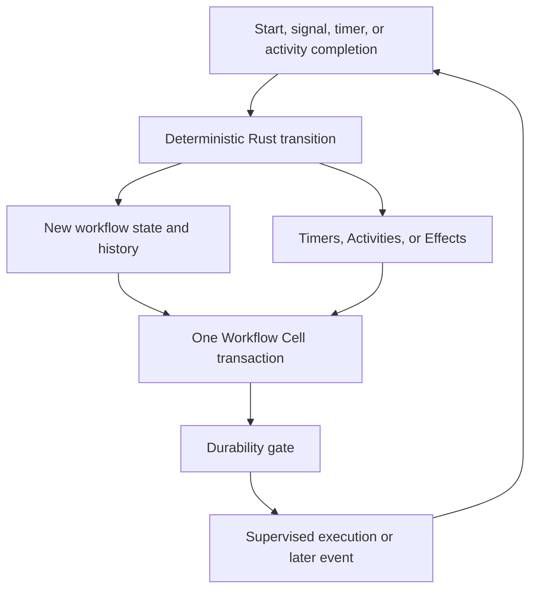
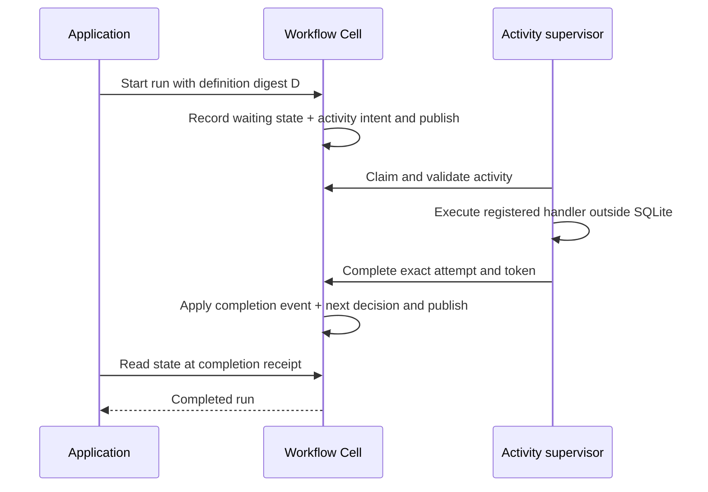

Workflow is a durable state machine for a process that outlives one request: onboarding, fulfillment, a review, or a staged migration. A run records its state and history. A compiled Rust definition decides how an event changes that state and which durable actions to request.

<PrimitiveDiagram id="workflow" />

## Separate decisions from execution

A transition runs inside the Cell's SQLite transaction. It can produce new state, timers, activity intents, cross-Cell Effects, or terminal status. It cannot perform network or object-store I/O. [Activities](/docs/primitives/activities) execute external work after a published claim and return a recorded result.



Workflow ID bytes select the shard. The run pins a definition digest when it starts. Retain every definition referenced by stored runs; changing the current definition affects new runs, not an automatic migration of old ones.

## Define a small process

This definition follows the runnable welcome example: `begin` records one `echo` Activity, then an activity-completion event finishes the run. The digest is an explicit tutorial fixture. A release must give each actual definition version its stable digest and retain the needed versions.

```rust
use cellule_runtime::primitives::workflow::{
    WorkflowAction, WorkflowContext, WorkflowDecision, WorkflowDefinition, WorkflowStatus,
};
use cellule_runtime::{Digest, Error};

struct Welcome;

impl WorkflowDefinition for Welcome {
    fn digest(&self) -> Digest {
        Digest::from_bytes([72; 32])
    }

    fn transition(
        &self,
        state: &[u8],
        event: &[u8],
        context: WorkflowContext,
    ) -> cellule_runtime::Result<WorkflowDecision> {
        if state.is_empty() && event == b"begin" {
            let expires_at_ms = context
                .now_ms()
                .checked_add(60_000)
                .ok_or(Error::Command("activity expiry overflow"))?;
            return Ok(WorkflowDecision {
                status: WorkflowStatus::Running,
                state: b"waiting-for-activity".to_vec(),
                result: None,
                actions: vec![WorkflowAction::Activity {
                    activity_type: "echo".into(),
                    input: b"welcome sent".to_vec(),
                    due_at_ms: context.now_ms(),
                    expires_at_ms,
                }],
            });
        }
        if state == b"waiting-for-activity" && event.starts_with(b"activity\0") {
            return Ok(WorkflowDecision {
                status: WorkflowStatus::Completed,
                state: b"done".to_vec(),
                result: Some(event.to_vec()),
                actions: Vec::new(),
            });
        }
        Err(Error::Command("unexpected welcome transition"))
    }
}
```

The example recognizes the native completion-event prefix and stores the event bytes. A product definition should decode and validate its event formats and distinguish successful completion from failure before choosing the next business state. Keep that decision deterministic; use the supplied context rather than sampling wall-clock time in the transition.

The module registers this definition, declares the `echo` activity type, and binds the workflow and activity operations. The full program includes those descriptors and schemas.

## Start and inspect a run

Obtain `application.workflow::<M>()`. This function confirms the initial state at the start receipt. It does not run an Activity or wait until the entire process completes.

```rust
use cellule_runtime::primitives::workflow::{WorkflowModule, WorkflowNamespace, WorkflowRun};
use cellule_runtime::{Error, MutationIdentity};

async fn start_welcome<M: WorkflowModule>(
    workflows: &WorkflowNamespace<M>,
    identity: MutationIdentity,
    workflow_id: Vec<u8>,
) -> Result<WorkflowRun, Box<dyn std::error::Error>> {
    let started = workflows
        .start(identity, workflow_id.clone(), b"begin".to_vec())
        .await?;
    let observed = workflows.state(workflow_id, Some(started.receipt)).await?;
    observed
        .output
        .ok_or_else(|| Error::Control("started workflow is missing").into())
}
```

### Send a signal to the exact run

A workflow ID names the logical process; a run ID names one execution of it. Use the run returned by the runtime rather than sending a signal to a guessed or obsolete run. A stable signal ID makes repeated delivery idempotent in that run.

```rust
use cellule_runtime::primitives::workflow::{
    WorkflowModule, WorkflowNamespace, WorkflowOutcome, WorkflowSignal,
};
use cellule_runtime::{Committed, InvocationError, MutationIdentity};

async fn send_signal<M: WorkflowModule>(
    workflows: &WorkflowNamespace<M>,
    identity: MutationIdentity,
    workflow_id: Vec<u8>,
    run_id: [u8; 16],
    signal_id: [u8; 16],
    event: Vec<u8>,
) -> Result<Committed<WorkflowOutcome>, InvocationError<WorkflowOutcome>> {
    workflows
        .signal(
            identity,
            WorkflowSignal {
                workflow_id,
                run_id,
                signal_id,
                event,
            },
        )
        .await
}
```

The signal's bytes must match the receiving definition's event contract. The welcome definition above accepts its begin and native completion events; it does not define an approval event. A review workflow would explicitly implement that transition.

## Follow durable progress



A crash can interrupt progress, but the published state still explains what must happen next. A pending command must be resolved before inventing a replacement event. A duplicate signal should reuse its signal identity and input rather than allocating new identities after a lost response.

## Use controls without losing history boundaries

| Control or outcome | Behavior |
| --- | --- |
| Pause | Accepted only with no live activity lease; ready work remains durable |
| Resume | Returns to running without synthesizing an event |
| Restart | Terminal runs only; starts a new request-derived run under the current definition |
| Cancel | Idempotent workflow event that cancels outstanding local work |
| RunMismatch | The command names a different execution from the current run |
| NotRunning | The status does not accept the requested operation |

Quiescent pause avoids discarding a completion from external work already in flight. Restart removes terminal local history as documented; it is not a rewind that makes an external side effect disappear. Define product compensation and reconciliation explicitly.

## Bound state and retain definitions

| Boundary | Current contract |
| --- | --- |
| State or event payload | At most 1 MiB |
| Activity payload | At most 256 KiB |
| Activity attempts | At most 20 |
| Activity lifetime | At most 7 days |
| Definition retention | Current plus every digest referenced by stored runs |

Keep state focused on decisions and references rather than accumulating unbounded external bodies. Timers require maintenance scheduling; activities require supervisors. Registry compilation alone does not start either loop.

## Run the complete program

```sh
cargo run -p cellule-app --example workflow --locked
```

The [workflow source](https://github.com/crabbuild/cellule/blob/main/crates/cellule-app/examples/workflow.rs) registers a Welcome definition and Echo handler, starts `welcome/42`, supervises one activity, then reads completed state at the completion receipt. Expected output is `workflow welcome/42: completed`.

Continue with [Activities](/docs/primitives/activities), the [Workflow contract](/docs/crates/runtime/docs/primitives#workflow), and the [application guide](/docs/crates/app).
