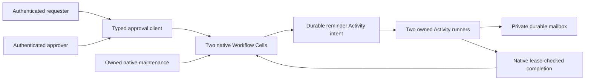

# Purchase approvals

A runnable human approval application with two Workflow shards, deterministic
signals and timers, and a real reminder Activity. Each purchase requires all
assigned approvers; one rejection ends the request. The requester controls
pause, resume, cancellation, and restart. Reminder delivery creates an immutable,
verified record in an application-owned local mailbox outside SQLite.



## Run

From the repository root, with Rust 1.97 and Docker Compose:

```sh
sh cookbook/scripts/approvals.sh
```

The demo submits a purchase, replays its retained request, waits for the owned
timer and Activity, verifies the mailbox record, deduplicates a human signal,
collects two approvals, reads the completed state at its receipt, and drains.
It uses persistent local S3-compatible storage with development credentials;
no cloud account is required. The [workspace guide](../../README.md) explains
storage, working files, and explicit reset.

## Contracts

| Boundary | Policy |
| --- | --- |
| Identity | A purchase is a canonical nonzero UUID; its 16 bytes select one of two fixed Workflow shards. Native run IDs fence signals and controls across restarts. |
| Human authorization | The embedding supplies a verified employee and tenant handle. Submit stamps that employee; only assigned approvers vote, and only the requester controls the run. Team members may inspect requests. |
| Local personas | The CLI simulates `alice`, `bob`, `carol`, and `dana`. Its security boundary is the operating-system user; choosing a persona is not network authentication. |
| Decisions | First accepted vote per employee is immutable. Repeating a signal ID with identical bytes is a native duplicate; changing its bytes is a durable identity conflict. A new signal cannot overwrite a prior vote. |
| Deadline | Logical time at or after the frozen deadline takes precedence over a new vote or Activity completion, even if the deadline timer is queued behind it. A late submission completes as timed out. |
| Reminder | One timer creates one native Activity with immutable recipients and input. An overdue reminder at submission is scheduled immediately. Terminal reminder failure is observable without preventing a later human decision. |
| Pause | Native pause requires no leased Activity. Pause stops timers and new claims; it does not move the absolute deadline. Resume after the deadline produces timeout. |
| Cancellation | Native cancellation stops local outstanding work. A mailbox record already published remains an external fact and carries its exact run ID. Cancellation does not retract it. |
| Restart | Only terminal runs restart. Restart replaces the native current-run state and history; this is not an archival system. Old retained outcomes remain resolvable within request retention, and old-run signals cannot vote in the new run. |
| History | Current-run business transitions have bounded, receipt-aware pages of 1–10 entries. Each traversal pins the exact run ID. Native duplicate/ignored signals and control operations are not new business transitions. Native event sequence gaps are expected. |
| Limits | Four sorted, distinct approvers excluding the requester; 128-byte title, bounded synthetic units, 8-KiB definition values, two runners, one Activity per claim, 15-second heartbeat leases, 64-MiB Cells, and shared explicit host budgets. |

## Retain before dispatch

Preparation writes a version-one JSON record containing the authenticated
persona, absolute times, canonical mailbox directory, and exact operation.
It fsyncs the file and parent directory and refuses to overwrite an existing
record. The identity lasts five minutes. Preserve the record unchanged when
an outcome is unknown; resolution never dispatches. Expiry does not prove
absence. Native business rejections are printed and exit unsuccessfully.

```sh
cat > /tmp/purchase.json <<'JSON'
{"operation":"submit","id":"018f7ce0-67d0-7000-8000-000000000001","title":"Workstations","units":2400,"approvers":["bob","carol"],"timeout_ms":600000,"remind_in_ms":1000}
JSON
sh cookbook/scripts/approvals.sh prepare alice /tmp/approval-mailbox /tmp/purchase.json /tmp/purchase.mutation.json
sh cookbook/scripts/approvals.sh apply cookbook/.state/approvals alice /tmp/purchase.mutation.json
sh cookbook/scripts/approvals.sh resolve cookbook/.state/approvals alice /tmp/purchase.mutation.json
sh cookbook/scripts/approvals.sh serve cookbook/.state/approvals 5
sh cookbook/scripts/approvals.sh get cookbook/.state/approvals alice 018f7ce0-67d0-7000-8000-000000000001
```

`get` returns the current native run ID as 16 bytes. Render those bytes as a
UUID for the following operation shapes; `signal_id` is a separately retained,
canonical nonzero UUID. The caller supplies the authenticated persona to
prepare, apply, and resolve; the retained persona must match it.

```json
{"operation":"vote","id":"PURCHASE_UUID","run_id":"RUN_UUID","signal_id":"SIGNAL_UUID","choice":"approve"}
{"operation":"pause","id":"PURCHASE_UUID","run_id":"RUN_UUID"}
{"operation":"resume","id":"PURCHASE_UUID","run_id":"RUN_UUID"}
{"operation":"cancel","id":"PURCHASE_UUID","run_id":"RUN_UUID"}
```

Restart combines `run_id` with a new submission's fields and the same purchase
ID. The deadline is frozen anew. Use `history STATE_DIRECTORY PRINCIPAL
PURCHASE_UUID RUN_UUID - 2`, then its `next` sequence to continue. A changed
run is rejected instead of silently applying an old cursor to new history.

## External durability and lifecycle

The mailbox is a local notification simulator, an independent external system.
The Activity derives its stable key through `ActivityContext::idempotency_key`.
It renders bounded content, writes and fsyncs a private temporary file, publishes
without overwriting a destination, and fsyncs the directory. A retry verifies
existing bytes and returns the same content digest; conflicting bytes fail.
`read_mail` checks both the digest and key. The Activity performs file I/O
outside SQLite, with at most one file operation per owned runner.

Store the mailbox in a private local directory configured by the application,
separate from disposable SQLite working files. Do not delete it when testing
Cellule cold restore. Mailbox cleanup and recipient consumption are application
policy; a production adapter should use an external idempotency/reconciliation
contract appropriate to its notification service.

`serve` installs the Activity runners; compilation and native timer maintenance
alone do not execute reminders. A signed 30-second node lease fences live-owner
takeover. SIGINT/SIGTERM stop serving admission and await accepted Activity
completion, then release ownership and SQLite files. Interrupted mutations
exit unsuccessfully and retain their evidence. SIGKILL requires lease expiry
before a successor can acquire ownership.

For process fault evidence, `publication_delay_ms` delays only a newly created
mailbox record's return by at most ten seconds. Its structured
`mailbox_published` tracing event occurs after durable external publication.
A replay of an existing record skips the delay. This provides a concrete crash
seam between external work and native Workflow completion.

## Evidence and reuse

The [public behavior suite](tests/application.rs) covers immutable human votes,
deduplication and changed-signal rejection, authorization, owned timers and
Activities, verified mailbox records, cold restore, receipt-bound reads,
pagination, requester controls, old-vote resolution after reassignment,
deadline precedence, and graceful Activity drain.
The [process driver](../../scenarios/approvals.py) uses private persistent storage
and kills a worker after its durable mailbox publication, then proves lease
fencing, takeover, same-key retry, one external record, human decision replay,
terminal-state rejection, and exact-run restart behavior.

Reuse `ApprovalClient`, domain types, `open`, and `spawn_reminders` in an
embedding application. The current definition and Activity implementation are
pinned by digest. Changed source/schema is rejected by the support assembly;
compatible release evolution and retention of additional live definitions
belong to the catalog's evolution application. No alternate publication path
or migration bypass is introduced. The full [catalog](../../../docs/cookbook.md)
contains the remaining applications.
