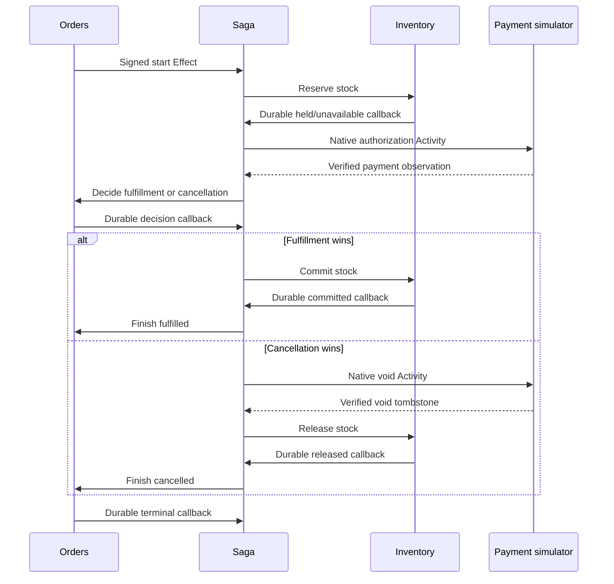

# Checkout

This reference application places orders, reserves stock, authorizes a synthetic
payment, and either fulfills the order or compensates it. Its reusable library
owns the domain contracts; its binary owns local HTTP authentication, providers,
process signals, and worker lifetime. It uses the public Cellule APIs.

**Implementation status:** qualified and runnable. All 18 checkout tests passed
in the isolated workspace qualification, alongside the existing applications:
173 tests total, with none failed or ignored. Both persistent demos and the
24-check process journey passed; build, format, checks, Clippy, API docs, and
layout/documentation gates passed. The process journey reclaimed the same
native Activity for both fulfillment and cancellation recovery, then restored
order, inventory, and payment records from retained authoritative objects.

## Run

From the repository root, with Rust 1.97 and Docker Compose:

```sh
sh cookbook/scripts/checkout.sh
```

The demo starts an independently owned payment receiver and executes four fresh
orders: fulfillment, declined payment, unavailable stock, and cancellation after
authorization. It checks payment apply counts, inventory settlement, native saga
completion, and permanent placement replay before draining both nodes. Repeating
the demo uses fresh order UUIDs and the same permanent inventory seed. If an
interrupted demo leaves pending work, inspect its stored payment origin and
restart the payment receiver on that exact port before resuming checkout; the
origin is part of the immutable business request.

The local provider uses the shared cookbook development credentials. The receiver
accepts only numeric loopback HTTP, has a separate authoritative storage prefix,
and uses `CELLULE_CHECKOUT_PAYMENT_TOKEN` (default `cookbook-local-payment`). This
credential is read from the environment and is never persisted in an order.
This simulator performs no real charge and needs no cloud or payment account.

## Separate transaction domains

| Domain | Durable contract |
| --- | --- |
| Orders | Permanent immutable request, cancellation intent, irrevocable fulfillment decision, terminal projection, and original saga-start Effect. |
| Inventory | Fixed initial capacity, atomic holds, sold units, release/unavailable tombstones, and callback Effects. |
| Sagas | Native Workflow, exact run/step correlation, payment Activities, permanent callback bindings, and bounded reconciliation tokens. |
| Payments | Independent simulator authorization/decline/void record keyed by order UUID and every immutable request field. |



Each SQL receiver publishes its decision and callback intent atomically. A native
Effect receipt acknowledges delivery; the matching domain callback advances the
saga. The saga completes only after the terminal order callback. Reads of an
order, reservation, payment, and saga have independent Cell receipts; a receipt
from one domain does not establish visibility in another.

Cancellation requests race with the order Cell's fulfillment decision. Before
that decision, cancellation triggers compensation; after `Committing`, it returns
`TooLate`. An already accepted cancellation remains replayable after completion.
A declined or unavailable order may also finish cancelled if cancellation won
before terminal publication. An order that never dispatched payment needs no void.

Payment idempotency uses the permanent order UUID and full frozen request, even
when native Activity IDs, completion tokens, lease attempts, or reconciliation
attempts change. Authorization and void each apply at most once. A void arriving
before authorization creates a tombstone that blocks any later authorization.
The adapter looks up the business record after a lost HTTP reply.

An uncertain authorization or void moves the order to `NeedsReview` and keeps its
stock held. A verified authorization returned during a void attempt also remains
unsettled. The operator can submit a retained reconciliation token to retry the
same business identity. Eight distinct attempts are allowed; exhausting them
leaves the uncertainty and stock hold visible for application-specific handling.
No automatic timeout claims a refund, absence, or release.

## Retained ingress and inspection

Prepare commands offline and preserve the resulting file unchanged:

```sh
mkdir -p cookbook/.state/checkout
cat > cookbook/.state/checkout/seed.json <<'JSON'
{"operation":"seed","seed":{"sku":"widget","units":100}}
JSON
sh cookbook/scripts/checkout.sh prepare cookbook/.state/checkout/seed.json cookbook/.state/checkout/seed.request.json
sh cookbook/scripts/checkout.sh apply cookbook/.state/checkout cookbook/.state/checkout/seed.request.json
sh cookbook/scripts/checkout.sh resolve cookbook/.state/checkout cookbook/.state/checkout/seed.request.json
```

Other concrete ingress shapes are:

```json
{"operation":"place","spec":{"id":"00000000-0000-0000-0000-000000000001","sku":"widget","quantity":1,"amount":125,"payment_endpoint":"http://127.0.0.1:19025/","payment_policy":"Approve"}}
```

```json
{"operation":"cancel","order":"00000000-0000-0000-0000-000000000001"}
```

```json
{"operation":"reconcile","input":{"order":"00000000-0000-0000-0000-000000000001","token":"00000000-0000-0000-0000-000000000002"}}
```

Run `payment-state FAULT_FILE up`, then `payment-server PAYMENT_STATE 19025
FAULT_FILE` in one terminal and `serve CHECKOUT_STATE` in another. The receiver
owns only Payments; the checkout owns Orders, Inventory, and Sagas. Each CLI
mutation/query acquires ownership, so stop the corresponding serving process
before using its state directory from a second process. Embeddings can use the
same typed `CheckoutClient` concurrently through the current owner's handle.

Inspection commands are `order`, `reservation`, `saga`, `stock`, `orders`, and
`payment`; see `help` for arguments. `resolve` reads the original native outcome
without dispatch. Prepared identities live at most five minutes; an expired
resolution runs offline without creating a state directory and proves no absence.
A native accepted placement is distinct from a terminal order result.

## Bounds and lifecycle

| Resource | Limit |
| --- | --- |
| Permanent orders, reservations, sagas, payments | 128 each per installation. |
| Permanent product seeds | 16; identical replay does not replenish sold or held units. |
| Permanent internal messages/callbacks | 4,096 per domain; no deduplication pruning. |
| Quantity / initial stock / synthetic amount | 1–100 / 1–10,000 / 1–1,000,000 minor units. |
| Reconciliation tokens | Eight distinct accepted tokens per order. |
| Order query page / encoded output | 1–100 current records / 256 KiB. |
| HTTP body / response / live sockets / admitted mutations | 4 KiB / 4 KiB / eight / four. |
| HTTP header/body deadlines | Two seconds each. |
| Activity / Effect retention | Ten minutes per Activity / seven days per Effect. |
| Worker polling | 200 ms when active, up to two seconds when idle. |

These are deliberate reference bounds, not speculative production configuration.
Domain identities are retained permanently. Exhausted message capacity or an
expired delivery remains inspectable in native evidence and does not silently
complete the order. Deployments need their own retention, operator escalation,
refund policy, payment adapter, HTTP authorization, and trust discovery.

Workers supervise signed Effects and native Activities. Signed routes pin source
Cell, destination, operation, codec, permission, and payload role. Process-local
signing trust is ephemeral; remote deployments supply durable trust. The receiver
owns admitted mutation jobs separately from HTTP connections. Disconnecting the
caller cannot cancel publication; shutdown stops admission and drains accepted
jobs, workers, leases, and SQLite handles.

## Verification

Focused tests cover contention and capacity conservation, permanent identity
conflicts, tombstones, causal callbacks, decision races, compensation, explicit
uncertainty, bounded reconciliation, original outcome resolution, cold restore,
canonical wire fixtures, actual HTTP reply loss, authentication, body bounds, and
signed end-to-end journeys.

```sh
cargo test --manifest-path cookbook/Cargo.toml -p cellule-cookbook-checkout --locked
cargo clippy --manifest-path cookbook/Cargo.toml -p cellule-cookbook-checkout --all-targets --locked -- -D warnings
```

Run `python3 cookbook/scenarios/checkout.py BINARY` only in CI or an isolated
source snapshot with private authoritative storage. It kills checkout after
external authorization and before native completion, then proves both recovered
fulfillment and recovered cancellation using the same native action and permanent
payment key. It also exercises an actual dropped reply, HTTP outage and operator
review, pagination, seed replay, owned drain, and cold restoration of both nodes.
The fixture modes `down` and `drop-authorize-reply` are explicit failure injection;
the latter drops one authorization reply per receiver process after publication.
`CELLULE_CHECKOUT_AFTER_AUTHORIZATION_MS` delays the native completion checkpoint
by at most ten seconds for the crash scenario.

See the [catalog](../../../docs/cookbook.md), [cookbook guide](../../README.md), and
[framework integration guide](../../../docs/framework.md).
