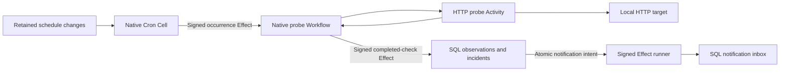

# Endpoint monitor

Schedule local HTTP probes, retain the first native-completed observation, open
and close incidents, and deliver durable notification edges to an independent
SQL inbox. The library owns immutable definitions, business identities,
incident policy, typed clients, and the compiled application. The executable
owns its private provider scope, OS-principal ingress, synthetic target,
signed peer trust, background workers, signals, and drain.

**Qualified:** public-behavior tests, repeated persistent demos, and the
crash, redelivery, and cold-restore scenario pass.

```sh
sh cookbook/scripts/endpoint-monitor.sh
```

The demo runs a real numeric-loopback HTTP target, observes an outage and
recovery, verifies one opening and one closing notification for the same
incident, exercises actual lost-reply resolution, and pauses scheduling. The demo uses
a five-second interval to leave durable provider capacity for every pipeline
stage. It pauses its own schedule on success, error, or interruption.
Docker Compose and Rust 1.97 are required. Each demo consumes a permanent
monitor identity and definition. Authoritative objects use the private
`cookbook/endpoint-monitor/cells` prefix.



## Contracts

| Boundary | Application policy |
| --- | --- |
| Schedule configuration | Canonical nonzero monitor and definition UUIDs. Definition identity permanently binds monitor, endpoint, interval, and first due time. A replacement or recreated lifetime needs a new definition UUID. Replaying an old definition returns its original generation without reactivating or replacing a later configuration. |
| Scheduling | Native fixed intervals, one second through one year. Preparation freezes the relative initial delay. Native Cron retains absolute occurrence times; bounded catch-up publishes separate occurrence intent. Pause/delete prevent future ticks; previously published probes remain eligible. |
| Probe identity | Authorized Cron Cell, monitor, immutable definition, native generation, and occurrence derive the permanent check key. Run IDs and lease attempts do not change it. One permanently bound occurrence starts one native Workflow. |
| External observation | Read-only HTTP GET runs outside SQLite. Redirects and proxies are disabled; connection timeout is 500 ms, total timeout 1500 ms, response body at most 1024 bytes. HTTP 2xx with a bounded readable body is up; other status, timeout, transport failure, or oversized body is down. |
| Observation durability | Before native completion, redelivery may observe a changed endpoint. The first durable Workflow completion fixes the observation and atomically publishes its result Effect. A completed Workflow receipt does not prove SQL projection visibility. |
| Unknown outcome | Stale scheduled probes and native execution failures produce an explicit unknown observation. Unknown advances the incident watermark but preserves known health and an open incident; it does not claim recovery or that no HTTP request ran. |
| Incident ordering | State is scoped to one immutable definition. Only a greater occurrence counter advances it. Late observations remain immutable history and cannot overwrite a newer status or reopen a recovered incident. This watermark policy can omit a historical transient outage whose check arrives late. |
| Incident transaction | A down observation without an open incident opens one; further down observations add history. An up observation closes the open incident. Check, watermark, incident edge, and notification intent publish in one SQL transaction. |
| Deduplication | An identical check or notification edge returns its original row and outcome. Changed immutable bytes under the same business key are durably rejected. Native source Effect redelivery cannot create an additional incident edge. |
| Notifications | Signed Effects deliver to a separate permanent SQL inbox. Inbox arrival order is not source occurrence order. Inspect source and destination receipts separately. The reference inbox is the application notification destination. |
| Authority | The local OS caller controls this installation. Peer delivery permits only the exact pinned source Cell, destination, command, and application permission. Probe URLs are canonical numeric IPv4 loopback HTTP with an explicit port, bounded path, and no credentials, query, or fragment. |
| Ownership | One fixed shard per namespace. One supervisor per native source, with 200-ms pacing after work and exponential idle backoff capped at two seconds; accepted HTTP calls and signed delivery cycles finish before graceful drain. Runner failure closes readiness and retains originating errors or pending evidence. |

The installation retains at most 16 permanent monitor identities, 128 immutable
schedule definitions, and 2048 permanent probe bindings/checks/notification edges.
No lifetime deduplication records are deleted. Operators pause schedules before
capacity is exhausted; a production installation chooses partition and retention
policies consistent with these contracts. Each Cell declares 64 MiB native and
16 MiB change limits. Check and alert queries return 1–100 items with explicit
receiver-local keyset cursors and a 256-KiB encoded output limit. Pagination uses current reads, not a snapshot
across commands or Cells.

## Persistent commands

Use a private target-state file and a free loopback port. Target operations and
preparation run without storage. Run the target in a separate terminal:

```sh
sh cookbook/scripts/endpoint-monitor.sh target-state /tmp/monitor-target.txt up
sh cookbook/scripts/endpoint-monitor.sh target 19024 /tmp/monitor-target.txt 300
```

Prepare and retain a configuration before dispatch:

```sh
cat > /tmp/monitor-change.json <<'JSON'
{"operation":"upsert","monitor":"00000000-0000-0000-0000-000000000001","definition":{"id":"00000000-0000-0000-0000-000000000002","label":"Local API","endpoint":"http://127.0.0.1:19024/probe"},"interval_ms":1000,"start_in_ms":200}
JSON
sh cookbook/scripts/endpoint-monitor.sh prepare /tmp/monitor-change.json /tmp/monitor-mutation.json
sh cookbook/scripts/endpoint-monitor.sh apply cookbook/.state/endpoint-monitor /tmp/monitor-mutation.json
sh cookbook/scripts/endpoint-monitor.sh resolve cookbook/.state/endpoint-monitor /tmp/monitor-mutation.json
sh cookbook/scripts/endpoint-monitor.sh serve cookbook/.state/endpoint-monitor 60
```

While serving, change the synthetic target with `target-state FILE down` and
`target-state FILE up`. It serves read-only `/probe`; this is a local test fixture,
not product control ingress. `target-state` explicitly replaces its chosen file
using temporary publication and file/directory fsync. Mutation preparation uses
exclusive publication and refuses an existing destination.

After serving drains, inspect `get STATE MONITOR_UUID`,
`inspect STATE MONITOR_UUID DEFINITION_UUID [AFTER_ROW] [LIMIT]`, and
`alerts STATE MONITOR_UUID DEFINITION_UUID [AFTER_ROW] [LIMIT]`. A checkpoint's
`progress.check.ticket` can be saved and read with `workflow STATE TICKET_JSON`.
Scheduling and inspection commands do not start delivery workers.

Pause, resume, and delete use the same preparation flow:

```json
{"operation":"pause","monitor":"00000000-0000-0000-0000-000000000001"}
{"operation":"resume","monitor":"00000000-0000-0000-0000-000000000001","start_in_ms":200}
{"operation":"delete","monitor":"00000000-0000-0000-0000-000000000001"}
```

Retain request files unchanged after interruption or an uncertain response.
Validity is five minutes; expired resolution reports `absence_proven: false`
without provisioning storage. Native probe lifetime is one hour from its
original due time. Result and notification Effect intent lasts seven days.
A successor cannot steal a live owner; SIGKILL requires the signed 30-second
serving lease to expire before takeover. Recovery restores authority-pinned
roots and preserves orphan working sessions.

## Verification

```sh
cargo test --manifest-path cookbook/Cargo.toml -p cellule-cookbook-endpoint-monitor --locked
cargo clippy --manifest-path cookbook/Cargo.toml -p cellule-cookbook-endpoint-monitor --all-targets --locked -- -D warnings
```

The [persistent process scenario](../../scenarios/endpoint-monitor.py) runs in CI
or an isolated source snapshot with private storage. It kills the monitor after
SQL publishes an outage observation and incident edge but before source ack,
then recovers the target and monitor. Redelivery must reuse the exact effect,
check row, edge, and receipt. Recovery closes the same incident once. Cold
restore must retain the immutable checks, incident state, notification edges,
and original scheduling outcomes. `serve STATE SECONDS 10000` exposes a bounded
first-projection checkpoint; `lose-reply` additionally exercises actual native
resolution after the destination has published.
