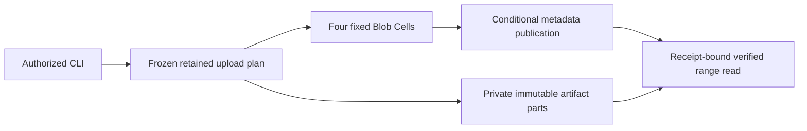

# Persistent file vault

Freeze a local file into verified immutable parts, stage them across restarts,
then atomically publish a file manifest. Readers see the previous publication
until completion. Replacement and deletion require the observed ETag.



## Run

With Rust 1.97 and Docker Compose, from the repository root:

```sh
sh cookbook/scripts/file-vault.sh
```

The demo freezes a two-part file, stages its first part, verifies that it is
invisible, resumes and completes, downloads through bounded verified ranges,
and compares every byte. It emits JSON lines for each phase and a final
`"scenario":"passed"` result. Each run uses a new file key.

## Resume a retained upload

Prepare before sending any Cell command. The input file must contain 1 byte
through 8 MiB, and the plan directory must not exist:

```sh
sh cookbook/scripts/file-vault.sh prepare documents/report.bin report.bin report-upload
sh cookbook/scripts/file-vault.sh stage cookbook/.state/file-vault report-upload
sh cookbook/scripts/file-vault.sh head cookbook/.state/file-vault documents/report.bin
sh cookbook/scripts/file-vault.sh resume cookbook/.state/file-vault report-upload
sh cookbook/scripts/file-vault.sh download cookbook/.state/file-vault documents/report.bin recovered.bin
```

The `stage` command intentionally stops after one part; an optional count stages
more. Its process drains before exiting. A separate `resume` process resolves
each phase's original identity before deciding whether to dispatch it. Keep
`upload.json` and the numbered part files unchanged. The plan freezes the input
and hashes each part and the whole file. Later edits to the original input do
not affect resumption; edits to retained parts fail verification before work.

Request identities have a five-minute validity window, while unfinished
uploads expire after one hour. Resumption within the request window preserves
the original outcomes. Expired evidence does not prove absence: inspect the
publication before deciding on new work. This implementation does not silently
mint new identities for an expired or unknown phase.

To replace a file, append the ETag from `head` to `prepare`. The condition is
checked at completion, so two uploads based on the same publication cannot
both replace it. To abandon staging, run `abort STATE_DIRECTORY PLAN_DIRECTORY`.
Abort and upload expiry remove upload metadata; they do not collect artifacts.

## Conditional deletion and downloads

Retain a deletion request before dispatch:

```sh
sh cookbook/scripts/file-vault.sh prepare-delete documents/report.bin ETAG delete-report.json
sh cookbook/scripts/file-vault.sh delete cookbook/.state/file-vault delete-report.json
```

Replace `ETAG` with the exact 64-character token from the file's metadata.
Replaying that deletion resolves its original outcome and cannot delete a
newly recreated file. A new deletion with the stale ETag is durably rejected.
Conflicts and missing uploads print their recorded outcome and receipt and
exit nonzero. Storage and integrity errors retain their originating causes.

Resuming a completed plan reports its recorded publication and original
receipt. A later replacement or deletion does not rewrite that outcome. Use
`head` to inspect current publication state; a read requiring an old receipt
may still observe a newer publication.

`download` accepts an optional required ETag after the output path. It pins the
initial publication token, checks it on every range, and advances its receipt
minimum. If the publication changes or an artifact fails verification, the
download fails. A temporary output becomes visible only after the entire file
is verified and synced. Existing output files are never overwritten. The
reported BLAKE3 digest hashes the downloaded bytes; it is distinct from the
primitive's publication ETag.

## Contracts and lifecycle

| Contract | Behavior |
| --- | --- |
| File identity | 1–256 canonical relative lowercase ASCII path bytes; no empty, dot, parent, or absolute segments. |
| Topology | Fixed namespace and four key-derived Blob shards; stable application/tenant IDs. |
| Part and range | Nonempty parts and reads capped at 256 KiB. |
| File | 1–32 contiguous parts, at most 8 MiB. |
| Plan | Version one, at most 64 KiB; local part paths derive from validated numbers. Files and directory entries sync before dispatch. |
| Preparation | Public `BlobNamespace::prepare_mutation` stages bytes and retains exact command evidence; staging does not publish a reference. |
| Publication | Create-only or exact-ETag replacement; manifest and outcome commit together. |
| Operations | Blob mutation 1, query 2, internal maintenance 3; schema and codec version one. |
| Recovery | Exact authority-pinned metadata restore; every required part verifies on read. |
| Infrastructure | Probed local S3, signed renewable lease, bounded maintenance and resource budgets, drain on every CLI exit. |

The [shared node](../../support/README.md) installs native Blob schema and
supervises expired-upload cleanup. The artifact store uses a physical prefix
private to this application. The local OS principal owns the fixed tenant;
network embeddings must supply their own authorization and artifact scopes.

A preparation failure can leave an incomplete local plan directory. It has no
valid manifest and cannot dispatch; inspect and remove it before preparing a
new plan. Preserve complete plans for retries. Cleanly drained SQLite working
files are removed; interrupted sessions can leave local evidence. Object
storage persists through `local-storage.sh down`.

This vault never deletes physical parts. Artifact collection requires the
complete reference set across all four Cells, stopped writers, and a grace
boundary. The catalog's separate collector owns that protocol. Compatible
module upgrades and cloud/fleet qualification remain separate work.

## Evidence

Public tests verify staging across restart, range boundaries, exact recovered
bytes, completion replay, conditional replacement races, deletion replay,
abort, bounds, frozen-source validation, and corrupted-artifact refusal after
metadata restore. The independent-process scenario uses local S3 to verify
cold resumption, retained phase resolution, downloads, replacement conflicts,
recreated-file preservation, and tampered-plan refusal.
