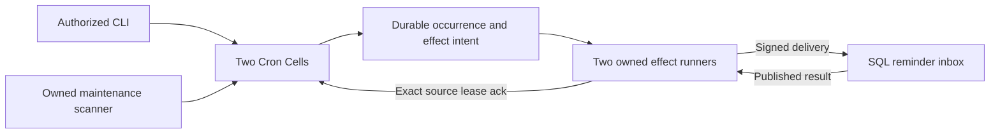

# Interval scheduler

Create recurring reminders, pause and resume them, and inspect delivered
occurrences. Two native Cron shards publish due occurrences through supervised
maintenance; two owned effect runners deliver signed commands to a SQL inbox.
The application library provides validated typed operations and bounded reads.

```sh
sh cookbook/scripts/interval-scheduler.sh
```

The launcher starts the pinned local S3 provider, runs the demo, and drains
accepted work. Rust 1.97 and Docker Compose are required. The demo verifies
replay, fixed timestamps, real lost-reply resolution, pause/resume/delete, and
reconciliation between published source occurrences and destination records.



An occurrence and the schedule's next due time advance in one source
transaction. The destination inbox publishes separately. A source receipt
proves the Cron Cell's position; it does not prove the inbox has caught up.
The public delivery query accepts an inbox receipt, and source/destination
positions appear separately in diagnostics.

## Prepare, apply, and resolve

Preparation runs without storage, validates bounded input, converts the
relative initial delay to an absolute timestamp, and freezes a five-minute
request identity. It creates a version-one JSON file, fsyncs it and its parent,
and refuses overwrite. Keep that record unchanged on retry or interruption.

```sh
cat > /tmp/reminder.json <<'JSON'
{"operation":"upsert","id":"018f7ce0-67d0-7000-8000-000000000001","reminder":{"title":"Review","message":"Review the report"},"interval_ms":1000,"start_in_ms":200}
JSON
sh cookbook/scripts/interval-scheduler.sh prepare /tmp/reminder.json /tmp/reminder.mutation.json
sh cookbook/scripts/interval-scheduler.sh apply cookbook/.state/interval-scheduler /tmp/reminder.mutation.json
sh cookbook/scripts/interval-scheduler.sh resolve cookbook/.state/interval-scheduler /tmp/reminder.mutation.json
sh cookbook/scripts/interval-scheduler.sh serve cookbook/.state/interval-scheduler 5
sh cookbook/scripts/interval-scheduler.sh get cookbook/.state/interval-scheduler 018f7ce0-67d0-7000-8000-000000000001
sh cookbook/scripts/interval-scheduler.sh deliveries cookbook/.state/interval-scheduler 018f7ce0-67d0-7000-8000-000000000001 - 20
```

`serve` without a duration runs until interruption. Other commands open the
same persistent installation but do not start effect runners. Due source
intents can therefore be visible before any reminder reaches the inbox.

Other ingress JSON uses the same preparation flow:

```json
{"operation":"pause","id":"018f7ce0-67d0-7000-8000-000000000001"}
{"operation":"resume","id":"018f7ce0-67d0-7000-8000-000000000001","start_in_ms":200}
{"operation":"delete","id":"018f7ce0-67d0-7000-8000-000000000001"}
```

Missing schedules produce a durable `not_found` business rejection. The CLI
prints its receipt and exits unsuccessfully; replay returns that same outcome.
Resolution never dispatches. Unknown or expired evidence exits unsuccessfully;
expiry does not prove a command never ran. Source error chains are printed on
stderr. The library's `Change` uses an explicit absolute `next_due_ms`; relative
delays are an ingress convenience and are frozen before the first dispatch.

## Schedule and lifetime policy

| Contract | Application behavior |
| --- | --- |
| Identity | Nonzero canonical lowercase hyphenated UUID; its bytes select one of two fixed shards. |
| Content | Trimmed nonempty title up to 80 UTF-8 bytes and message up to 512 bytes; no control characters. |
| Intervals | Fixed elapsed milliseconds, one second through a 365-day year. Calendar expressions and time zones are not supplied. |
| Initial due time | At or after mutation issuance, at most five years ahead. If dispatch crosses the due time, the original absolute time remains eligible. |
| Catch-up | Every missed interval publishes its own occurrence, up to the native 128-item total Tick budget per activation. No application policy silently skips missed occurrences. |
| Changes | Upsert replaces the definition and resets its occurrence counter. Pause/resume preserves the counter and advances the native generation when the control changes. Concurrent edits serialize; the last accepted upsert becomes current. |
| Stop/delete | Prevents future ticks. Already-published effects remain deliverable; stopping the schedule does not roll back a reminder that was published. |
| Recreate | Native generations restart after delete. The retained upsert request ID is included as a definition identity, distinguishing the new lifetime from old deliveries. |
| Destination key | Permanent `(schedule, definition, generation, occurrence)` uniqueness; a matching duplicate reuses the original row, changed time or content is rejected. |
| Reads | Schedule and delivery pages of 1–100 items, explicit source shard or exact schedule key, positive receiver cursors. Pagination uses current reads, not a cross-command snapshot. |

Delivery rows use receiver-local IDs and are ordered by arrival. Their scheduled
timestamps and source counters retain the original fixed-interval order; an
application must not infer cross-Cell delivery ordering from an inbox row ID.
The inbox does not prune its business-key records. Three Cells have 64-MiB
database limits; a production application must choose partition and retention
policies consistent with its lifetime deduplication contract.

## Process and failure boundaries

The executable owns its fixed local tenant and application IDs, OS-principal
authorization, private provider prefix, readiness, signals, and peer trust.
The shared `LocalPeer` exercises actual signing, authorization, and destination
inbox dispatch. Its random signer is pinned inside this process; it is not a
network identity or fleet discovery implementation. The application authorizer
permits only reminder delivery, resolution, and required destination description.

The node installs bounded native maintenance before opening readiness.
`spawn_delivery` installs one runner per source Cell; no raw Tick loop is
exposed to users. Each cycle claims one effect under a 15-second lease,
revalidates it, delivers outside SQLite, resolves a lost reply, and acknowledges
the exact source lease. Failure closes readiness and retains the originating
error or pending evidence. SIGINT/SIGTERM stop serving admission and drain
accepted cycles before the node withdraws its lease. Mutation interruption
returns an error so callers retain their prepared records.

The signed node lease lasts 30 seconds and is renewed while serving. Another
process cannot steal a live owner. SIGKILL leaves local evidence and requires
expiry before takeover; a successor restores the authority-pinned roots.

`serve STATE SECONDS AFTER_PUBLICATION_MS lose-reply` exercises fault controls.
Duration is 1–3600 seconds, the first successful reply delay is 0–10000 ms, and
`lose-reply` drops that reply after inbox publication. An optional bounded
progress stream reports effect ID, source sequence, schedule, generation,
occurrence, receiver row, and destination sequence. It is diagnostic; slow
observers do not block publication or settlement. On graceful drain the delay
is skipped and source settlement finishes. The process scenario kills the
server at this exact boundary and verifies the restored source redelivers the
same effect and the destination returns the same row and receipt.

## Evidence and reuse

The [public behavior suite](tests/application.rs) verifies owned ticks and
runners, interval timestamps, controls and durable rejections, pending-intent
restart, catch-up, signed lost-reply resolution, deletion/recreation, payload
conflicts, bounded pagination, receipt-domain rejection, wire fixtures, and
graceful drain after destination publication.
The [process scenario](../../scenarios/interval-scheduler.py) verifies persistent
storage and independent-process recovery after SIGKILL, live-owner refusal,
complete source/destination occurrence reconciliation, replay, controls,
lost-reply resolution, and definition lifetimes. Recovery waits for every paused
source occurrence and the original effect receipt before draining, with a
bounded deadline. Expired leases may be requeued behind catch-up work; delivery
order is not occurrence order. Run process tests in CI or an
isolated source snapshot with private storage.

The reusable library exposes `SchedulerClient`, domain types, compiled modules,
`open`, and `spawn_delivery`. Call the service assembly once before exposing
ingress, and drain on every startup or serving failure. Network applications
replace local authorization and peer transport while keeping stable IDs,
codecs, definitions, and transaction boundaries. Source, dependency lock,
schema, operations, and topology are pinned; incompatible releases require
explicit evolution instead of a catalog bypass. See the
[workspace guide](../../README.md) and [catalog](../../../docs/cookbook.md).
