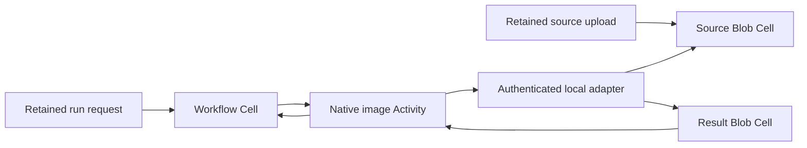

# Media pipeline

Upload a PNG, process a thumbnail outside SQLite, and link its verified Blob
manifest into a durable Workflow. This application uses Cellule's public typed
Blob, Workflow, and Activity APIs. Its library contains reusable immutable
artifact and transformation code; the executable owns credentials, the private
provider scope, authenticated local transport, and process lifetime.

The local journey and persistent crash scenario passed against private local
S3-compatible storage. This is application behavior evidence; cloud, scale,
and upgrade qualification remain separate framework profiles.

```sh
sh cookbook/scripts/media-pipeline.sh
```

Docker Compose and Rust 1.97 are required. The launcher starts the cookbook's
local object provider. SQLite uses the specified state directory; authoritative
objects use `cookbook/media-pipeline/cells` and a private artifact prefix. No
cloud account is required. Stop the provider with `sh cookbook/scripts/local-storage.sh down`;
its volume is retained.

## Boundaries and contracts



| Contract | Implementation |
| --- | --- |
| Immutable source | BLAKE3 of the complete PNG is its key. Every manifest uses `Missing`; no replacement or deletion operation is exposed. |
| Immutable result | Key includes the source digest, integer thumbnail size, algorithm version, and pinned `image` version. Run and lease identities do not change this key. |
| Visibility | Native Blob staging is invisible. Only a completed one-part manifest is read or linked. |
| Input pin | Activity fetches verified native Blob bytes; adapter verifies the exact source manifest, and Activity checks its full digest and size. |
| Computation | PNG decode has strict 1024-pixel width/height limits and a 32 MiB decoder allocation limit. One owned blocking task produces each thumbnail. |
| Transformation | Convert to RGBA8; integer floor dimensions with a minimum of one pixel; preserve aspect ratio, never upscale, Triangle filtering, PNG encoding. |
| Output link | Activity verifies output digest, size, key, and dimensions before native completion. Workflow verifies the frozen transformation before storing the manifest link. |
| Retry | Read the immutable key first and verify exact bytes. A retry may create a fresh staging plan; `Missing` and byte verification prevent a second visible artifact. Uncertain commands never prove absence. |
| Run admission | One ID permanently binds source, operation, endpoint, and deadline. Changed bytes are a durable `Conflict`; 1024 permanent bindings bound run admission. |
| Credentials | `CELLULE_MEDIA_TOKEN` is read at runtime and never stored in Workflow input. The default is an explicit synthetic local-development credential. |
| Ownership | Adapter dispatches through the already-open Blob writer. The Activity does not acquire a second writer or publish a manifest directly to object storage. |
| Drain | Stop admission, finish admitted adapter jobs and native Activity completions, then release node ownership. A disconnected caller does not cancel its accepted publication. |

There is one fixed shard per namespace. Receipts belong to one Cell; a Workflow
receipt does not establish visibility in a Blob Cell. Artifact reads independently
verify their pinned manifests and native part integrity. A failed or expired
Activity may have published output before failure; a missing Workflow link
never proves that no output exists. Cancellation does not delete an artifact.

Encoded inputs and outputs are 1..256 KiB, thumbnails fit a 1..128 pixel square,
and adapter JSON bodies are at most 2 MiB. Four connections and four admitted
jobs bound transport memory; the one Workflow shard owns one sequential Activity
runner. Each Cell has declared 64 MiB native and 16 MiB change limits. The source
and result namespace share one private artifact store, so collection would need
the complete cross-Cell reference set and all documented quiescence conditions;
this app performs no collection.

## Persistent journey

Run serving commands sequentially for this installation. The OS caller owns the
fixed local tenant; only the numeric loopback adapter accepts network requests,
and its bearer credential is checked before body parsing or native dispatch.
Choose a free fixed adapter port and keep it for the lifetime of each run.

```sh
sh cookbook/scripts/media-pipeline.sh sample /tmp/media-source.png
sh cookbook/scripts/media-pipeline.sh prepare /tmp/media-source.png /tmp/media-upload.json
sh cookbook/scripts/media-pipeline.sh upload cookbook/.state/media-pipeline /tmp/media-upload.json > /tmp/media-source.json
sh cookbook/scripts/media-pipeline.sh prepare-run /tmp/media-source.json 128 http://127.0.0.1:19021/ /tmp/media-run.json
sh cookbook/scripts/media-pipeline.sh start cookbook/.state/media-pipeline /tmp/media-run.json
sh cookbook/scripts/media-pipeline.sh serve cookbook/.state/media-pipeline 19021 60
```

`prepare-run` prints the Workflow UUID. `get STATE_DIRECTORY WORKFLOW_UUID`
prints its source, current action, result link, and failure detail. Download via
`download STATE_DIRECTORY source|result HEX_KEY OUTPUT_FILE`; `HEX_KEY` is the
64-character lowercase hex encoding of the link's 32 key bytes. Downloads are
verified before exclusive file publication and never overwrite an existing file.

Keep upload plans and run requests before dispatch. They freeze original bytes
and command identities; preparation refuses to overwrite them. Run `start`
again with the same retained request to obtain the original command outcome, or
`resolve STATE_DIRECTORY REQUEST_FILE` to resolve the original evidence. Request
validity is five minutes; expired evidence reports `absence_proven: false` and
requires inspection before selecting new work. Staging and Activities have a
one-hour lifetime. Expired staged uploads are maintenance candidates, not safe
part deletion evidence.

## Verification

```sh
cargo test --manifest-path cookbook/Cargo.toml -p cellule-cookbook-media-pipeline --locked
cargo clippy --manifest-path cookbook/Cargo.toml -p cellule-cookbook-media-pipeline --all-targets --locked -- -D warnings
```

The [persistent process scenario](../../scenarios/media-pipeline.py) must run in
CI or an isolated source snapshot against private local storage. It kills the
worker after verified Blob publication and before native completion, then
restarts after the serving lease expires. The recovered native attempt must use
the same run, action, output key, manifest, and bytes. `CELLULE_MEDIA_AFTER_PUBLICATION_MS=10000`
opens the bounded observation window; its setting is external to persisted run
input. SIGTERM must finish accepted native completion before releasing ownership.

The isolated qualification run passed all 121 cookbook tests, workspace build,
all-target checks, Clippy with warnings denied, and API documentation with
warnings denied. Media has 12 focused tests. Two complete demos passed, and the
persistent process scenario passed 18 checks, including actual process death
between output publication and Activity completion, native attempt-two reuse,
unchanged manifest ETag and PNG bytes, durable conflicting-input rejection,
SIGTERM completion drain, and reconstruction after removing local working state.
The CI matrix automatically includes the application from Cargo membership;
its GitHub jobs have not been run as part of this local qualification.
