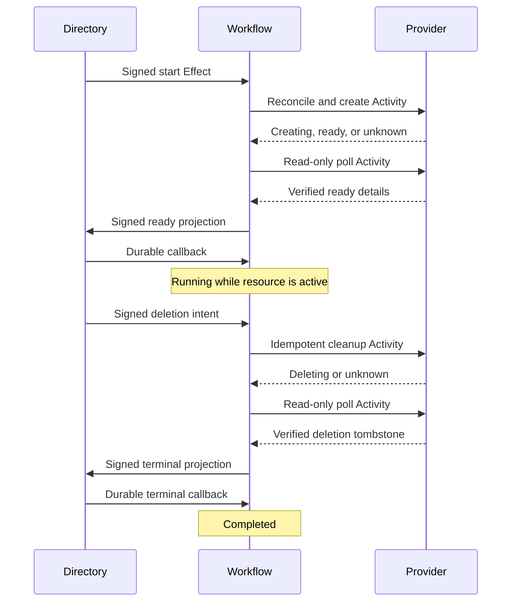

# Resource provisioning

This application requests a simulated virtual volume, waits for provider creation,
publishes verified details, and deprovisions it. The library owns immutable
business identities, directory transactions, and a native Workflow. The binary
owns provider HTTP authentication, admission, local configuration, and workers.

**Implementation status:** qualified and runnable. All 21 provisioning tests passed
in the isolated cookbook qualification: 194 tests total, with none failed or ignored.
Both persistent demos and the 22-check process journey passed, together with format,
build, checks, Clippy, API docs, and layout/documentation gates. Recovery reclaimed
the same native Activity for continued provisioning and cancellation, then restored
directory, provider, and Workflow state from retained authoritative objects.

## Run

From the repository root, with Rust 1.97 and Docker Compose:

```sh
sh cookbook/scripts/provisioning.sh
```

The demo exercises lost creation replies, retrying cleanup, early cancellation,
provider outage, and explicit operator reconciliation. It verifies that each
provider mutation applies once and that the Workflow completes only after the
provider tombstone and directory callback. Repeating it allocates fresh business
UUIDs. The simulator stores durable SQL records and synthetic `sim://volumes/`
addresses; it requires no cloud account and allocates no physical volume.

The independently owned provider uses a separate authoritative storage prefix.
`CELLULE_PROVISIONING_PROVIDER_TOKEN` supplies its credential (default
`cookbook-local-provider`); credentials remain in the environment. Its origin is
numeric IPv4 loopback HTTP with an explicit port and is permanently part of the
resource request. Resume an interrupted installation with the provider on that
same origin. The shared cookbook object store uses development credentials.

## Coordination and evidence

| Domain | Durable contract |
| --- | --- |
| Directory | Immutable resource request, original start Effect, deletion intent, verified projection, permanent callback replies. |
| Flows | Native Workflow and Activities, exact run/step correlation, early deletion binding, bounded reconciliation tokens. |
| Provider | Full request binding, stable create/delete keys, asynchronous lifecycle deadlines, permanent deletion tombstone. |



An accepted directory command differs from a ready resource. Provider acceptance
of deletion differs from completed cleanup. The provider's own supervised worker
advances durable deadlines using a read-only due hint; advancement rechecks
the deadline and native time in its transaction. Idle scans publish no commands,
and GET never mutates lifecycle state. Receipts belong to
one Cell and do not establish visibility in another domain.

Provider keys derive from the permanent resource UUID and operation kind. Every
immutable request field is separately bound. Native action identities, lease
attempts, completion tokens, and operator reconciliation cannot create another
provider resource. The adapter looks up that business identity before creation
and after an uncertain mutation reply. Deletion before creation installs a
permanent tombstone that prevents a late create from reopening the resource.

Deletion is a durable product intent. It never cancels an already accepted
external action: that action is reconciled before cleanup proceeds. A signed
intent arriving before Workflow start is retained. A deletion racing the ready
projection prevents the directory from republishing Active. Terminal completion
requires both verified provider deletion and its directory acknowledgment.

Eight automatic Activities per stage bound uncertainty and polling. Exhaustion
publishes `NeedsReview` while retaining the last verified observation, which can
be stale. Regressing provider evidence also requires review. An operator retains
a reconciliation token and resumes the same resource and keys; eight distinct
cycles are permitted, with a total lifetime cap of 512 provider Activities.
Exhaustion leaves inspectable uncertainty. No timeout claims absence or cleanup.

## Retained ingress and inspection

Prepare mutation evidence offline and preserve it unchanged:

```sh
mkdir -p cookbook/.state/provisioning
cat > cookbook/.state/provisioning/request.json <<'JSON'
{"operation":"request","spec":{"id":"00000000-0000-0000-0000-000000000001","name":"example-volume","capacity_mib":16,"provider_endpoint":"http://127.0.0.1:19026/"}}
JSON
sh cookbook/scripts/provisioning.sh prepare cookbook/.state/provisioning/request.json cookbook/.state/provisioning/request.retained.json
sh cookbook/scripts/provisioning.sh apply cookbook/.state/provisioning cookbook/.state/provisioning/request.retained.json
sh cookbook/scripts/provisioning.sh resolve cookbook/.state/provisioning cookbook/.state/provisioning/request.retained.json
```

Other input shapes:

```json
{"operation":"delete","resource":"00000000-0000-0000-0000-000000000001"}
```

```json
{"operation":"reconcile","input":{"resource":"00000000-0000-0000-0000-000000000001","token":"00000000-0000-0000-0000-000000000002"}}
```

Run `provider-state FAULT_FILE up`, then `provider-server PROVIDER_STATE 19026
FAULT_FILE` in one terminal and `serve APPLICATION_STATE` in another. The provider
owns only Provider; the application owns Directory and Flows. Stop a serving
process before running another CLI against its ownership domain. Embeddings can
use the typed `ProvisioningClient` through the current owner's handle.

Inspect with `resource`, `resources`, `workflow`, and `provider`; `help` lists
arguments. Native resolution reads the original outcome without dispatch.
Prepared identities last at most five minutes. Expired resolution runs offline,
creates no state directory, and proves no absence. Resource UUIDs remain bound
permanently after native request evidence expires.

## Bounds and ownership

| Resource | Bound |
| --- | --- |
| Permanent resources and provider records | 128 per installation. |
| Permanent internal callbacks | 4,096 per domain; no pruning or identity reuse. |
| Volume capacity / name | 1–1,024 synthetic MiB / 64 canonical ASCII bytes. |
| Query page / encoded output | 1–100 records / 256 KiB. |
| HTTP request and response | 4 KiB each, two-second body/request deadlines. |
| Live HTTP sockets / admitted mutations | Eight / four. |
| Automatic attempts / reconciliation cycles | Eight per stage / eight distinct accepted tokens. |
| Native Activities / Effects | Ten minutes per Activity / seven days per Effect. |
| Activity lease / Effect lease | 30 seconds / 15 seconds. |
| Worker polling | 200 ms when active, up to two seconds when idle. |

Signed routes pin source Cell, destination, command, codec, permission, and typed
payload. Local signing trust is ephemeral; distributed deployments supply durable
trust and discovery. HTTP publication jobs outlive disconnected callers. Shutdown
stops admission, drains accepted mutations and workers, releases leases, and
closes SQLite handles. A deployment owns its real provider adapter, authorization,
retention policy, and escalation when an unresolved external resource persists.

## Verification

Tests exercise permanent operation keys, changed-request conflicts, deletion
before creation, read-only polling, early cancellation, signed callbacks,
projection races, bounded uncertainty, retrying cleanup, cold restore, canonical
wire fixtures, actual HTTP failure and admission validation, and idle scanning without durable
command churn.

```sh
cargo test --manifest-path cookbook/Cargo.toml -p cellule-cookbook-provisioning --locked
cargo clippy --manifest-path cookbook/Cargo.toml -p cellule-cookbook-provisioning --all-targets --locked -- -D warnings
```

Run `python3 cookbook/scenarios/provisioning.py BINARY` only in CI or an isolated
source snapshot against private authoritative storage. It kills the source after
provider creation and before native completion, then recovers the same native
Activity for continued provisioning and cancellation. It exercises cleanup
failure, provider outage and operator review, permanent tombstones, bounded
pagination, owned drain, and cold restoration of both domains.

Provider fixtures: `up`, `down`, `drop-create-reply` (one TCP reply dropped after
publication per receiver process), and `fail-delete-once` (one deletion rejected
before publication). `CELLULE_PROVISIONING_AFTER_CREATE_MS` delays the durable
creation checkpoint by at most ten seconds for process fault injection.

See the [catalog](../../../docs/cookbook.md), [cookbook guide](../../README.md), and
[framework integration guide](../../../docs/framework.md).
