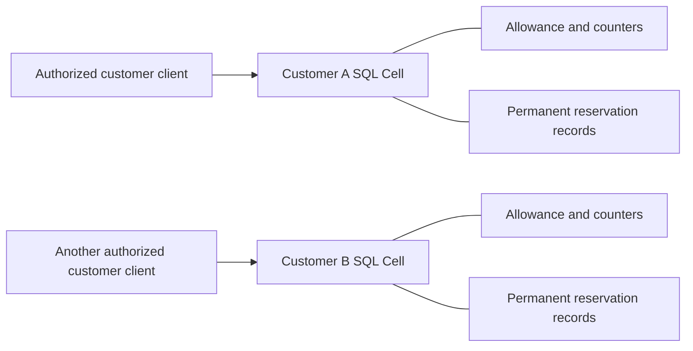

# Credit quotas

Each customer has one SQL entity Cell containing a lifetime credit allowance,
account counters, and permanent reservation records. A reservation holds a fixed
amount. Consuming it spends the entire amount; releasing it returns the entire
amount. Those terminal decisions are mutually exclusive and idempotent, including
when a later retry has a fresh mutation request ID.

```sh
sh cookbook/scripts/quotas.sh
```

The default demo opens a fresh customer, races two 75-credit reservations against
100 credits, and verifies one winner and one durable rejection. It releases the
winner, replays the original release, retries it with a fresh request ID, proves
that the released business ID cannot hold credits again, and consumes another
reservation once. It prints reconciled counters and a receipt, then drains.
Docker and Rust 1.97 or newer are required.

## Transaction boundary



An account and all its reservations share one transaction domain. Each accepted
change preserves `allowance = available + reserved + consumed`. Reservations
and counter changes publish together; a failed write rolls both back. Different
customers have independent balances, business IDs, ownership, and receipt domains.
There is no global quota transaction across customer Cells.

The library models simulated API credits. An embedding application owns identity,
administrator permissions, allowance policy, and actual API execution. Construct
a `QuotaClient` only after authorizing its tenant and customer. Reserve before
external work, then consume or release according to the product's outcome policy;
this example does not claim exactly-once execution of an external service.
Shell access is the local CLI's authorization boundary; it exposes no network API.

## Retained CLI operations

Run from the repository root. Keep prepared files outside boot-owned working
sessions, and choose a distinct file for each new logical command.

```sh
mkdir -p cookbook/.state/quota-inputs
cat > cookbook/.state/quota-inputs/open.json <<'JSON'
{"customer":"acme","action":{"operation":"open","allowance":100}}
JSON
sh cookbook/scripts/quotas.sh prepare \
  cookbook/.state/quota-inputs/open.json cookbook/.state/quota-inputs/open.mutation.json
sh cookbook/scripts/quotas.sh apply cookbook/.state/quotas cookbook/.state/quota-inputs/open.mutation.json
cat > cookbook/.state/quota-inputs/reserve.json <<'JSON'
{"customer":"acme","action":{"operation":"reserve","id":"01900000-0000-7000-8000-000000000001","credits":30}}
JSON
sh cookbook/scripts/quotas.sh prepare \
  cookbook/.state/quota-inputs/reserve.json cookbook/.state/quota-inputs/reserve.mutation.json
sh cookbook/scripts/quotas.sh apply cookbook/.state/quotas cookbook/.state/quota-inputs/reserve.mutation.json
sh cookbook/scripts/quotas.sh account cookbook/.state/quotas acme
sh cookbook/scripts/quotas.sh list cookbook/.state/quotas acme - 20
```

To consume, prepare another file containing:

```json
{"customer":"acme","action":{"operation":"consume","id":"01900000-0000-7000-8000-000000000001"}}
```

To return credits instead, use `release` with that ID while it is active.
Releasing a consumed reservation and consuming a released one reject durably.
A full reservation is one work unit; split a larger workload into separately
identified reservations when it needs independent settlement.

The `set_allowance` action uses the current account revision from `account`:

```json
{"customer":"acme","action":{"operation":"set_allowance","expected_revision":3,"allowance":150}}
```

A lower allowance must still cover all held and spent credits. This operation
never resets consumption or forgets reservation identities. To demonstrate
contention, prepare two distinct reservation files for the same customer, then:

```sh
sh cookbook/scripts/quotas.sh race cookbook/.state/quotas \
  cookbook/.state/quota-inputs/reserve-a.mutation.json cookbook/.state/quota-inputs/reserve-b.mutation.json
sh cookbook/scripts/quotas.sh resolve cookbook/.state/quotas cookbook/.state/quota-inputs/reserve-a.mutation.json
sh cookbook/scripts/quotas.sh serve cookbook/.state/quotas acme 60
```

`race` runs both prepared commands concurrently through the same fenced writer
and reports both decisions with their receipts. For insufficient total credits,
exactly one succeeds. Serving installs owned native maintenance and lease renewal;
SIGTERM or interrupt drains the node. Independent short CLI commands also drain
before another process acquires their idle Cells.

## Contracts and bounds

| Contract | Behavior |
| --- | --- |
| Customer key | 1–64 lowercase ASCII letters, digits, and internal hyphens. Framework version-one hashed entity partition; allowance changes and ownership moves do not change identity. |
| Allowance | Integer 0..1,000,000,000,000; zero disables new positive holds. Each reservation costs 1..1,000,000,000,000 credits. Arithmetic is checked. |
| Counter invariant | Nonnegative counters with consumed + reserved at most allowance. Stored SQL CHECK constraints reinforce handler validation. |
| Revision | Increments only on domain state changes. Allowance edits require the observed revision. Business no-ops do not increment it, although native outcome publication still has a receipt. |
| Reservation ID | Nonnil canonical lowercase hyphenated UUID, persisted as 16 bytes. Customer-local business identity is separate from the native request identity. |
| Reserve retry | An existing ID with the same amount returns `existing_reservation`, including its terminal state, without creating a new hold. A differing amount conflicts. Callers must check the returned state before treating it as an active hold. |
| Settlement retry | Repeated consume returns `already_consumed`; repeated release returns `already_released`. Neither changes counters. The opposite terminal action returns `closed`. |
| Durable rejection | Insufficient credits, stale allowance revision, invalid bounds, missing state, capacity, and closed state remain native business rejections with observable outcomes and receipts. Replaying a rejected request stays rejected even after available credits change. |
| Failed reserve | A rejected allocation creates no business reservation record. A fresh logical attempt can succeed later, while the original native request remains rejected. |
| Native evidence | Preparation freezes customer, action, UUID request ID, and five-minute timestamps in a create-new fsynced file. Resolve observes the original outcome; expired resolution reports metadata with `absence_proven: false` before provisioning or dispatch. Expiry never proves absence and is never permission to reissue an uncertain operation. |
| Business retention | At most 1,024 permanent reservation records per customer. Terminal rows never disappear to free capacity; existing settlement and allowance edits remain available at capacity. New customer/period policies or archival require explicit application design. |
| Reads | 1–100 UUID-ordered records per keyset page, with counters from the same FIFO read. Separate pages are current observations, not one historical snapshot. Only the same customer's receipt can gate a read. |
| Process bounds | 4 KiB JSON input, 1 KiB command input/output, 32 KiB page output; 64 MiB database / 16 MiB capture per Cell. Shared node budgets and four resident SQL workers bound local admission. |
| Lifecycle | Probe persistent storage, enroll a signed session, renew its 30-second lease every five seconds, supervise native maintenance, stop ingress, drain owned work, and release Cells. Successful drain removes only the current boot's SQLite working files. |
| Diagnostic fault | `apply ... AFTER_PUBLICATION_MS` delays its final ingress reply by at most ten seconds after printing a durable publication checkpoint. It supports process recovery verification; normal apply has zero delay. |

Initialization refuses to overwrite an existing account. Terminal business
records persist independently of short-lived native request receipts. Recovery
uses the authority-pinned root and fresh working files. Crashed boot evidence
stays untouched by later boots; a successor cannot steal a live enrollment lease.

## Code and verification

[Handlers](src/commands.rs) enforce accounting and permanent settlement;
[models](src/model.rs) own identity and explicit version-one codecs;
[queries](src/queries.rs) return bounded coherent observations; the
[client](src/lib.rs) binds one customer capability; the [binary](src/main.rs)
owns provider, retained files, CLI admission, diagnostics, and process drain.

```sh
cargo test --manifest-path cookbook/Cargo.toml \
  -p cellule-cookbook-quotas --test application --locked
```

[Public application tests](tests/application.rs) reconcile counters against
reservation history, race allocation and terminal settlement, verify bounds and
allowance edits, exercise actual signed reply loss, test customer/receipt scope,
fill permanent record capacity, and restore a clean successor. The
[process scenario](../../scenarios/quotas.py) runs in CI or an isolated source
snapshot against private local S3. It demonstrates same-owner contention,
SIGKILL after release publication, live-owner refusal, native expiry takeover,
original outcome resolution, fresh-identity idempotency, bounded pages,
independent cold restore, orphan evidence preservation, and SIGTERM drain.
These checks prove the local cookbook profile; provider and fleet qualification
remain separate framework work.
