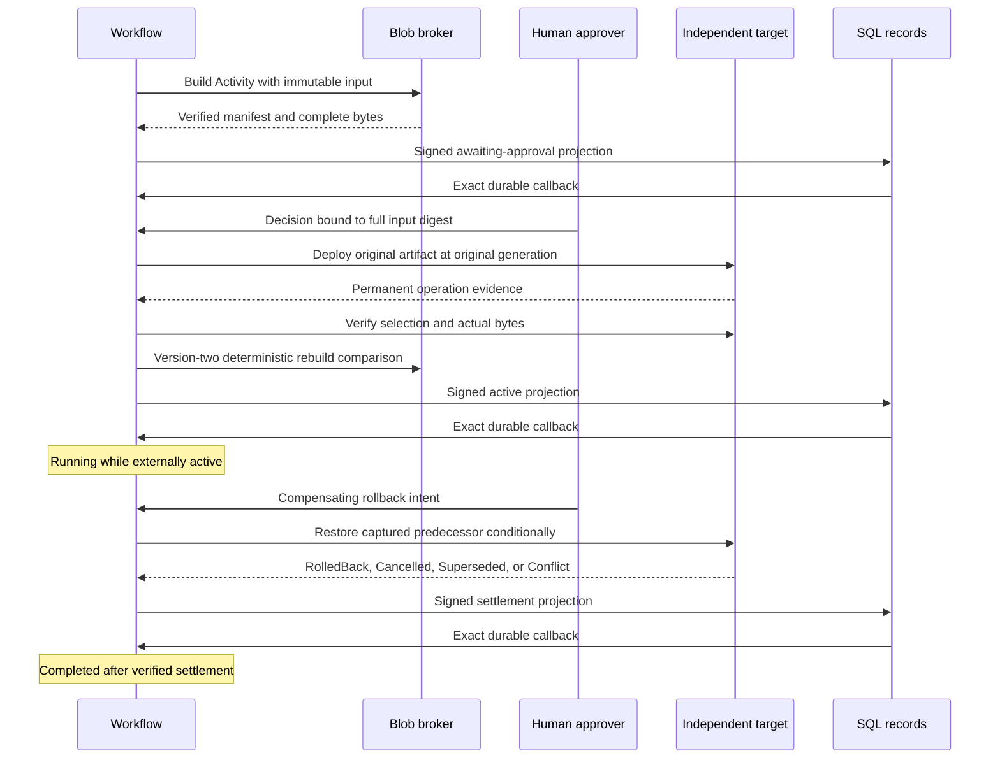

# Release pipeline

Build a deterministic local artifact, obtain human approval, deploy it to an
independently durable target, verify its bytes, and restore its predecessor.
The library owns immutable inputs, native Workflow decisions, SQL records,
conditional target transactions, and staged Blob publication. The binary owns
HTTP capabilities, providers, prepared request files, and process lifetime.

**Status: qualified local reference application.** The native libraries and real
HTTP composition passed 26 tests in isolated snapshots. The persistent process
driver passed 25 checks, including Activity reclamation after a crash, actual code
rollout with retained definitions, conditional compensation, accepted-work drain,
and interrupted-demo recovery of the original request and exact Blob bytes.

## Run

From the repository root, with Rust 1.97 and Docker Compose:

```sh
sh cookbook/scripts/release-pipeline.sh
```

The demo runs two separately owned applications in one process. It publishes
actual Blob bytes, waits for approval, uses the authenticated target over HTTP,
requires version-two reproducibility verification, waits for signed SQL
acknowledgments, and compensates once. A fresh release identity permits repeat
runs against retained storage. It preserves the target's previous selection.
Interrupting the demo drains both applications and returns a failure identifying
the retained request. Resolve and inspect that request before choosing further
control actions; interruption does not automatically compensate external work.

For independent processes, run these in separate terminals:

```sh
sh cookbook/scripts/release-pipeline.sh target-fault /tmp/release-target.txt up
sh cookbook/scripts/release-pipeline.sh target-server cookbook/.state/release-pipeline/target 19117 600 /tmp/release-target.txt
sh cookbook/scripts/release-pipeline.sh serve cookbook/.state/release-pipeline/flow 2 19118 600
```

Prepare a source containing 1–4096 bytes and freeze the original target
generation. A new target starts at generation zero; inspect an existing target
with `fetch-target` before preparing a new release. Never refresh that
generation when retrying the same release.

```sh
printf 'hello release\n' > /tmp/release-source.txt
sh cookbook/scripts/release-pipeline.sh prepare-release /tmp/release-source.txt example 0 http://127.0.0.1:19117/ http://127.0.0.1:19118/ 300 /tmp/release-start.json
sh cookbook/scripts/release-pipeline.sh send http://127.0.0.1:19118/ /tmp/release-start.json
```

`prepare-release` prints the release's 32-character hexadecimal ID. Inspect it
with `fetch URL workflow RELEASE_HEX` and `fetch URL record RELEASE_HEX`.
Wait for `AwaitingApproval`, then prepare and submit a decision:

```sh
sh cookbook/scripts/release-pipeline.sh prepare-approval /tmp/release-start.json approve /tmp/release-approval.json
sh cookbook/scripts/release-pipeline.sh send http://127.0.0.1:19118/ /tmp/release-approval.json
```

After observing `Active`, compensate using the original full request:

```sh
sh cookbook/scripts/release-pipeline.sh prepare-rollback /tmp/release-start.json /tmp/release-rollback.json
sh cookbook/scripts/release-pipeline.sh send http://127.0.0.1:19118/ /tmp/release-rollback.json
```

Use `reject` for a negative human decision. Rollback intent may precede start;
the eventual Workflow installs a target tombstone without building or deploying.
The prepared files cannot be overwritten. Keep them outside working directories
that a cold-restoration scenario will remove.

## Transaction domains and proof

| Domain | Durable responsibility |
| --- | --- |
| Artifacts | Private staged parts, immutable native Blob manifests, verified complete content. |
| Flows | Permanent full input binding, native definition/run, approval timer, Activities, control tokens, signed progress intent. |
| Records | Monotonic release summaries, exact signed message bindings, callbacks committed with the received projection. |
| Target application | Verified deployed bytes, permanent release binding, monotonic named slot generation, captured predecessor, compensation outcome. |



An accepted command acknowledges durable intent. `Active` means the workflow
verified the deployment and received its SQL callback; it records a historical
observation. Another release can subsequently change the target. Query the
target's current generation and selection to learn its present state.

Artifacts are deterministic version-one envelopes: 16 magic/version bytes,
16 release bytes, a four-byte source length, and the exact source. Complete-byte
BLAKE3 and the release scope derive an immutable key. Staged parts remain
invisible until native completion. The broker checks the permanently accepted
Workflow input, atomically saves and syncs its original upload plan, and verifies
native metadata and every required byte before returning publication evidence.
A key conflict succeeds only after verifying an identical published winner.

The target permanently binds release, target name, artifact, and original
generation. Deploy commits the actual bytes, selected slot, operation record,
and native outcome together. Original-generation refusal commits a domain
`Conflict` record; callers inspect that acknowledged outcome. Changed permanent
input is rejected without replacing the binding.

Rollback restores the predecessor only while the exact installed generation and
selection still match. A newer generation yields permanent `Superseded`, even
if another rollback restored an older artifact with the same bytes. It cannot
undo that newer selection. An early rollback writes a full-request tombstone,
preventing a delayed deployment from reopening the operation. Native Workflow
cancellation is never exposed as reversal of external work.

## Versions, retries, and recovery

Version one registers its definition and Build/Target handlers. Version two
registers a genuinely different inventory: it retains the exact version-one
code and definition and adds a Rebuild Activity required by new runs. Both
inventories are supplied by this executable. Existing runs keep their pinned
version; changing the current definition does not rewrite them.

Stop the old server before introducing version two. After a crash, allow the
writer and 30-second Activity lease to expire, then recover its authority-pinned
state under version one. The explicit rollout command recovers and drains that
predecessor before publishing the compatible code upgrade:

```sh
sh cookbook/scripts/release-pipeline.sh recover-old cookbook/.state/release-pipeline/flow
sh cookbook/scripts/release-pipeline.sh rollout cookbook/.state/release-pipeline/flow
sh cookbook/scripts/release-pipeline.sh serve cookbook/.state/release-pipeline/flow 2 19118 600
```

Use ordinary version-two serving for subsequent restarts. This one-way CLI
introduction requires the predecessor; an older registry refuses migrated state.
The original immutable catalog proof remains intact. Future releases must retain
archived definition logic, digests, handlers, and the actual compiled predecessor;
recompiling edited source under an old version label does not establish compatibility.

Each work stage permits three automatic attempts. Unknown replies remain
unresolved and eventually publish `NeedsReview`; they do not prove absence,
deployment, or compensation. `prepare-reconcile START_REQUEST REQUEST_FILE`
freezes an operator token for retrying the original stage and input. Two distinct
cycles and 32 total Activities bound a run. Replaying a token is idempotent;
changing its input digest or original generation is rejected.

The adapter looks up the permanent target identity before mutation and after an
uncertain reply. Compensation intent waits for accepted work to reconcile.
Native completion follows external settlement and its exact receiver callback.
Source receipts and Blob receipts cannot be used as SQL receiver receipts.

Stop a serving process before running `apply`, `resolve`, `workflow`, `record`,
or `download` directly against its state directory. These commands select an
explicit compiled version. Prepared native identities retain their original
five-minute windows; expired resolution runs offline and proves no absence.
Permanent release and target bindings outlive native request evidence.

## Application policy and bounds

HTTP accepts only canonical numeric IPv4 loopback origins with explicit ports.
Credentials remain in the environment; all four pipeline capabilities require
distinct values. Local defaults demonstrate the policy and are development
credentials. Applications supply their own authentication and principal binding.
Local signing trust for Effects is ephemeral; distributed deployments supply
durable trust and discovery.

| Capability | Environment credential | Local default |
| --- | --- | --- |
| Private artifact worker and inspection | `CELLULE_RELEASE_ARTIFACT_TOKEN` | `cookbook-local-release` |
| Independent target | `CELLULE_RELEASE_TARGET_TOKEN` | `cookbook-local-release` |
| Submitter | `CELLULE_RELEASE_SUBMITTER_TOKEN` | `cookbook-local-submitter` |
| Human approver | `CELLULE_RELEASE_APPROVER_TOKEN` | `cookbook-local-approver` |
| Rollback/reconciliation operator | `CELLULE_RELEASE_OPERATOR_TOKEN` | `cookbook-local-operator` |

| Resource | Bound |
| --- | --- |
| Permanent releases / receiver records | 64 per installation. |
| Permanent callback messages | 2048 per direction. |
| Independent target operations / named slots | 1024 / 64; no eviction or identity reuse. |
| Source / complete binary artifact | 4096 / 4132 bytes. |
| HTTP input / operator output | 32 / 64 KiB. |
| Activity HTTP response | 32 KiB, verified against the pinned input. |
| Live sockets / admitted owned requests | Eight / four per listener. |
| Header/body deadline / Activity HTTP deadline | Two seconds / two seconds per request. |
| Activity lease / Effect lease | 30 / 15 seconds. |
| Automatic stage attempts / operator cycles / lifetime Activities | Three / two / 32. |
| Worker poll interval | 50 ms active, up to 500 ms idle. |
| Native database / capture limits per Cell | 64 / 16 MiB. |

Readiness includes native lease and task health. HTTP stops admission during
drain and retains accepted jobs independently of callers. Shutdown joins jobs,
Activities, Effects, and maintenance before releasing writers and SQLite handles.
No artifact part deletion is implemented; collecting this shared scope requires
a complete cross-Cell reference set, quiesced writes, and a grace boundary.

Target fixtures: `up`, `down`, `drop-deploy-reply` (one reply lost after durable
publication per server process), `fail-rollback-once` (one refusal before
publication), and `delay-deploy` (one second before publication). Fault files
are replaced atomically. `CELLULE_RELEASE_AFTER_DEPLOY_MS` delays native completion
by at most ten seconds after independently verified target publication.

## Verification

```sh
cargo test --manifest-path cookbook/Cargo.toml -p cellule-cookbook-release-pipeline --all-features --locked
cargo clippy --manifest-path cookbook/Cargo.toml -p cellule-cookbook-release-pipeline --all-targets --all-features --locked -- -D warnings
python3 cookbook/scenarios/release-pipeline.py BINARY
```

Run process qualification only in CI or an isolated source snapshot against
private authoritative storage. The process driver requires a fresh private
installation and preserves original inputs across lease expiry and rollout.
Run it before the version-two demo in that installation. The driver also
interrupts a demo after actual Blob publication, verifies both drain events,
and restores the original request, Workflow input, and complete artifact bytes.
Its result is completion evidence only after the driver passes. In-memory HTTP
and public-API tests alone do not prove independent-process recovery.

See the [catalog](../../../docs/cookbook.md), [cookbook guide](../../README.md),
and [application integration guide](../../../docs/framework.md).
